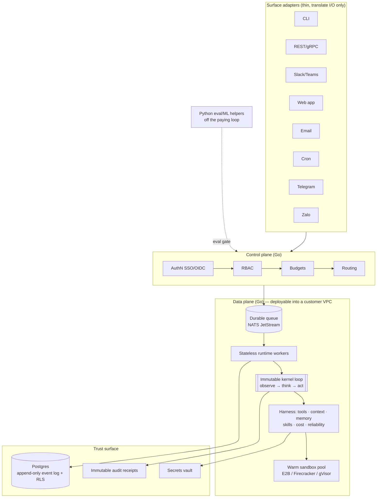

# 🤖 Nexus Agent

> **One model-agnostic AI agent platform** — a single reliable agent kernel wrapped in an engineered harness, exposed through thin surface adapters, fronted by a control plane, and grounded in a trust surface. It serves customers from a 5-person startup to a 50,000-person enterprise **through configuration and connectors, never per-customer code forks.**

Nexus Agent unifies the best ideas of the current generation of agent products on **one immutable, event-sourced kernel**, and adds the control plane, trust surface, and cost governance that separate a demo from a system a security-conscious enterprise will sign.

---

## 📋 Table of Contents

- [🤔 Why Nexus Agent](#why-nexus-agent)
- [📐 The two governing equations](#the-two-governing-equations)
- [🏛️ Architecture at a glance](#architecture-at-a-glance)
- [📜 Core design principles](#core-design-principles)
- [✨ Feature highlights](#feature-highlights)
- [🛠️ Technology stack](#technology-stack)
- [📁 Repository layout](#repository-layout)
- [🚀 Getting started](#getting-started)
- [▶️ Submitting a run](#submitting-a-run)
- [🌐 Surfaces & connectors](#surfaces--connectors)
- [☁️ Deployment topologies](#deployment-topologies)
- [⚡ Reliability & scale](#reliability--scale)
- [🔒 Security & trust surface](#security--trust-surface)
- [💰 Cost governance & observability](#cost-governance--observability)
- [🧪 Testing & the release gate](#testing--the-release-gate)
- [📚 Documentation](#documentation)
- [📌 Project status](#project-status)
- [⚖️ License](#license)

---

## 🤔 Why Nexus Agent

Most agent products are demos that break in production: they string-match model
output, run away on cost, leak across tenants, and can't prove what they did.
Nexus Agent is built the opposite way — as **one reliable loop** whose behavior
and guarantees are identical no matter which surface a user reaches it from, and
whose every action is attributable, isolated per tenant, cost-metered, and
verified against explicit acceptance criteria rather than self-declared.

The same build runs as multi-tenant SaaS, single-tenant, self-hosted in a
customer's environment (BYOC), or a split control-plane/data-plane hybrid — chosen
by configuration. New organizations are onboarded with **config + connectors, not
a fork of the kernel.**

---

## 📐 The two governing equations

Everything in the platform is downstream of two equations:

```
Reliability        ≈  Model capability  ×  Harness quality
                          (mostly fixed)     (our job — ~80% of quality)

Enterprise-ready   ≈  Harness quality    ×  Trust surface
                                             (security + governance + observability)
```

The model is roughly fixed for the life of the project. **~80% of production
quality comes from the harness** — the prompts, tools, sandboxes, memory,
orchestration, guardrails, and observability around the model. A brilliant harness
that can't prove what it did, can't be scoped to a tenant, and can't be audited
will not ship in a regulated company — hence the trust surface is a day-one
requirement, not a retrofit.

---

## 🏛️ Architecture at a glance

A hard **control-plane / data-plane split** behind a versioned contract, so the
data plane can move into a customer VPC by configuration.



- **Kernel** — the single agent loop: an async-generator step that classifies every
  model response into a typed union (`TOOL_CALLS` / `CONTENT` / `EMPTY`) and always
  ends in a typed terminal reason (`completed`, `max_turns`, `cost_exhausted`,
  `error`, `aborted`, `prompt_too_long`, `hook_stopped`, `approval_expired`).
- **Harness** — tools, cache-stable context, per-turn cost metering, file-first
  memory, on-demand skills, and reliability engineering.
- **Surfaces** — thin adapters (CLI, chat, web, REST/gRPC, email, cron,
  Telegram/Zalo) that only translate input and output; no per-surface control flow.
- **Control plane** — auth (SSO/OIDC), RBAC, per-tenant/per-task budgets, and
  deterministic routing.
- **Trust surface** — per-tenant isolation via Postgres row-level security, vaulted
  secrets, immutable audit receipts, and evals-in-CI.

---

## 📜 Core design principles

The platform is governed by the **Nexus Agent Constitution** (nine core
principles). Every design decision maps back to one of them:

| # | Principle | What it means |
|---|-----------|---------------|
| I | 🔁 **One Loop, Many Surfaces** | A single kernel async generator; surfaces are thin adapters that only translate I/O. No per-surface control-flow fork. |
| II | 🗄️ **Immutable Models, Append-Only State** | Agent/Tool/Model/config are immutable; the only mutable state is an append-only event log. Every `tool_use` is paired with a `tool_result`. |
| III | ⚡ **Cache-Stable Context Is Architecture** | A byte-stable prefix + volatile tail; per-turn content is banned from the prefix; >90% cache-read target. |
| IV | 💰 **Stop on Cost, Not Vibes** | Per-turn token metering attributed to task + tenant; hard per-task/per-tenant ceilings → `cost_exhausted`. |
| V | 🛡️ **Safety Is Per-Invocation and Fails Closed** | Per-invocation safety checks on parsed input; fail-closed tool defaults; the Rule of Two. |
| VI | 🏢 **Tenant First; Audit & Observability Day-One** | Tenant is the first dimension of every key/row/workspace/cost/secret; DB row-level security; immutable audit log. |
| VII | 🔌 **Model- and Provider-Agnostic by Abstraction** | One provider abstraction + normalized stream contract; native tool-calling only; deterministic auditable routing. |
| VIII | 🔄 **Reliability: Classify, Resume, Never Silently Retry** | Typed failure classification before retry; logged backoff + jitter; circuit-break; durable checkpoint/resume. |
| IX | ✅ **Verify Against Acceptance Criteria; Govern Every Change** | No self-declared success; prompts/tools/skills are versioned, reviewed, and eval-gated (≥90% pass + zero regressions). |

---

## ✨ Feature highlights

- 🔁 **Reliable single-agent loop** — completes multi-turn, tool-using tasks under a
  hard cost bound, always reporting a typed terminal reason; never runs away.
- 🌐 **Many surfaces, one behavior** — CLI, REST/gRPC API, chat (Slack/Teams), web,
  email, cron, and consumer messaging (Telegram/Zalo) all share the same loop and
  guarantees.
- 🔒 **Enterprise trust surface** — per-tenant data/secret/budget isolation at the
  data layer (RLS), immutable tamper-evident audit receipts, vaulted secrets the
  model never sees, and human-in-the-loop approval for high-impact actions.
- ✌️ **The Rule of Two** — when a session would combine *untrusted input*, *private
  data*, and *external state change/communication*, at most two proceed
  unattended; the third requires human approval.
- 💰 **Cost governance** — per-turn token/cost metering attributed to task + tenant,
  hard ceilings with `cost_exhausted` stops and alerts (never a surprise bill).
- 🔭 **Structure-only observability** — operators inspect decision patterns and
  per-turn cost/latency/token spans without reading private conversation content.
- 🧠 **Memory & skills** — file-first per-tenant memory injected at session start
  (retention-bounded, injection-screened), and reusable skills loaded on demand;
  agent-proposed skills are promoted only through a human/eval gate.
- ⚙️ **Config-not-forks onboarding** — new orgs are onboarded via tenant settings,
  agent definitions, seeded skills, enabled surfaces, and permission-scoped
  connectors — the kernel is never forked.

---

## 🛠️ Technology stack

| Layer | Choice |
|-------|--------|
| 🔵 **Control plane, gateway, kernel, workers** | Go 1.23 (`net/http`/gRPC, `pgx`, `go-redis`) |
| 🐍 **ML / eval helpers (off the paying loop)** | Python 3.12 (`pytest`, eval runner, LLM-as-judge, context condenser) |
| 💻 **Web surface** | TypeScript 5.x · React 19 · Vite · Tailwind · React Query |
| 🗄️ **State store** | PostgreSQL — append-only event log + config/cost/audit tables, tenant isolation via **row-level security** |
| ⚡ **Cache / locks** | Redis — session-key serial locks, rate-limit token buckets, sandbox-pool metadata, hot session cache |
| 📨 **Durable queue / event plane** | NATS JetStream (default adapter behind a swappable queue port; SQS/Redis Streams/Temporal-class alternates) |
| 📦 **Sandbox runtime** | E2B (default), swappable for Docker / Firecracker / gVisor / local-OS isolation |
| 🤖 **LLM providers** | One provider abstraction + adapters: Anthropic native, OpenAI-compatible, Bedrock/Vertex, CLI-subprocess fallback |
| 🗃️ **Object storage** | S3-compatible, for offloaded oversized tool outputs and large artifacts |
| 🌍 **Web fetch** | crawl4ai (clean chunked markdown) |
| 🔭 **Observability** | OpenTelemetry SDK |
| 🔗 **Connectors** | MCP client for external systems of record |
| 🚢 **Packaging** | OCI images + Helm chart / Terraform module; KEDA/HPA autoscale on queue depth |

---

## 📁 Repository layout

```text
backend-go/
├── cmd/
│   ├── control-plane/        # gateway: authN (SSO/OIDC), RBAC, rate limit, budget, routing
│   ├── runtime-worker/       # stateless worker: pulls a session, runs the kernel loop
│   └── surface-gateway/      # thin surface adapters entrypoint (CLI/API/chat/email/cron/telegram/zalo)
├── kernel/                   # the agent loop: async-generator step, typed terminal states,
│                             #   response classification, tool_use/tool_result invariant
├── internal/
│   ├── provider/             # provider abstraction + normalized stream contract + adapters
│   ├── tools/                # self-registering registry, buildTool factory, exec pipeline; builtins
│   ├── connectors/           # per-user OAuth (auth-code + PKCE), token vault, gmail/gdrive/gcalendar
│   ├── context/              # two-zone prompt, cache discipline, structured compaction
│   ├── memory/               # file-first memory, per-tenant, injection screening, retention
│   ├── skills/               # progressive disclosure + propose → gate → version → promote
│   ├── cost/                 # per-turn token/cost meter, per-task/per-tenant ceilings
│   ├── reliability/          # failure classifier, circuit breaker, stuck detection, resume
│   ├── tenancy/              # tenant context, RLS scoping, per-tenant budgets/limits
│   ├── security/             # layered defense, Rule of Two, receipts, egress, secrets vault
│   ├── audit/                # immutable audit log + tamper-evident tool receipts
│   ├── queue/                # durable job queue (NATS JetStream default), session-key routing
│   ├── sandbox/              # warm pool, TTL/reclamation, per-tenant caps, resource limits
│   ├── surfaces/             # per-surface adapter translators
│   └── observability/        # OTel spans, structure-only tracing, cost/latency/token spans
├── migrations/               # Postgres schema incl. row-level security policies
└── tests/                    # contract · integration · load · unit

ml-python/                    # Python 3.12 helper service (off the paying loop)
├── src/
│   ├── evals/                # ~20-case eval set, LLM-as-judge rubric, end-state checks, CI gate
│   ├── condenser/            # structured compaction / summarizer on a cheaper helper model
│   └── judge/                # rubric scoring + held-out grader protection
└── tests/

frontend/                     # React 19 web surface (a thin surface adapter)
└── src/                      # components · pages · services (run submission, event stream, polling)

deploy/                       # OCI images + Helm chart / Terraform module; autoscale policy; load driver

specs/001-agent-platform/     # Specification, plan, research, data model, contracts, tasks
├── spec.md · plan.md · research.md · data-model.md · quickstart.md
├── contracts/                # kernel ABI · control/data-plane · run-API OpenAPI · tool contract
└── checklists/
```

> **Structure decision:** The Go `backend-go/` tree holds three separately
> deployable binaries (`control-plane`, `runtime-worker`, `surface-gateway`)
> sharing the immutable `kernel/` and `internal/` harness. This realizes the
> control-plane / data-plane split — the data plane (`runtime-worker` + `kernel` +
> `internal/{sandbox,memory,provider}`) can deploy into a customer VPC unchanged.
> All per-organization behavior lives in Postgres config rows + markdown bootstrap
> files read at runtime; the kernel is never forked.

---

## 🚀 Getting started

### Prerequisites

- **Go 1.23**, **Python 3.12**, **Node 20+** (for the web surface)
- **Docker** (Postgres, Redis, sandbox images)
- A configured provider credential in the vault (never in env or prompt)

### Setup

```bash
# From repo root
docker compose up -d postgres redis          # state store + cache
make migrate                                  # apply migrations incl. RLS policies
make seed-tenant TENANT=acme                  # one tenant + agent + a demo skill
make run-control-plane &                      # auth, RBAC, budgets, routing
make run-worker &                             # stateless kernel worker
```

Expected: `make migrate` reports **RLS enabled on every tenant-scoped table**, and
the control plane logs a `v1` control/data-plane handshake.

---

## ▶️ Submitting a run

The external REST surface is one adapter over the single kernel. Every surface
(CLI, chat, email, cron, Telegram/Zalo) translates to the same run model.

```bash
# Submit a run
curl -sX POST localhost:8080/v1/runs \
  -H 'Authorization: Bearer <oidc>' \
  -d '{"agent_id":"<id>","input":"triage this bug and propose a fix","data_label":"internal"}'
# → 202 { "session_id": "...", "status": "queued" }

# Stream progress (structure only — no private content)
curl -N localhost:8080/v1/runs/<session_id>/events

# Poll status + terminal reason
curl -s localhost:8080/v1/runs/<session_id>
```

**✅ Guarantees on every run:**

- Each `tool_use` event is paired with a `tool_result` before the next model call
  (synthetic result on any error path).
- The terminal event carries a typed `terminal_reason`.
- Code and shell execute in a sandbox with hard CPU/memory/PID/wall-clock limits
  and network default-deny — a runaway loop is killed and reclaimed.
- Long-running interactions **stream or poll — never a blocked connection**.

Response codes of note: `402` budget exhausted (per-task/per-tenant ceiling),
`403` RBAC denied, `429` at capacity (admission control, with `Retry-After`).

---

## 🌐 Surfaces & connectors

- **Surfaces**: CLI, REST/gRPC API, chat (Slack/Teams), web app, email, cron, and
  consumer messaging (**Telegram**, **Zalo**). Adding a surface is a thin adapter —
  no kernel change.
- **Per-user personal connectors**: **Gmail**, **Google Drive**, **Google
  Calendar** (and MCP-based systems of record) via a one-time per-user OAuth 2.0
  authorization-code + PKCE consent. Tokens are vaulted per `(tenant, user,
  connector)`, auto-refreshed, and revocable. **The model only ever sees a
  connector handle — never the token.** High-impact sends are gated by approval and
  constrained by the Rule of Two.

---

## ☁️ Deployment topologies

The **same build** runs in four topologies, selected by configuration:

| Topology | Description |
|----------|-------------|
| 🏢 **Multi-tenant SaaS** | Shared control + data plane; strict per-tenant isolation via RLS and per-tenant sandboxes (Firecracker/gVisor). |
| 🏠 **Single-tenant** | Dedicated stack; the tenant boundary is the whole deployment. |
| 🖥️ **Self-hosted / BYOC** | Data plane runs in the customer's VPC; sensitive payloads never leave their boundary. NATS JetStream travels as one embeddable Go binary. |
| 🔀 **Hybrid** | Split control-plane / data-plane across a versioned contract. |

Regulated/sensitive payloads are routed **deterministically by data label** (not
model discretion) to a self-hosted in-VPC model so they never leave the trust
boundary.

---

## ⚡ Reliability & scale

- 📬 **Runs are jobs, not requests** — asynchronous jobs on a durable queue, pulled by
  stateless disposable workers with all state externalized. A killed worker loses
  nothing and re-queues from the last checkpoint.
- 🗝️ **Session-key routing** — per-session serial (a Redis lock keyed on
  `session_key`), cross-session concurrent — linear horizontal scale with no
  history races.
- 🔄 **Classify, resume, never silently retry** — every failure is classified before
  any retry, logged with reason, backed off with jitter, and circuit-broken after
  3 identical failures. Runs resume from durable Postgres checkpoints.
- 🚦 **Stuck detection** — repeated actions, oscillation, or zero net change over K
  steps breaks the loop with a clear reason.
- 🟢 **Deploy safety** — in-flight runs are never cut over mid-task (rainbow deploy).
- 📉 **Graceful degradation** — admission control, weighted-fair scheduling across
  tenants, and priority load-shedding keep the system responsive under overload.
- 🔑 **Idempotency** — retries, at-least-once redelivery, and resume-from-checkpoint
  deduplicate state-changing effects on a durable per-effect idempotency key.

**Targets:** ≥99.9% control-plane/API and ≥99.5% agent-run completion
availability; p95 queue-wait < 5s interactive / < 60s batch; first token < 2s
interactive; >90% cache-read on steady-state turns; thousands of concurrent
long-running sessions (~5,000+ per single-org deployment).

---

## 🔒 Security & trust surface

- 🏢 **Tenant-first isolation** — enforced at the **data layer** via Postgres
  row-level security, not application ACLs. One tenant can never reach another's
  rows, secrets, budgets, or workspaces.
- 🔐 **Vaulted secrets** — credentials are injected at tool-execution time from a
  vault; the model only ever sees a handle. Output is sanitized so leaked control
  markup or secret-shaped tokens never reach a user or log.
- 📋 **Immutable audit** — every mutating action produces a tamper-evident receipt
  tying it to a user, tenant, tool, inputs, result, and timestamp.
- 🛡️ **Per-invocation safety, fail-closed** — each command is judged by a per-invocation
  safety check on parsed input; tool defaults are fail-closed.
- ✌️ **The Rule of Two** — no session runs *untrusted input* + *private data* +
  *external state change* all unattended; the third leg requires human approval.
- 👤 **Human-in-the-loop** — payments, deletions, external sends, and production
  changes are gated by scoped approval. An approval unanswered within its TTL
  **expires as a denial** (`approval_expired`), audited.
- 📦 **Sandbox trust boundary** — all code/shell runs in a resource-limited sandbox
  with network default-deny (egress only via a domain allowlist); code never runs
  on the host or sees files outside its session workspace.
- 💉 **Prompt-injection defense** — user input, tool output, and retrieved content are
  all treated as untrusted; a poisoned retrieval corpus or a planted instruction
  cannot become a trusted command.

---

## 💰 Cost governance & observability

- 📊 **Meter where you spend** — input/output tokens metered per turn in the same
  layer that spends them, attributed to the task chain + tenant.
- 🚧 **Hard ceilings** — per-task and per-tenant ceilings terminate with an explicit
  `cost_exhausted` reason and an alert — never a surprise bill.
- ⚡ **Cache-stable context** — a byte-stable prefix (tool catalog + stable system
  prompt + append-only transcript) and a volatile tail rebuilt each turn; structured
  compaction at ~80% budget on a cheaper helper model, off the paying loop.
- 🔀 **Deterministic routing** — by data label (sensitivity) and difficulty
  (capability floor); auditable, never model discretion.
- 🔭 **Structure-only tracing** — OTel spans expose decision patterns and per-turn
  cost/latency/token spans without reading conversation content; the actual
  prompt/response is inspectable only under authorized debugging.

---

## 🧪 Testing & the release gate

- 🔵 **Go** — `go test` unit + integration (testcontainers for Postgres/Redis).
- 🐍 **Python** — `pytest` for the eval harness.
- 📄 **Contract tests** — against the kernel ABI, the control-plane ↔ data-plane API,
  and the run-API surface.
- 📈 **Load tests** — concurrency + endurance-soak harness asserting the SLA targets.
- 🚦 **The eval gate** — a versioned eval set (~20 real cases) with an LLM-as-judge
  rubric + end-state checks runs in CI as the **release gate**. Any change to a
  prompt, tool, model, or skill must clear **≥90% pass AND zero regressions** versus
  the current baseline before it can ship. No previously-passing case may regress.

---

## 📚 Documentation

Full specification and design artifacts live under
[specs/001-agent-platform/](specs/001-agent-platform/):

| Document | Purpose |
|----------|---------|
| [spec.md](specs/001-agent-platform/spec.md) | Feature specification — user stories & functional requirements |
| [plan.md](specs/001-agent-platform/plan.md) | Implementation plan — architecture, tech context, constitution check |
| [research.md](specs/001-agent-platform/research.md) | Phase 0 research — key technical decisions & rationale |
| [data-model.md](specs/001-agent-platform/data-model.md) | Entities, relationships, and RLS model |
| [quickstart.md](specs/001-agent-platform/quickstart.md) | Runnable validation scenarios mapped to user stories |
| [contracts/kernel-abi.md](specs/001-agent-platform/contracts/kernel-abi.md) | Provider / Tool / Memory / Workspace / Channel interfaces |
| [contracts/control-data-plane.md](specs/001-agent-platform/contracts/control-data-plane.md) | Versioned control-plane ↔ data-plane contract |
| [contracts/run-api.openapi.yaml](specs/001-agent-platform/contracts/run-api.openapi.yaml) | External run-submission REST surface contract |
| [contracts/tool-contract.md](specs/001-agent-platform/contracts/tool-contract.md) | Self-describing tool + execution-pipeline contract |
| [tasks.md](specs/001-agent-platform/tasks.md) | Dependency-ordered implementation tasks |

---

## 📌 Project status

**Draft / in design.** The specification, implementation plan, research, data
model, and contracts are complete; the platform is delivered in six shippable,
independently testable phases: **kernel → harness → reliability/context →
surfaces/skills → trust surface → scale/compliance**.

---

## ⚖️ License

Released under the [MIT License](LICENSE). © 2026 truongpx396.
