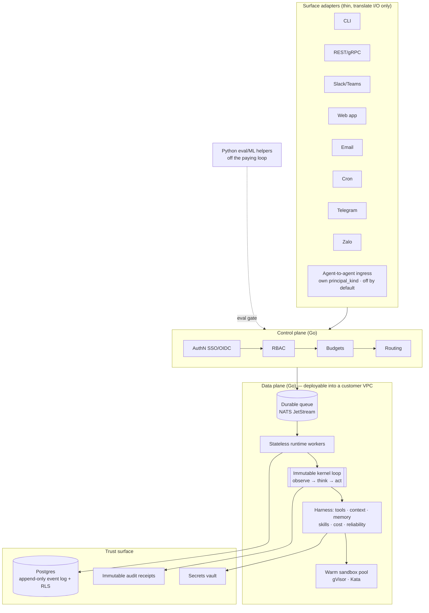

# 🤖 Nexus Agent - 🏢 Enterprise Edition

> **One model-agnostic AI agent platform** — a single reliable agent kernel wrapped in an engineered harness, exposed through thin surface adapters, fronted by a control plane, and grounded in a trust surface. It serves customers from a 5-person startup to a 50,000-person enterprise **through configuration and connectors, never per-customer code forks.**

Nexus Agent unifies the best ideas of the current generation of agent products on **one immutable, event-sourced kernel**, and adds the control plane, trust surface, and cost governance that separate a demo from a system a security-conscious enterprise will sign.

---

## 📋 Table of Contents

- [🤔 Why Nexus Agent](#why-nexus-agent)
- [📐 The two governing equations](#the-two-governing-equations)
- [🏛️ Architecture at a glance](#architecture-at-a-glance)
- [📜 Core design principles](#core-design-principles)
- [✨ Feature highlights](#feature-highlights)
- [🛠️ Technology stack](#technology-stack)
- [📁 Repository layout](#repository-layout)
- [🚀 Getting started](#getting-started)
- [▶️ Submitting a run](#submitting-a-run)
- [🌐 Surfaces & connectors](#surfaces--connectors)
- [☁️ Deployment topologies](#deployment-topologies)
- [⚡ Reliability & scale](#reliability--scale)
- [🔒 Security & trust surface](#security--trust-surface)
- [💰 Cost governance & observability](#cost-governance--observability)
- [🧪 Testing & the release gate](#testing--the-release-gate)
- [📚 Documentation](#documentation)
- [📌 Project status](#project-status)
- [⚖️ License](#license)

---

## 🤔 Why Nexus Agent

Most agent products are demos that break in production: they string-match model
output, run away on cost, leak across tenants, and can't prove what they did.
Nexus Agent is built the opposite way — as **one reliable loop** whose behavior
and guarantees are identical no matter which surface a user reaches it from, and
whose every action is attributable, isolated per tenant, cost-metered, and
verified against explicit acceptance criteria rather than self-declared.

The same build runs as multi-tenant SaaS, single-tenant, self-hosted in a
customer's environment (BYOC), or a split control-plane/data-plane hybrid — chosen
by configuration. New organizations are onboarded with **config + connectors, not
a fork of the kernel.**

---

## 📐 The two governing equations

Everything in the platform is downstream of two equations:

```
Reliability        ≈  Model capability  ×  Harness quality
                          (mostly fixed)     (our job — ~80% of quality)

Enterprise-ready   ≈  Harness quality    ×  Trust surface
                                             (security + governance + observability)
```

The model is roughly fixed for the life of the project. **~80% of production
quality comes from the harness** — the prompts, tools, sandboxes, memory,
orchestration, guardrails, and observability around the model. A brilliant harness
that can't prove what it did, can't be scoped to a tenant, and can't be audited
will not ship in a regulated company — hence the trust surface is a day-one
requirement, not a retrofit.

---

## 🏛️ Architecture at a glance

A hard **control-plane / data-plane split** behind a versioned contract, so the
data plane can move into a customer VPC by configuration.


```mermaid
flowchart TB
    subgraph Surfaces["Surface adapters (thin, translate I/O only)"]
        CLI[CLI] & API[REST/gRPC] & Chat[Slack/Teams] & Web[Web app]
        Email[Email] & Cron[Cron] & TG[Telegram] & Zalo[Zalo]
        A2A[Agent-to-agent ingress<br/>own principal_kind · off by default]
    end

    subgraph Control["Control plane (Go)"]
        Auth[AuthN SSO/OIDC] --> RBAC[RBAC] --> Budget[Budgets] --> Route[Routing]
    end

    subgraph DataPlane["Data plane (Go) — deployable into a customer VPC"]
        Queue[(Durable queue<br/>NATS JetStream)]
        Worker[Stateless runtime workers]
        Kernel[[Immutable kernel loop<br/>observe → think → act]]
        Harness[Harness: tools · context · memory<br/>skills · cost · reliability]
        Sandbox[Warm sandbox pool<br/>gVisor · Kata]
    end

    subgraph Trust["Trust surface"]
        RLS[(Postgres<br/>append-only event log + RLS)]
        Vault[Secrets vault]
        Audit[Immutable audit receipts]
    end

    Surfaces --> Control --> Queue --> Worker --> Kernel --> Harness
    Harness --> Sandbox
    Worker --> RLS
    Harness --> Vault
    Kernel --> Audit
    MLPython[Python eval/ML helpers<br/>off the paying loop] -.eval gate.-> Control
```

- **Kernel** — the single agent loop: an async-generator step that classifies every
  model response into a typed union (`TOOL_CALLS` / `CONTENT` / `EMPTY`) and always
  ends in a typed terminal reason (`completed`, `max_turns`, `cost_exhausted`,
  `error`, `aborted`, `prompt_too_long`, `hook_stopped`, `approval_expired`,
  `input_expired`).
- **Harness** — tools, cache-stable context, per-turn cost metering, file-first
  memory, on-demand skills, and reliability engineering.
- **Surfaces** — thin adapters across nine surface classes (CLI, chat, web,
  REST/gRPC, email, cron, Telegram, Zalo, and agent-to-agent ingress) that only
  translate input and output; no per-surface control flow.
- **Control plane** — auth (SSO/OIDC, per-tenant issuer), RBAC, per-tenant rate
  limits, per-tenant/per-task budgets, and deterministic routing.
- **Trust surface** — per-tenant isolation via Postgres row-level security, vaulted
  secrets, immutable audit receipts, and evals-in-CI.

---

## 📜 Core design principles

The platform is governed by the **Nexus Agent Constitution** (nine core
principles). Every design decision maps back to one of them:

| # | Principle | What it means |
|---|-----------|---------------|
| I | 🔁 **One Loop, Many Surfaces** | A single kernel async generator; surfaces are thin adapters that only translate I/O. No per-surface control-flow fork. |
| II | 🗄️ **Immutable Models, Append-Only State** | Agent/Tool/Model/config are immutable; the only mutable state is an append-only event log. Every `tool_use` is paired with a `tool_result`. |
| III | ⚡ **Cache-Stable Context Is Architecture** | A byte-stable prefix + volatile tail; per-turn content is banned from the prefix; >90% cache-read target. |
| IV | 💰 **Stop on Cost, Not Vibes** | Per-turn token metering attributed to task + tenant; hard per-task/per-tenant ceilings → `cost_exhausted`. |
| V | 🛡️ **Safety Is Per-Invocation and Fails Closed** | Per-invocation safety checks on parsed input; fail-closed tool defaults; the Rule of Two. |
| VI | 🏢 **Tenant First; Audit & Observability Day-One** | Tenant is the first dimension of every key/row/workspace/cost/secret; DB row-level security with transaction-local scope that survives connection pooling; hash-chained, externally anchored audit log; telemetry is content-free by construction and reading conversation content is an audited, expiring grant. |
| VII | 🔌 **Model- and Provider-Agnostic by Abstraction** | One provider abstraction + normalized stream contract; native tool-calling only; deterministic auditable routing. |
| VIII | 🔄 **Reliability: Classify, Resume, Never Silently Retry** | Typed failure classification before retry; logged backoff + jitter; circuit-break; durable checkpoint/resume. |
| IX | ✅ **Verify Against Acceptance Criteria; Govern Every Change** | No self-declared success; prompts/tools/skills are versioned, reviewed, and eval-gated (≥90% pass + zero regressions), with the gate in place before the first behavior-bearing slice and a deterministic provider harness behind the tests. |

---

## ✨ Feature highlights

- 🔁 **Reliable single-agent loop** — completes multi-turn, tool-using tasks under a
  hard cost bound, always reporting a typed terminal reason; never runs away.
- 🌐 **Many surfaces, one behavior** — CLI, REST/gRPC API, chat (Slack/Teams), web,
  email, cron, and consumer messaging (Telegram/Zalo) all share the same loop and
  guarantees.
- 🔒 **Enterprise trust surface** — per-tenant data/secret/budget isolation at the
  data layer (RLS), immutable tamper-evident audit receipts, vaulted secrets the
  model never sees, and human-in-the-loop approval for high-impact actions — bound
  to the exact call it authorizes, resolvable only by an authorized human, and
  invalidated with the run it gates.
- ✌️ **The Rule of Two** — when a session would combine *untrusted input*, *private
  data*, and *external state change/communication*, at most two proceed
  unattended; the third requires human approval.
- 💰 **Cost governance** — per-turn token/cost metering attributed to task + tenant,
  hard ceilings with `cost_exhausted` stops and alerts (never a surprise bill).
- 🔭 **Content-free observability** — telemetry is a signal class that *structurally
  cannot* carry conversation content (deny-by-default attribute allowlist, no
  content-admitting flag), so it stays inside the crypto-shredding erasure boundary.
  Spans are derived from the event log and turn-scoped, so a run suspended for hours
  on an approval or killed mid-turn still traces; every span resolves to the exact
  event range it covers and back. Reading actual prompts is an audited, expiring
  grant that emits a receipt per read — not an operator capability.
- 🕸️ **Bounded delegation** — single-threaded by default; sub-agents are read-only
  context firewalls whose capability can only *shrink* on descent while taint only
  *grows* on return, bounded on depth, concurrency, and per-run totals, drawing from
  a pre-reserved fan-out envelope so one delegation can't starve its tenant, and
  attributed by full delegation chain rather than immediate parent. When the
  roster of agents a run may delegate to is large, target selection uses the same
  **deferred-disclosure-and-measured-selection** discipline as the tool and skill
  selectors — a bounded, relevance-ranked candidate set on demand, not a static
  resident list.
- 📋 **Processes, not just conversations** — a recurring workflow is a **declarative
  orchestration plan** (steps, conditions, bounded loops, approval gates, optional
  read-only fan-out) that is versioned, reviewed, and eval-gated like code. The
  platform evaluates the control flow, so **routing between steps costs zero model
  tokens**; the model works only *inside* a step. The same plan runs the same way
  twice, replays from the log naming the branch it took, and resumes from a
  checkpoint — this is where *decision* parallelism lives, in reviewed
  configuration rather than a model's runtime discretion. (Inside a single turn,
  parallelism is a property of the tools themselves: each declares whether it is
  read-only, concurrency-safe, or exclusive, and only safe batches run
  concurrently — fail-closed to serial when unproven.)
- 🧠 **Memory & skills** — file-first per-tenant memory injected at session start
  (retention-bounded, injection-screened), and reusable skills loaded on demand
  through three bounded disclosure tiers. **Memory consolidation** — the
  extraction, summarization, and dedup that writes durable memory — is an
  **ordered, metered, degrade-capable** stage, not a background best-effort:
  a durable fact is written *before* the compaction or prune that would discard
  its source (memory-write precedes history-truncate), every model call it makes
  is metered and ceiling-checked like any other, and under pressure it falls back
  to a no-model extractive pass rather than failing the turn or dropping the
  write. **Ambient extraction** from a shared channel's traffic (mining memory
  with no session) is **off by default**, consent- and configuration-bounded,
  provenance-tracked and poison-screened, and attributes each fact to the
  principal who said it rather than to the thread. A skill is a **signed, content-addressed
  bundle**, not a text field: every file in it clears the injection scan, a bundled
  script registers as a real tool through the ordinary gates or the bundle is
  refused, and **every origin clears the same gate** — an import from a registry
  needs publisher provenance, a verified signature, and a pinned version, because
  gating only the agent's own proposals gates the one source least likely to be
  hostile. A skill can only *narrow* what a run may do: its declared tools
  intersect the resolved catalog and never extend it, so "load this skill" is not a
  permission-widening lever reachable from injected content.
- 🧰 **A catalog with an identity model** — tools are `{namespace}/{name}@{version}`
  with one owning source per namespace, so a second server cannot shadow an
  approved tool and silently re-point every approval scope and audit receipt that
  named it. Large catalogs load on demand while the run's harness digest pins the
  *resolvable universe* rather than the materialized set — deferred disclosure
  without sacrificing reproducibility — and the selector that decides what the
  model can see is eval-gated and measured like any other behaviour.
- 🧱 **The sandbox is not a bypass** — agent-written code can orchestrate tools
  (the code-execution pattern that trades context tokens for in-sandbox work), but
  only through a **broker** that re-enters the same execution pipeline: same
  permission chain, same approval gate, same idempotency claim, same receipt, same
  taint. A direct network path from sandbox code to a connector is a prohibited
  egress route, not an optimization.
- 🔌 **Optional ecosystem adapters, one authority boundary** — model gateways
  (LiteLLM, OpenRouter, vLLM/Ollama), LLM-observability backends (Langfuse,
  Arize/Phoenix, Braintrust, Grafana, Datadog), eval/dataset platforms, and
  durable-execution engines (Temporal, Restate, Inngest) all attach through
  existing ports by configuration — and the platform runs complete with every one
  of them off. Each may supply transport, capacity, storage, or presentation;
  none may become the routing authority, the cost ceiling, the source of truth,
  the release gate, the audit record, or a path to content. **Adopt the tool,
  keep the authority.** Every adapter is admitted by a conformance suite that
  records what it supports, degrades, and cannot do — **on the dimensions that
  matter for its port**, so a vector store is tested on tenant isolation and
  subject-level deletion rather than on cache breakpoints, and a proxy that
  quietly stops reporting cache-read tokens withdraws the cache-read claim
  instead of faking it. Evaluation tooling attaches in two shapes and never one:
  a **hosted platform** (Langfuse, Braintrust) is an adapter that stores corpora
  and receives scores; a **grader library** (DeepEval, Promptfoo, Ragas) is a
  pinned in-tree dependency supplying metrics *beneath* the platform's trial
  statistics — because no such library implements k-trial intervals or a
  three-valued verdict, and every model-graded metric it offers is a judge that
  must be calibrated before it may block anything.
- 📄 **Documents are an input, not an obstacle** — a PDF, DOCX, PPTX, or XLSX
  reaching the agent through a connector or the filesystem is converted to the
  same clean chunked markdown the web fetcher produces. The converter runs **in
  the sandbox**, because document parsers are a first-tier memory-safety surface
  fed bytes the attacker chose; its output is untrusted like any fetch, since
  conversion is decoding and not sanitization; and where it invokes a model to
  describe an image or transcribe audio, that call goes through the provider port
  — routed by data label, metered, and ceilinged, rather than an unrouted model
  call arriving under a parser's name.
- ⚙️ **Config-not-forks onboarding** — new orgs are onboarded via tenant settings,
  agent definitions, seeded skills, enabled surfaces, and permission-scoped
  connectors — the kernel is never forked.

---

## 🛠️ Technology stack

| Layer | Choice |
|-------|--------|
| 🔵 **Control plane, gateway, kernel, workers** | Go 1.23 (`net/http`/gRPC, `pgx`, `go-redis`) |
| 🐍 **ML / eval helpers (off the paying loop)** | Python 3.12 (`pytest`, eval runner, LLM-as-judge, context condenser) |
| 💻 **Web surface** | TypeScript 5.x · React 19 · Vite · Tailwind · React Query |
| 🗄️ **State store** | PostgreSQL — append-only event log + config/cost/audit tables, tenant isolation via **row-level security** with transaction-local (`SET LOCAL`) scope |
| ⚡ **Cache / locks / reservations** | Redis — session-key serial locks, **atomic budget-reservation counters** (the pre-spend ceiling of FR-083), rate-limit token buckets, sandbox-pool metadata, hot session cache |
| 📨 **Durable queue / event plane** | NATS JetStream (default adapter behind a swappable queue port; SQS/Redis Streams/Temporal-class alternates) |
| 📦 **Sandbox runtime** | Session-scoped OCI containers under **gVisor** (`runsc`) by default — Docker `--runtime=runsc` on a single host, the same image under `runtimeClassName: gvisor` on Kubernetes; swappable for Kata Containers, microVM, or local-OS isolation |
| 🤖 **LLM providers** | One provider abstraction + adapters: Anthropic native, OpenAI-compatible, Bedrock/Vertex, CLI-subprocess fallback; a model gateway (LiteLLM/OpenRouter/vLLM) may sit behind the same port as *transport only* |
| 🗃️ **Object storage** | S3-compatible, for offloaded oversized tool outputs and large artifacts |
| 🔐 **Secrets & keys** | External secrets vault (injection at tool-execution time; the model sees a handle) + KMS/HSM — per-tenant content-encryption keys with BYOK, and a **sign-only** audit-chain signing key the data plane cannot read |
| 🌍 **Web fetch & documents** | crawl4ai for web, a MarkItDown-class converter for PDF/DOCX/PPTX/XLSX — both **in-sandbox**, both returning clean chunked markdown, both taint-declared untrusted |
| 🧮 **Retrieval (when files stop being enough)** | pgvector by default — it inherits RLS, region pinning, PITR, and the erasure path; Qdrant/Weaviate attach as optional `retrieval` adapters that must re-earn all four |
| 🔭 **Observability** | OpenTelemetry SDK — OTLP is the single write path; Langfuse / Arize / Braintrust / Grafana / Datadog are optional export targets (content-free) |
| 🔗 **Connectors** | MCP client for external systems of record |
| 🚢 **Packaging** | OCI images + Helm chart / Terraform module; KEDA/HPA autoscale on queue depth |

---

## 📁 Repository layout

```text
backend-go/
├── cmd/
│   ├── control-plane/        # gateway: authN (SSO/OIDC), RBAC, rate limit, budget, routing
│   ├── runtime-worker/       # stateless worker: pulls a session, runs the kernel loop
│   └── surface-gateway/      # thin surface adapters entrypoint (CLI/API/chat/email/cron/telegram/zalo)
├── kernel/                   # the agent loop: async-generator step, typed terminal states,
│                             #   response classification, tool_use/tool_result invariant
├── internal/
│   ├── provider/             # provider abstraction + normalized stream contract + adapters
│   ├── tools/                # self-registering registry, buildTool factory, exec pipeline;
│   │                         #   qualified identity {namespace}/{name}@{version} + namespace
│   │                         #   ownership, catalog manifest, deferred disclosure + gated
│   │                         #   selector, descriptor re-verification; builtins
│   ├── connectors/           # per-user OAuth (auth-code + PKCE), token vault,
│   │                         #   gmail/gdrive/gcalendar/notion
│   ├── context/              # two-zone prompt, cache discipline, structured compaction
│   ├── memory/               # file-first memory, per-tenant, injection screening, retention;
│   │                         #   pgvector retrieval tier + rerank/top-K; derived artifacts as
│   │                         #   deletable projections (erasure deletes the index)
│   ├── skills/               # signed content-addressed bundles, three-tier disclosure,
│   │                         #   one admission gate per origin, capability narrowing,
│   │                         #   propose → gate → version → promote
│   ├── cost/                 # per-turn token/cost meter, per-task/per-tenant ceilings
│   ├── reliability/          # failure classifier, circuit breaker, stuck detection,
│   │                         #   checkpoint/snapshot/hydrate, write-ahead effect claims, resume
│   ├── tenancy/              # tenant context, RLS scoping, per-tenant budgets/limits
│   ├── security/             # layered defense, Rule of Two, receipts, egress, secrets vault
│   ├── audit/                # immutable audit log + tamper-evident tool receipts
│   ├── queue/                # durable job queue (NATS JetStream default), session-key
│   │                         #   routing, admission control
│   ├── sandbox/              # warm pool, TTL/reclamation, per-tenant caps, resource limits
│   │                         #   + network default-deny; broker = the only route from
│   │                         #   sandbox code into the tool pipeline
│   ├── surfaces/             # per-surface adapter translators; capability descriptors,
│   │                         #   per-turn principal resolution, conversation binding,
│   │                         #   outbound delivery outbox
│   └── observability/        # log-derived turn-scoped spans, content-free attribute allowlist,
│                             #   versioned attribute model, fixed metric labels + exemplars,
│                             #   trace-context propagation, cost/latency/token spans
├── migrations/               # Postgres schema incl. row-level security policies
└── tests/                    # contract · integration · load · unit

ml-python/                    # Python 3.12 helper service (off the paying loop)
├── src/
│   ├── evals/                # corpus + suite classes (incl. retrieval), trial statistics,
│   │                         #   pinned grader libraries beneath the statistics layer,
│   │                         #   scheduled adversarial discovery (off the gate),
│   │                         #   environment digest, fork-based cases, efficiency budgets,
│   │                         #   integrity, CI gate
│   ├── condenser/            # structured compaction / summarizer on a cheaper helper model
│   └── judge/                # rubric scoring, held-out grader protection, human-label calibration
└── tests/

frontend/                     # React 19 web surface (a thin surface adapter)
└── src/                      # components · pages · services (run submission, event stream, polling)

deploy/                       # OCI images + Helm chart / Terraform module; autoscale policy; load driver

specs/001-agent-platform/     # Specification, plan, research, data model, contracts, tasks
├── spec.md · plan.md · research.md · data-model.md · quickstart.md
├── contracts/                # kernel ABI · control/data-plane · run-API OpenAPI · tool contract
│                             #   · orchestration plane · integration ports
└── checklists/               # requirements quality checklist

docs/diagrams/                # Excalidraw sources: architecture · kernel lifecycle ·
                              #   run flow · trust surface
```

> **Structure decision:** The Go `backend-go/` tree holds three separately
> deployable binaries (`control-plane`, `runtime-worker`, `surface-gateway`)
> sharing the immutable `kernel/` and `internal/` harness. This realizes the
> control-plane / data-plane split — the data plane (`runtime-worker` + `kernel` +
> `internal/{sandbox,memory,provider}`) can deploy into a customer VPC unchanged.
> All per-organization behavior lives in Postgres config rows + markdown bootstrap
> files read at runtime; the kernel is never forked.

---

## 🚀 Getting started

### Prerequisites

- **Go 1.23**, **Python 3.12**, **Node 20+** (for the web surface)
- **Docker** (Postgres, Redis, sandbox images)
- A configured provider credential in the vault (never in env or prompt)

### Setup

```bash
# From repo root
docker compose up -d postgres redis          # state store + cache
make migrate                                  # apply migrations incl. RLS policies
make seed-tenant TENANT=acme                  # one tenant + agent + a demo skill
make run-control-plane &                      # auth, RBAC, budgets, routing
make run-worker &                             # stateless kernel worker
```

Expected: `make migrate` reports **RLS enabled on every tenant-scoped table** and
that tenant scope is set **transaction-locally** (`SET LOCAL`) — the half that
survives the transaction-pooling tier — and the control plane logs a `v1`
control/data-plane handshake.

---

## ▶️ Submitting a run

The external REST surface is one adapter over the single kernel. Every surface
(CLI, chat, email, cron, Telegram/Zalo) translates to the same run model.

```bash
# Submit a run
curl -sX POST localhost:8080/v1/runs \
  -H 'Authorization: Bearer <oidc>' \
  -d '{"agent_id":"<id>","input":"triage this bug and propose a fix","data_label":"internal"}'
# → 202 { "session_id": "...", "status": "queued" }

# Stream progress (structure only — no private content)
curl -N localhost:8080/v1/runs/<session_id>/events

# Poll status + terminal reason
curl -s localhost:8080/v1/runs/<session_id>
```

**✅ Guarantees on every run:**

- Each `tool_use` event is paired with a `tool_result` before the next model call
  (synthetic result on any error path).
- The terminal event carries a typed `terminal_reason`.
- Code and shell execute in a sandbox with hard CPU/memory/PID/wall-clock limits
  and network default-deny — a runaway loop is killed and reclaimed.
- Long-running interactions **stream or poll — never a blocked connection**.

Response codes of note: `402` budget exhausted (per-task/per-tenant ceiling),
`403` RBAC denied, `429` at capacity (admission control, with `Retry-After`).

---

## 🌐 Surfaces & connectors

- **Surfaces**: CLI, REST/gRPC API, chat (Slack/Teams), web app, email, cron, and
  consumer messaging (**Telegram**, **Zalo**). Adding a surface is a thin adapter —
  no kernel change. Each surface publishes a **conformance-tested capability
  descriptor** (can it render an approval package? carry a step-up challenge?
  accept a schema-declared answer? stream?), and approval routing filters on it —
  so an approval policy naming an effect class no configured channel can serve is
  refused *when it is configured*, not when it expires unanswered.
- **Multi-principal channels**: in a shared conversation, authority is the
  **turn-submitting principal** — resolved per turn, never inherited from whoever
  opened the thread. Steering and cancellation authorize per turn, and an audience
  label bounds what may be delivered into the conversation and written to memory.
- **Outbound delivery** rides a durable outbox with the event appended before the
  send, so a crash never duplicates a reply and a *never-delivered* approval
  request stays distinguishable from an *unanswered* one.
- **Agent callers** (agent-to-agent ingress) are their own admission class:
  disabled by default, subset-scoped, source-tainted as untrusted, metered to a
  named payer, and incapable of resolving an approval or answering the agent's own
  question.
- **Per-user personal connectors**: **Gmail**, **Google Drive**, **Google
  Calendar**, and **Notion** (plus MCP-based systems of record) via a one-time
  per-user OAuth 2.0 authorization-code + PKCE consent. Tokens are vaulted per
  `(tenant, user, connector)`, auto-refreshed, and revocable. **The model only ever sees a
  connector handle — never the token.** High-impact sends are gated by approval and
  constrained by the Rule of Two.

---

## ☁️ Deployment topologies

The **same build** runs in four topologies, selected by configuration:

| Topology | Description |
|----------|-------------|
| 🏢 **Multi-tenant SaaS** | Shared control + data plane; strict per-tenant isolation via RLS and per-tenant sandboxes (gVisor by default; Kata where a separate kernel is required). |
| 🏠 **Single-tenant** | Dedicated stack; the tenant boundary is the whole deployment. |
| 🖥️ **Self-hosted / BYOC** | Data plane runs in the customer's VPC; sensitive payloads never leave their boundary. NATS JetStream travels as one embeddable Go binary. |
| 🔀 **Hybrid** | Split control-plane / data-plane across a versioned contract. |

Regulated/sensitive payloads are routed **deterministically by data label** (not
model discretion) to a self-hosted in-VPC model so they never leave the trust
boundary.

For a small, single **trusted** tenant (e.g. a company on Casdoor), the
single-tenant topology collapses to **~5 standing services + Casdoor** on one
Linux host — control-plane + surface-gateway + an embedded worker pool merge into
one binary, the Python condenser stays as a separate service, NATS folds into
Redis, a small warm sandbox pool remains on the host, and object storage becomes
a local volume. See [`deploy/mini/`](deploy/mini/README.md) for the reference
`docker-compose-mini.yml` and how each collapse maps back to the spec.

---

## ⚡ Reliability & scale

- 📬 **Runs are jobs, not requests** — asynchronous jobs on a durable queue, pulled by
  stateless disposable workers with all state externalized. A killed worker loses
  nothing and re-queues from the last checkpoint.
- 🗝️ **Session-key routing** — per-session serial (a Redis lock keyed on
  `session_key`), cross-session concurrent — linear horizontal scale with no
  history races.
- 🔄 **Classify, resume, never silently retry** — every failure is classified before
  any retry, logged with reason, backed off with jitter, and circuit-broken after
  3 identical failures. Runs resume from durable Postgres checkpoints.
- 🧩 **Three state artifacts, never conflated** — a *condensation* (model-facing
  context), a *checkpoint* (machine-facing resume: in-flight effect claim, held
  reservation, sandbox handle, pending approval digest), and a *snapshot*
  (disposable projection cache that bounds hydration). A summary cannot tell you
  whether the payment went out; the checkpoint can.
- 💳 **Write-ahead effect claims** — the idempotency claim is committed *before* the
  effect leaves the process, so a crash **during** a payment or send is resolved by
  probe or a human decision — never by re-execution, never by silent discard.
- 🍴 **Replay · resume · fork** — three distinct operations: a pure projection
  rebuild, a continuation of the same run, and a *fork* of a failed run at any step
  with a patched prompt and external effects disabled — the primitive that makes a
  production incident reproducible against a candidate fix.
- 📜 **The event log is a versioned contract** — every event carries a schema
  version with a documented upcasting path, so a log written years ago still
  replays. Everything that summarizes run state (session status, approval status,
  sandbox state) is a **projection of the log, never a second source of truth**.
- 🔖 **One digest pins behavior** — each run persists a `harness_digest` over the
  system-prompt version, resolved tool catalog, skill set, and safety policy, so a
  replay cannot silently diverge from the run it reproduces; the same digest is the
  cache-prefix identity the byte-stable prefix is measured against.
- 🚦 **Stuck detection** — repeated actions, oscillation, or zero net change over K
  steps breaks the loop with a clear reason.
- 🟢 **Deploy safety** — in-flight runs are never cut over mid-task (rainbow deploy).
- 📉 **Graceful degradation** — admission control, weighted-fair scheduling across
  tenants, and priority load-shedding keep the system responsive under overload,
  with concurrency pooled by class of work (interactive / background / auxiliary)
  so a flood in one class **sheds background first** rather than starving the
  interactive path.
- 🔑 **Idempotency** — retries, at-least-once redelivery, and resume-from-checkpoint
  deduplicate state-changing effects on a durable per-effect idempotency key.

- 💾 **Rehearsed recovery** — RPO ≤5 min / RTO ≤4 h with a quarterly restore drill;
  after restore the audit chain must verify and the event log must replay.
- 🧱 **Expand/contract migrations** — additive first, cleanup a release later, so a
  rolling deploy never needs two schemas at once.

**Targets:** ≥99.9% control-plane/API and ≥99.5% agent-run completion
availability, each with an error budget and burn-rate alerting that pages to a
named runbook section; p95 queue-wait < 5s interactive / < 60s batch; first token
< 2s interactive; >90% cache-read on steady-state turns; thousands of concurrent
long-running sessions (~5,000+ per single-org deployment).

---

## 🔒 Security & trust surface

- 🏢 **Tenant-first isolation** — enforced at the **data layer** via Postgres
  row-level security, not application ACLs. One tenant can never reach another's
  rows, secrets, budgets, or workspaces. Tenant scope is set **transaction-locally**
  so isolation survives the transaction-pooling tier, and the isolation test runs
  *through* that pooler.
- 🔐 **Vaulted secrets** — credentials are injected at tool-execution time from a
  vault; the model only ever sees a handle. Output is sanitized so leaked control
  markup or secret-shaped tokens never reach a user or log.
- 🔏 **Content encrypted at rest, erasable** — prompts, tool arguments, and results
  are envelope-encrypted per tenant (BYOK where required), so a right-to-erasure
  request is satisfied by **crypto-shredding** the key while the event log still
  replays and the audit chain still verifies. No event is ever deleted or rewritten.
- 🧹 **Erasure reaches what content was turned into** — a shred covers the log, and
  nothing else, which is why every **derived artifact** (vector index, keyword
  index, knowledge graph, response cache) is a projection rather than a store of
  record: it is *hard-deleted* in the same audited transaction that destroys the
  key, and a scheduled reconciliation proves no derived row outlived its source.
  Encrypting the index is not an alternative — embeddings invert well enough in
  practice that a vector surviving a shred is retained content, and a retrieval
  backend that cannot delete by subject is simply not admissible for a tenant
  with an erasure obligation.
- 📋 **Tamper-evident audit** — every mutating action produces a receipt tying it to
  a user, tenant, tool, inputs, result, and timestamp, **hash-chained** to its
  predecessor, signed by a sign-only KMS key the data plane cannot read, and
  periodically anchored outside the writing system. A scheduled verifier proves
  continuity — a per-record MAC alone would not detect an insider rewriting history.
- 🆔 **Delegated identity, never a god-mode account** — the agent acts inside the
  **calling user's** RBAC scope, enforced at the tool boundary rather than the UI.
  The platform issues **no credentials of its own**: each tenant brings its own
  OIDC issuer, tokens are validated against that issuer's JWKS, a first valid
  sign-in just-in-time provisions the user, and a per-tenant claims mapping keeps
  an identity-provider swap (Auth0, Keycloak, Entra, Okta, Casdoor…) a config
  change — no provider SDK is ever embedded.
- 📮 **Authenticated ingress, then verified linking** — webhook and OAuth-callback
  deliveries are verified by provider signature with replay rejection and
  per-identity flood limits *before* the kernel sees them. Signature authenticity
  and **identity binding are two different controls, and neither substitutes for
  the other**: an inbound consumer-surface identity must be bound to a platform
  user through a verified linking step before it can act, and an unlinked identity
  performs zero actions.
- 🧪 **The catalog is a trust boundary, not a manifest** — a tool, connector, or MCP
  descriptor is itself attacker-controlled text, so **every descriptor is scanned
  for injected instructions at admission and on every version bump**, failing
  closed on a high-severity match — the same posture applied to ingested
  documents. Vetting a server's provenance says nothing about what its tool
  descriptions tell the model to do.
- 🎟️ **Audience-restricted tokens** — every connector and MCP token is minted
  restricted to the one server it is for, so a compromised server cannot replay it
  against a different upstream resource. A token that cannot be audience-scoped is
  a rejection signal at the same governance gate as an over-broad permission scope.
- 🛡️ **Per-invocation safety, fail-closed** — each command is judged by a
  per-invocation safety check on parsed input, layered rather than singular: a fast
  deterministic rule pass resolves the common case in-process with no external
  call, and only the ambiguous remainder reaches a model classifier carrying its
  own bounded timeout that fails closed to **ASK** — never `ALLOW` — on timeout,
  error, or an unparseable verdict. Any model that adjudicates untrusted content
  is hardened against it: it receives the parsed input as **delimited data, never
  as instructions**, must return a **structured verdict** (free text fails closed),
  and **circuit-breaks a failing judge** — repeated timeouts or unparseable
  verdicts trip it to the fail-closed outcome for a cooldown rather than retrying
  a broken dependency on every call. Tool defaults are fail-closed throughout.
- 🪝 **Hooks are governed, not a free slot** — the `PreToolUse`/`PostToolUse` hook
  layer is a configured, bounded subsystem, not an open extension point. A hook may
  only **tighten** — `DENY` (final), `ASK`, or `DEFER`; a hook `ALLOW` is a defer,
  never a bypass, and no hook can add a capability, widen autonomy, relax a policy,
  or satisfy an approval (a final deny is the *sole* producer of the `hook_stopped`
  stop). Each hook declares one handler — a trust-tier-restricted local `command`,
  an SSRF-protected `http` POST, or a model-backed `prompt` — and fires only on a
  `matcher` or a CEL `if_expr`, so a metered prompt hook never runs on every call.
  Prompt hooks inherit the same hardening as the safety check (parsed input only,
  structured verdict, circuit breaker, billed and ceiling-capped). Every hook is
  bounded by a timeout that fails closed, a non-overridable chain budget, a per-turn
  cap, a decision cache, and a per-tenant token budget; an input rewrite is applied
  only through a path allowlist and **re-binds the canonical digest**, so approval
  and exactly-once bind what actually executes. Definitions are governed tenant
  config pinned into the harness digest — never populated from a descriptor's own
  contents.
- 🔒 **Autonomy is a ratchet, not a label** — `read_only` refuses every mutating
  capability, `supervised` gates every mutating invocation, `full` gates by effect
  class and policy. The level is pinned per run and may only be **tightened**
  mid-run: no model output, tool result, steering message, hook, or delegation
  parameter can widen it, because a mid-run widening is a direct prompt-injection
  lever.
- ✌️ **The Rule of Two** — no session runs *untrusted input* + *private data* +
  *external state change* all unattended; the third leg requires human approval.
- 👤 **Human-in-the-loop, as a transaction not a flag** — payments, deletions,
  external sends, and production changes are gated by scoped approval, enforced in
  the execution pipeline where no prompt can talk past it. A grant authorizes the
  **digest of the exact resolved call** — the same artifact the exactly-once key
  derives from — so a retry, resume, or substituted argument can't ride an earlier
  "yes." The approver sees a decision-ready package (never a bare UUID), can grant,
  **modify**, or deny with a rationale that goes back to the agent, and must be an
  authorized human — separated from the requester on irreversible classes, step-up
  re-authenticated on the highest ones, over a single-use channel token. Every
  decision emits its own hash-chained receipt. Approvals are **invalidated with the
  run** they gate — none outlives a cancel, a reap, or a steer. An approval
  unanswered after notify → remind → escalate **expires as a denial**
  (`approval_expired`), audited.
- 🙋 **The agent can ask, not just be told** — steering is the human→agent push
  channel; an **input request** is the agent→human pull channel: a schema-declared
  question that suspends the run at zero token cost and, on expiry, resolves either
  to a *recorded* default assumption or an `input_expired` stop. It carries no
  authorization and can never satisfy an approval gate.
- 🎚️ **Bounded oversight load** — a versioned per-tenant approval policy tiers
  effect classes by risk and value, and a human can authorize an enumerated,
  digest-bound **batch or plan pre-authorization** once instead of forty times.
  Nothing ever ungates a class permanently, and no standing scope, batch, or
  autonomy level can short-circuit the per-invocation safety check or the Rule of
  Two. Rubber-stamping is a measured, paged signal, not an accepted cost.
- 📦 **Sandbox trust boundary** — all code/shell runs in a resource-limited sandbox
  with network default-deny (egress only via a domain allowlist); code never runs
  on the host or sees files outside its session workspace.
- 💉 **Prompt-injection defense** — user input, tool output, and retrieved content are
  all treated as untrusted; a poisoned retrieval corpus or a planted instruction
  cannot become a trusted command.
- 🌍 **Residency by placement, not by policy text** — a tenant's region pin binds
  its event log, memory, artifacts, sandboxes, queue, *and* model routing to that
  region, and a run **fails closed** rather than execute outside it. Everything
  crossing a deployment boundary is enumerated in the control/data-plane contract
  and bounded to structure; the approval context package is the one content-bearing
  payload that may cross, and only when a tenant explicitly opts into upstream
  rendering.
- 🧬 **Our own supply chain meets the bar we impose** — reproducible, signed release
  artifacts with published provenance, an SBOM per release, pinned build-time
  dependencies, and dependency/container scanning in CI with a severity threshold
  that **fails the build** — the same standard applied to third-party models,
  connectors, and MCP servers.

---

## 💰 Cost governance & observability

- 📊 **Meter where you spend** — tokens metered per turn in the same layer that
  spends them, **split by class** (uncached / cache-read / cache-write / output) so
  the cache-read gate is measured rather than estimated, priced through a
  **versioned price book** so historical cost stays reproducible when a provider
  changes prices, and attributed to the task chain + tenant + user + agent +
  surface for showback/chargeback.
- 🧮 **Every model call is metered, not just the interactive turn** — the calls a
  user never sees (structured compaction, the safety-classifier model leg, an
  online judge or scorer, memory consolidation, retrieval embedding/rerank, an
  intent-classification pre-pass, title generation, model-backed document
  conversion) traverse the **same pre-spend reservation, per-class metering,
  price-book, attribution, and ceiling** path as a foreground turn. **"Off the
  paying loop" means a *cheaper* model, never an *unmetered* one** — a tenant
  ceiling bounds background work too, so at the ceiling an auxiliary call **fails
  closed to a declared degraded behaviour** (skip the title, defer the
  consolidation, fall back to the deterministic classifier leg) rather than
  breaching the ceiling or failing the user's turn. An entitlement-billed backend
  still records its token counts so it is never a blind spot.
- 🚧 **Hard ceilings, enforced before the spend** — every turn reserves its
  worst-case cost against an atomic per-tenant counter *before* the model call, so
  a burst of concurrent sessions cannot overshoot; a refusal terminates with an
  explicit `cost_exhausted` reason and an alert — never a surprise bill.
- ⚡ **Cache-stable context** — a byte-stable prefix (tool catalog + stable system
  prompt + append-only transcript) and a volatile tail rebuilt each turn. Before
  compaction, **non-destructive live-context pruning** trims what a turn *shows*
  the model — a per-result outlier guard, then a soft trim, then a hard clear to a
  refetchable reference — and it **never mutates, summarizes, or deletes any event
  in the log**, so a fork, an erasure, or an audited content read still sees the
  original; **structured compaction** at ~80% budget on a cheaper helper model is
  reached only when pruning cannot bring the slice under budget. "Off the paying
  loop" means *a cheaper model*, which is not the same as asynchronous — so whether
  compaction blocks the turn is a **declared, measured property**, not an
  assumption, and its latency contribution is reported.
- 🎛️ **Bound the output, not just the input** — every model call carries a bounded
  `max_tokens` and stop sequences, with schema-/grammar-constrained decoding for
  the model's own reply (not just tool arguments) and a terse-reasoning style, so
  filler and unbounded reasoning traces don't inflate tokens or latency. On a
  truncation signal the platform **escalates the reservation on a bounded retry**
  rather than emitting partial, unterminated output.
- 🚦 **Rate limiting and provider capacity** — per-tenant rate limits and token
  buckets sit in the control plane alongside the budget check, and provider
  throughput limits are absorbed by connection pooling, cached prefixes, and
  **failover-as-capacity**: one abstraction with retry → cooldown → failover across
  multiple backends, so a throttled provider degrades throughput instead of failing
  runs.
- 💤 **Skip the call entirely where it's safe** — an optional response cache
  (exact-match and/or semantic, similarity- and TTL-gated, tenant-scoped) fronts
  the model for repeat and near-duplicate requests. It is restricted to cacheable,
  non-state-dependent requests, is bypassable per request, and **never serves a
  cross-tenant hit**.
- 🔀 **Deterministic routing** — by data label (sensitivity) and difficulty
  (capability floor); auditable, never model discretion. Advanced harness features
  degrade by model tier — a below-floor model gets a scoped-down tool catalog and
  above-floor features disabled, by configuration rather than a kernel fork.
- 🔭 **Content-free tracing** — turn-scoped OTel traces emitted *from the event log*
  expose decision structure and per-turn cost/latency/token spans; attributes are
  allowlisted by key so content cannot leak into a monitoring backend the tenant's
  content key never reaches. Metric labels are fixed with per-run detail reached via
  exemplars; latency SLIs are computed on active time, never wall-clock inflated by
  a human approval wait.
- 🧾 **Cost that can't be lost** — per-turn records are appended with the turn and
  shipped through a durable outbox; a control-plane outage delays accounting, never
  loses it.

---

## 🧪 Testing & the release gate

- 🔵 **Go** — `go test` unit + integration (testcontainers for Postgres/Redis), run
  against a **deterministic recorded/fake provider** so correctness tests neither
  flake nor bill a live model. Live-model calls are confined to the eval suite.
- 🎲 **Property-based tests** — the `tool_use`/`tool_result` pairing rule is a total
  invariant over all histories, so it is proven over generated event sequences
  rather than sampled by examples.
- 🐍 **Python** — `pytest` for the eval harness.
- 📄 **Contract tests** — against the kernel ABI, the control-plane ↔ data-plane API,
  and the run-API surface.
- 🏢 **Isolation tests through the pooler** — cross-tenant assertions execute through
  the production PgBouncer tier, because a result obtained on a direct connection
  says nothing about the deployed topology.
- 📈 **Load tests** — concurrency + endurance-soak harness asserting the SLA targets.
- 🚦 **The eval gate** — a versioned eval set (~20 real cases) with an LLM-as-judge
  rubric + end-state checks runs in CI as the **release gate**, and it ships in the
  *foundational* phase, before the first behavior-bearing slice. Any change to a
  prompt, tool, model, or skill must clear **≥90% pass AND zero regressions** versus
  the current baseline before it can ship. No previously-passing case may regress.
- 🎯 **…and the gate is a measurement, not a ceremony.** The suite calls live
  models, so its verdict is **statistical**: k trials per case, per-case exact
  intervals, a regression defined as interval separation rather than a flipped
  trial, and a three-valued verdict where `inconclusive` is *never* resolved as
  `pass`. Cases are split into **regression / capability / safety / negative**
  classes with different thresholds — a safety case admits no threshold below
  100%. Every run pins an **`eval_environment_digest`** (image, guaranteed *and*
  hard-kill resource bands, concurrency, region) and refuses to compare across
  digests, because resource configuration alone moves agentic scores by more than
  most model changes; trials run on **cold** sandboxes, never the warm pool.
- 🧭 **Grade the trajectory, not only the end state** — an end-state check cannot
  see that the agent picked the wrong tool, guessed where it should have asked, or
  burned three times the work getting there, so cases also assert on the path:
  tool-selection accuracy, whether an input request was raised, and the turns and
  calls consumed.
- 🧮 **A judge is the last resort, not the default** — grader selection follows an
  explicit rule: **deterministic, code-based graders wherever the criterion is
  objectively checkable** (end state, exit status, schema validity, file contents),
  with the model judge reserved for genuinely subjective criteria. Held-out graders
  live outside the agent's workspace and reach, and the **visible-versus-held-out
  pass-rate gap is measured** — a widening gap is how spec-gaming announces itself.
- 🧩 **Every artifact carries its own cases** — a global corpus measures the
  platform, not the skill, connector, or tool you are about to enable, so each
  behavior-bearing artifact ships a **versioned case set** run at its promotion or
  enablement gate. A scheduled corpus re-run catches upstream drift that arrives
  with no change on our side.
- 🎭 **The oversight gate is tested adversarially** — the corpus carries mandatory
  human-in-the-loop cases, including injected attempts to suppress or simulate
  consent, to widen autonomy mid-run, or to reach a gated effect through a standing
  scope. All must be refused and audited.
- 🔦 **…and the attack list keeps growing without the gate going soft** — a
  hand-authored corpus only tests the attacks someone already imagined, so a
  **scheduled adversarial scan** probes a live eval tenant *through a real
  surface* as a declared non-human principal (a scan pointed at a bare model
  endpoint measures the model, not the platform between it and the caller). Its
  findings are **candidates**, never verdicts: a human triages and promotes them
  into the versioned safety class, because a non-deterministic probe set cannot
  satisfy the trial statistics the gate is built on. Its coverage is reported as
  partial — a clean scan is not adversarial assurance.
- 🔎 **Retrieval is measured, not assumed** — reranking, top-K, grounding, and
  citations are requirements, so they are graded: a **retrieval suite** over a
  pinned corpus snapshot scores context precision and recall, first-relevant
  rank, and citation validity with code graders, groundedness with a judge, and
  retrieved-tokens-per-query on the efficiency footing — because raising recall
  by injecting more context is a cost regression a quality metric reports as a
  win. No retrieval tier is enabled, and no embedding-model, chunking, reranker,
  or top-K change ships, without it.
- 📥 **Growing the corpus from production is a governed path** — because telemetry
  is structure-free and content may not cross a tenant boundary, a production case
  becomes an eval case only through an explicit, tenant-consented, redacted,
  governance-signed export — never by reading traces.
- ⚖️ **The judge is an instrument** — pinned snapshot + rubric, drawn from a
  different model family than the agent it grades, and calibrated against
  human labels to a published agreement floor **before** it may block a change.
- 📡 **Quality is measured in production too** — but not by shipping conversations
  to a vendor. An **in-boundary online scorer** runs inside the erasure boundary
  and emits only structure-free scores through the telemetry allowlist, feeding
  drift alerts and a rollout guardrail that auto-rolls-back a bad change. A score
  is a number; a number is not content.
- 💰 **Efficiency is gated, not just reported** — a change that holds its quality
  verdict while regressing tokens, turns, or tool calls beyond the declared band
  is blocked. On a platform whose stop signal is cost, an ungated efficiency
  regression is an incident that ships with a green check.
- 📟 **Agent-specific golden signals** — alerting covers more than infrastructure:
  queue wait and oldest-message age, completion rate by terminal reason,
  cost-ceiling breach rate, stuck-detection rate, cache-read rate, sandbox
  reclamation, provider throttle/failover, approval fatigue and time-to-decision,
  `approval_mismatch` and resolution-refused rates, content-access refusals,
  unresolved in-flight effect claims, compaction chain depth, telemetry
  attribute-drop rate, judge calibration drift, and the held-out gap. A platform
  that alerts on latency and cost but not on whether answers got worse is measuring
  only the failures its infrastructure can feel.
- 👥 **Every control has a named owner** — a **platform team** owns the shared
  harness; an **AgentOps** function owns SLOs, on-call, evals-in-CI, cost
  dashboards, and behavioral incident response; a **governance/risk** function
  signs off new tools, connectors, and autonomy increases and maintains the AI risk
  register. An unowned control is not a control.
- 🏁 **The go-live gate** — no production launch without the checklist green:
  attributable audit, vaulted per-tenant secrets, sandboxing with hard limits and
  network default-deny, human approval on high-impact actions, one leg of the
  lethal trifecta broken per risky flow, per-task/per-tenant ceilings, failure
  classification + resume + stuck detection, evals green, cache-read >90%
  steady-state, documented residency/retention/no-train, and a rehearsed
  behavioral-incident runbook.

---

## 📚 Documentation

Full specification and design artifacts live under
[specs/001-agent-platform/](specs/001-agent-platform/):

| Document | Purpose |
|----------|---------|
| [spec.md](specs/001-agent-platform/spec.md) | Feature specification — user stories & functional requirements |
| [plan.md](specs/001-agent-platform/plan.md) | Implementation plan — architecture, tech context, constitution check |
| [research.md](specs/001-agent-platform/research.md) | Phase 0 research — key technical decisions & rationale |
| [data-model.md](specs/001-agent-platform/data-model.md) | Entities, relationships, and RLS model |
| [quickstart.md](specs/001-agent-platform/quickstart.md) | Runnable validation scenarios mapped to user stories |
| [contracts/kernel-abi.md](specs/001-agent-platform/contracts/kernel-abi.md) | Provider / Tool / Memory / Workspace / Channel interfaces |
| [contracts/control-data-plane.md](specs/001-agent-platform/contracts/control-data-plane.md) | Versioned control-plane ↔ data-plane contract |
| [contracts/run-api.openapi.yaml](specs/001-agent-platform/contracts/run-api.openapi.yaml) | External run-submission REST surface contract |
| [contracts/tool-contract.md](specs/001-agent-platform/contracts/tool-contract.md) | Self-describing tool + execution-pipeline contract |
| [contracts/integration-ports.md](specs/001-agent-platform/contracts/integration-ports.md) | Optional third-party adapters, the port map, and the authority boundary |
| [contracts/orchestration-plane.md](specs/001-agent-platform/contracts/orchestration-plane.md) | Declarative orchestration plans — zero-token deterministic control flow |
| [tasks.md](specs/001-agent-platform/tasks.md) | Dependency-ordered implementation tasks |
| [checklists/requirements.md](specs/001-agent-platform/checklists/requirements.md) | Requirements-quality checklist |

Visual design artifacts live under [docs/diagrams/](docs/diagrams/). Each is an
Excalidraw source (open at [excalidraw.com](https://excalidraw.com) or with the
VS Code extension) alongside a rendered SVG:

| Diagram | Shows |
|---------|-------|
| [01 · architecture](docs/diagrams/01-architecture.svg) | Surfaces → control plane → data plane → trust surface, with the BYOC boundary ([source](docs/diagrams/01-architecture.excalidraw)) |
| [02 · kernel lifecycle](docs/diagrams/02-kernel-lifecycle.svg) | One turn: hygiene → **pre-spend reservation** → model call → typed classification → paired result, with a producer for each of the nine terminal reasons ([source](docs/diagrams/02-kernel-lifecycle.excalidraw)) |
| [03 · run lifecycle](docs/diagrams/03-run-flow.svg) | A run end to end: submit → rejection codes → queue → worker → checkpointed turns → **suspend for a human** → terminal reason ([source](docs/diagrams/03-run-flow.excalidraw)) |
| [04 · trust surface](docs/diagrams/04-trust-surface.svg) | The co-equal perimeter controls: isolation, vault, encryption/erasure, chained audit, content-free telemetry, approval, sandbox, and the Rule of Two ([source](docs/diagrams/04-trust-surface.excalidraw)) |
| [05 · permission chain](docs/diagrams/05-permission-chain.svg) | The published total resolution order and the single execution pipeline every call walks — including the in-sandbox broker ([source](docs/diagrams/05-permission-chain.excalidraw)) |

> Editing a diagram: change the `.excalidraw` source, then re-export the SVG from
> Excalidraw (**Export image → SVG**, background on) so the rendered copy the
> README links does not drift from its source.


---

## 📌 Project status

**Draft / in design.** The specification, implementation plan, research, data
model, and contracts are complete; the platform is delivered in six shippable,
independently testable phases: **kernel → harness → reliability/context →
surfaces/skills → trust surface → scale/compliance**.

The spec is the *target architecture*, not the first release. [plan.md](specs/001-agent-platform/plan.md)
carries an explicit **MVP cut line** on the principle that **seams and schema
decisions are made early because they are expensive to retrofit, while
infrastructure is added late because it is cheap to add and expensive to carry.**

**Increment 1** ships the kernel, transaction-local RLS proven through the
pooler, the hash-chained audit chain, per-tenant encryption with the erasure
path, reserve-then-reconcile cost ceilings, a content-free telemetry export path,
and a live eval gate — on one surface (REST), single-tenant. It ships alongside
the **identity seams that cannot be retrofitted**: fully-qualified tool identity
and the catalog manifest, skill `bundle_digest`/`origin`/`signature`, the surface
capability descriptor with its `principal_kind` and conversation binding, the
delivery outbox, the delegation-chain columns, and the trace/event join key.

**Deliberately deferred**, each with a stated trigger in the cut line and each
additive against that schema: the durable queue and stateless worker pool, the
sandbox pool, the *physical* control/data-plane split, consumer surfaces and
personal connectors, memory tiers beyond files (and with them the retrieval suite
that gates one and the derived-artifact deletion that releases one) and skill
promotion, document conversion beyond the plain-text families, scheduled
adversarial discovery, sub-agent
delegation and the orchestration plane as *behavior*, deferred tool disclosure
and its gated selector, the in-sandbox broker (until it exists, connector and MCP
endpoints stay in the sandbox egress deny set — a bypass is never the interim
state), third-party skill import, agent-to-agent ingress and multi-principal
channels, third-party ecosystem adapters, fork-based incident debugging and
log-derived span emission, content-access grants as a *workflow* (the enforcement
point ships in Increment 1), multi-region residency, BYOK, chargeback export, and
multi-topology packaging.

---

## ⚖️ License

Released under the [MIT License](LICENSE). © 2026 truongpx396.
