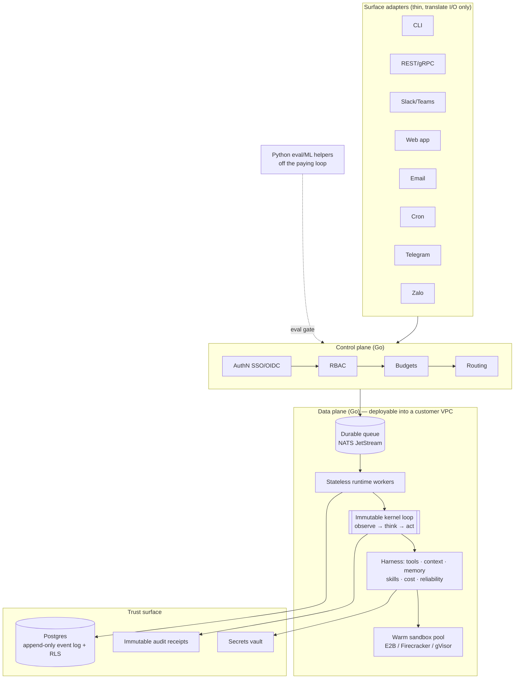

# 🤖 Nexus Agent

> **One model-agnostic AI agent platform** — a single reliable agent kernel wrapped in an engineered harness, exposed through thin surface adapters, fronted by a control plane, and grounded in a trust surface. It serves customers from a 5-person startup to a 50,000-person enterprise **through configuration and connectors, never per-customer code forks.**

Nexus Agent unifies the best ideas of the current generation of agent products on **one immutable, event-sourced kernel**, and adds the control plane, trust surface, and cost governance that separate a demo from a system a security-conscious enterprise will sign.

---

## 📋 Table of Contents

- [🤔 Why Nexus Agent](#why-nexus-agent)
- [📐 The two governing equations](#the-two-governing-equations)
- [🏛️ Architecture at a glance](#architecture-at-a-glance)
- [📜 Core design principles](#core-design-principles)
- [✨ Feature highlights](#feature-highlights)
- [🛠️ Technology stack](#technology-stack)
- [📁 Repository layout](#repository-layout)
- [🚀 Getting started](#getting-started)
- [▶️ Submitting a run](#submitting-a-run)
- [🌐 Surfaces & connectors](#surfaces--connectors)
- [☁️ Deployment topologies](#deployment-topologies)
- [⚡ Reliability & scale](#reliability--scale)
- [🔒 Security & trust surface](#security--trust-surface)
- [💰 Cost governance & observability](#cost-governance--observability)
- [🧪 Testing & the release gate](#testing--the-release-gate)
- [📚 Documentation](#documentation)
- [📌 Project status](#project-status)
- [⚖️ License](#license)

---

## 🤔 Why Nexus Agent

Most agent products are demos that break in production: they string-match model
output, run away on cost, leak across tenants, and can't prove what they did.
Nexus Agent is built the opposite way — as **one reliable loop** whose behavior
and guarantees are identical no matter which surface a user reaches it from, and
whose every action is attributable, isolated per tenant, cost-metered, and
verified against explicit acceptance criteria rather than self-declared.

The same build runs as multi-tenant SaaS, single-tenant, self-hosted in a
customer's environment (BYOC), or a split control-plane/data-plane hybrid — chosen
by configuration. New organizations are onboarded with **config + connectors, not
a fork of the kernel.**

---

## 📐 The two governing equations

Everything in the platform is downstream of two equations:

```
Reliability        ≈  Model capability  ×  Harness quality
                          (mostly fixed)     (our job — ~80% of quality)

Enterprise-ready   ≈  Harness quality    ×  Trust surface
                                             (security + governance + observability)
```

The model is roughly fixed for the life of the project. **~80% of production
quality comes from the harness** — the prompts, tools, sandboxes, memory,
orchestration, guardrails, and observability around the model. A brilliant harness
that can't prove what it did, can't be scoped to a tenant, and can't be audited
will not ship in a regulated company — hence the trust surface is a day-one
requirement, not a retrofit.

---

## 🏛️ Architecture at a glance

A hard **control-plane / data-plane split** behind a versioned contract, so the
data plane can move into a customer VPC by configuration.


```mermaid
flowchart TB
    subgraph Surfaces["Surface adapters (thin, translate I/O only)"]
        CLI[CLI] & API[REST/gRPC] & Chat[Slack/Teams] & Web[Web app]
        Email[Email] & Cron[Cron] & TG[Telegram] & Zalo[Zalo]
    end

    subgraph Control["Control plane (Go)"]
        Auth[AuthN SSO/OIDC] --> RBAC[RBAC] --> Budget[Budgets] --> Route[Routing]
    end

    subgraph DataPlane["Data plane (Go) — deployable into a customer VPC"]
        Queue[(Durable queue<br/>NATS JetStream)]
        Worker[Stateless runtime workers]
        Kernel[[Immutable kernel loop<br/>observe → think → act]]
        Harness[Harness: tools · context · memory<br/>skills · cost · reliability]
        Sandbox[Warm sandbox pool<br/>E2B / Firecracker / gVisor]
    end

    subgraph Trust["Trust surface"]
        RLS[(Postgres<br/>append-only event log + RLS)]
        Vault[Secrets vault]
        Audit[Immutable audit receipts]
    end

    Surfaces --> Control --> Queue --> Worker --> Kernel --> Harness
    Harness --> Sandbox
    Worker --> RLS
    Harness --> Vault
    Kernel --> Audit
    MLPython[Python eval/ML helpers<br/>off the paying loop] -.eval gate.-> Control
```

- **Kernel** — the single agent loop: an async-generator step that classifies every
  model response into a typed union (`TOOL_CALLS` / `CONTENT` / `EMPTY`) and always
  ends in a typed terminal reason (`completed`, `max_turns`, `cost_exhausted`,
  `error`, `aborted`, `prompt_too_long`, `hook_stopped`, `approval_expired`,
  `input_expired`).
- **Harness** — tools, cache-stable context, per-turn cost metering, file-first
  memory, on-demand skills, and reliability engineering.
- **Surfaces** — thin adapters (CLI, chat, web, REST/gRPC, email, cron,
  Telegram/Zalo) that only translate input and output; no per-surface control flow.
- **Control plane** — auth (SSO/OIDC), RBAC, per-tenant/per-task budgets, and
  deterministic routing.
- **Trust surface** — per-tenant isolation via Postgres row-level security, vaulted
  secrets, immutable audit receipts, and evals-in-CI.

---

## 📜 Core design principles

The platform is governed by the **Nexus Agent Constitution** (nine core
principles). Every design decision maps back to one of them:

| # | Principle | What it means |
|---|-----------|---------------|
| I | 🔁 **One Loop, Many Surfaces** | A single kernel async generator; surfaces are thin adapters that only translate I/O. No per-surface control-flow fork. |
| II | 🗄️ **Immutable Models, Append-Only State** | Agent/Tool/Model/config are immutable; the only mutable state is an append-only event log. Every `tool_use` is paired with a `tool_result`. |
| III | ⚡ **Cache-Stable Context Is Architecture** | A byte-stable prefix + volatile tail; per-turn content is banned from the prefix; >90% cache-read target. |
| IV | 💰 **Stop on Cost, Not Vibes** | Per-turn token metering attributed to task + tenant; hard per-task/per-tenant ceilings → `cost_exhausted`. |
| V | 🛡️ **Safety Is Per-Invocation and Fails Closed** | Per-invocation safety checks on parsed input; fail-closed tool defaults; the Rule of Two. |
| VI | 🏢 **Tenant First; Audit & Observability Day-One** | Tenant is the first dimension of every key/row/workspace/cost/secret; DB row-level security with transaction-local scope that survives connection pooling; hash-chained, externally anchored audit log; telemetry is content-free by construction and reading conversation content is an audited, expiring grant. |
| VII | 🔌 **Model- and Provider-Agnostic by Abstraction** | One provider abstraction + normalized stream contract; native tool-calling only; deterministic auditable routing. |
| VIII | 🔄 **Reliability: Classify, Resume, Never Silently Retry** | Typed failure classification before retry; logged backoff + jitter; circuit-break; durable checkpoint/resume. |
| IX | ✅ **Verify Against Acceptance Criteria; Govern Every Change** | No self-declared success; prompts/tools/skills are versioned, reviewed, and eval-gated (≥90% pass + zero regressions), with the gate in place before the first behavior-bearing slice and a deterministic provider harness behind the tests. |

---

## ✨ Feature highlights

- 🔁 **Reliable single-agent loop** — completes multi-turn, tool-using tasks under a
  hard cost bound, always reporting a typed terminal reason; never runs away.
- 🌐 **Many surfaces, one behavior** — CLI, REST/gRPC API, chat (Slack/Teams), web,
  email, cron, and consumer messaging (Telegram/Zalo) all share the same loop and
  guarantees.
- 🔒 **Enterprise trust surface** — per-tenant data/secret/budget isolation at the
  data layer (RLS), immutable tamper-evident audit receipts, vaulted secrets the
  model never sees, and human-in-the-loop approval for high-impact actions — bound
  to the exact call it authorizes, resolvable only by an authorized human, and
  invalidated with the run it gates.
- ✌️ **The Rule of Two** — when a session would combine *untrusted input*, *private
  data*, and *external state change/communication*, at most two proceed
  unattended; the third requires human approval.
- 💰 **Cost governance** — per-turn token/cost metering attributed to task + tenant,
  hard ceilings with `cost_exhausted` stops and alerts (never a surprise bill).
- 🔭 **Content-free observability** — telemetry is a signal class that *structurally
  cannot* carry conversation content (deny-by-default attribute allowlist, no
  content-admitting flag), so it stays inside the crypto-shredding erasure boundary.
  Spans are derived from the event log and turn-scoped, so a run suspended for hours
  on an approval or killed mid-turn still traces; every span resolves to the exact
  event range it covers and back. Reading actual prompts is an audited, expiring
  grant that emits a receipt per read — not an operator capability.
- 🕸️ **Bounded delegation** — single-threaded by default; sub-agents are read-only
  context firewalls whose capability can only *shrink* on descent while taint only
  *grows* on return, bounded on depth, concurrency, and per-run totals, drawing from
  a pre-reserved fan-out envelope so one delegation can't starve its tenant, and
  attributed by full delegation chain rather than immediate parent.
- 📋 **Processes, not just conversations** — a recurring workflow is a **declarative
  orchestration plan** (steps, conditions, bounded loops, approval gates, optional
  read-only fan-out) that is versioned, reviewed, and eval-gated like code. The
  platform evaluates the control flow, so **routing between steps costs zero model
  tokens**; the model works only *inside* a step. The same plan runs the same way
  twice, replays from the log naming the branch it took, and resumes from a
  checkpoint — this is where parallelism lives, in reviewed configuration rather
  than a model's runtime discretion.
- 🧠 **Memory & skills** — file-first per-tenant memory injected at session start
  (retention-bounded, injection-screened), and reusable skills loaded on demand;
  agent-proposed skills are promoted only through a human/eval gate.
- 🔌 **Optional ecosystem adapters, one authority boundary** — model gateways
  (LiteLLM, OpenRouter, vLLM/Ollama), LLM-observability backends (Langfuse,
  Arize/Phoenix, Braintrust, Grafana, Datadog), eval/dataset platforms, and
  durable-execution engines (Temporal, Restate, Inngest) all attach through
  existing ports by configuration — and the platform runs complete with every one
  of them off. Each may supply transport, capacity, storage, or presentation;
  none may become the routing authority, the cost ceiling, the source of truth,
  the release gate, the audit record, or a path to content. **Adopt the tool,
  keep the authority.** Every adapter is admitted by a conformance suite that
  records what it supports, degrades, and cannot do — so a proxy that quietly
  stops reporting cache-read tokens withdraws the cache-read claim instead of
  faking it.
- ⚙️ **Config-not-forks onboarding** — new orgs are onboarded via tenant settings,
  agent definitions, seeded skills, enabled surfaces, and permission-scoped
  connectors — the kernel is never forked.

---

## 🛠️ Technology stack

| Layer | Choice |
|-------|--------|
| 🔵 **Control plane, gateway, kernel, workers** | Go 1.23 (`net/http`/gRPC, `pgx`, `go-redis`) |
| 🐍 **ML / eval helpers (off the paying loop)** | Python 3.12 (`pytest`, eval runner, LLM-as-judge, context condenser) |
| 💻 **Web surface** | TypeScript 5.x · React 19 · Vite · Tailwind · React Query |
| 🗄️ **State store** | PostgreSQL — append-only event log + config/cost/audit tables, tenant isolation via **row-level security** |
| ⚡ **Cache / locks** | Redis — session-key serial locks, rate-limit token buckets, sandbox-pool metadata, hot session cache |
| 📨 **Durable queue / event plane** | NATS JetStream (default adapter behind a swappable queue port; SQS/Redis Streams/Temporal-class alternates) |
| 📦 **Sandbox runtime** | E2B (default), swappable for Docker / Firecracker / gVisor / local-OS isolation |
| 🤖 **LLM providers** | One provider abstraction + adapters: Anthropic native, OpenAI-compatible, Bedrock/Vertex, CLI-subprocess fallback; a model gateway (LiteLLM/OpenRouter/vLLM) may sit behind the same port as *transport only* |
| 🗃️ **Object storage** | S3-compatible, for offloaded oversized tool outputs and large artifacts |
| 🌍 **Web fetch** | crawl4ai (clean chunked markdown) |
| 🔭 **Observability** | OpenTelemetry SDK — OTLP is the single write path; Langfuse / Arize / Braintrust / Grafana / Datadog are optional export targets (content-free) |
| 🔗 **Connectors** | MCP client for external systems of record |
| 🚢 **Packaging** | OCI images + Helm chart / Terraform module; KEDA/HPA autoscale on queue depth |

---

## 📁 Repository layout

```text
backend-go/
├── cmd/
│   ├── control-plane/        # gateway: authN (SSO/OIDC), RBAC, rate limit, budget, routing
│   ├── runtime-worker/       # stateless worker: pulls a session, runs the kernel loop
│   └── surface-gateway/      # thin surface adapters entrypoint (CLI/API/chat/email/cron/telegram/zalo)
├── kernel/                   # the agent loop: async-generator step, typed terminal states,
│                             #   response classification, tool_use/tool_result invariant
├── internal/
│   ├── provider/             # provider abstraction + normalized stream contract + adapters
│   ├── tools/                # self-registering registry, buildTool factory, exec pipeline; builtins
│   ├── connectors/           # per-user OAuth (auth-code + PKCE), token vault, gmail/gdrive/gcalendar
│   ├── context/              # two-zone prompt, cache discipline, structured compaction
│   ├── memory/               # file-first memory, per-tenant, injection screening, retention
│   ├── skills/               # progressive disclosure + propose → gate → version → promote
│   ├── cost/                 # per-turn token/cost meter, per-task/per-tenant ceilings
│   ├── reliability/          # failure classifier, circuit breaker, stuck detection,
│   │                         #   checkpoint/snapshot/hydrate, write-ahead effect claims, resume
│   ├── tenancy/              # tenant context, RLS scoping, per-tenant budgets/limits
│   ├── security/             # layered defense, Rule of Two, receipts, egress, secrets vault
│   ├── audit/                # immutable audit log + tamper-evident tool receipts
│   ├── queue/                # durable job queue (NATS JetStream default), session-key routing
│   ├── sandbox/              # warm pool, TTL/reclamation, per-tenant caps, resource limits
│   ├── surfaces/             # per-surface adapter translators
│   └── observability/        # log-derived turn-scoped spans, content-free attribute allowlist,
│                             #   versioned attribute model, fixed metric labels + exemplars,
│                             #   trace-context propagation, cost/latency/token spans
├── migrations/               # Postgres schema incl. row-level security policies
└── tests/                    # contract · integration · load · unit

ml-python/                    # Python 3.12 helper service (off the paying loop)
├── src/
│   ├── evals/                # ~20-case eval set, LLM-as-judge rubric, end-state checks, CI gate
│   ├── condenser/            # structured compaction / summarizer on a cheaper helper model
│   └── judge/                # rubric scoring + held-out grader protection
└── tests/

frontend/                     # React 19 web surface (a thin surface adapter)
└── src/                      # components · pages · services (run submission, event stream, polling)

deploy/                       # OCI images + Helm chart / Terraform module; autoscale policy; load driver

specs/001-agent-platform/     # Specification, plan, research, data model, contracts, tasks
├── spec.md · plan.md · research.md · data-model.md · quickstart.md
├── contracts/                # kernel ABI · control/data-plane · run-API OpenAPI · tool contract
│                             #   · orchestration plane · integration ports
└── checklists/
```

> **Structure decision:** The Go `backend-go/` tree holds three separately
> deployable binaries (`control-plane`, `runtime-worker`, `surface-gateway`)
> sharing the immutable `kernel/` and `internal/` harness. This realizes the
> control-plane / data-plane split — the data plane (`runtime-worker` + `kernel` +
> `internal/{sandbox,memory,provider}`) can deploy into a customer VPC unchanged.
> All per-organization behavior lives in Postgres config rows + markdown bootstrap
> files read at runtime; the kernel is never forked.

---

## 🚀 Getting started

### Prerequisites

- **Go 1.23**, **Python 3.12**, **Node 20+** (for the web surface)
- **Docker** (Postgres, Redis, sandbox images)
- A configured provider credential in the vault (never in env or prompt)

### Setup

```bash
# From repo root
docker compose up -d postgres redis          # state store + cache
make migrate                                  # apply migrations incl. RLS policies
make seed-tenant TENANT=acme                  # one tenant + agent + a demo skill
make run-control-plane &                      # auth, RBAC, budgets, routing
make run-worker &                             # stateless kernel worker
```

Expected: `make migrate` reports **RLS enabled on every tenant-scoped table**, and
the control plane logs a `v1` control/data-plane handshake.

---

## ▶️ Submitting a run

The external REST surface is one adapter over the single kernel. Every surface
(CLI, chat, email, cron, Telegram/Zalo) translates to the same run model.

```bash
# Submit a run
curl -sX POST localhost:8080/v1/runs \
  -H 'Authorization: Bearer <oidc>' \
  -d '{"agent_id":"<id>","input":"triage this bug and propose a fix","data_label":"internal"}'
# → 202 { "session_id": "...", "status": "queued" }

# Stream progress (structure only — no private content)
curl -N localhost:8080/v1/runs/<session_id>/events

# Poll status + terminal reason
curl -s localhost:8080/v1/runs/<session_id>
```

**✅ Guarantees on every run:**

- Each `tool_use` event is paired with a `tool_result` before the next model call
  (synthetic result on any error path).
- The terminal event carries a typed `terminal_reason`.
- Code and shell execute in a sandbox with hard CPU/memory/PID/wall-clock limits
  and network default-deny — a runaway loop is killed and reclaimed.
- Long-running interactions **stream or poll — never a blocked connection**.

Response codes of note: `402` budget exhausted (per-task/per-tenant ceiling),
`403` RBAC denied, `429` at capacity (admission control, with `Retry-After`).

---

## 🌐 Surfaces & connectors

- **Surfaces**: CLI, REST/gRPC API, chat (Slack/Teams), web app, email, cron, and
  consumer messaging (**Telegram**, **Zalo**). Adding a surface is a thin adapter —
  no kernel change.
- **Per-user personal connectors**: **Gmail**, **Google Drive**, **Google
  Calendar** (and MCP-based systems of record) via a one-time per-user OAuth 2.0
  authorization-code + PKCE consent. Tokens are vaulted per `(tenant, user,
  connector)`, auto-refreshed, and revocable. **The model only ever sees a
  connector handle — never the token.** High-impact sends are gated by approval and
  constrained by the Rule of Two.

---

## ☁️ Deployment topologies

The **same build** runs in four topologies, selected by configuration:

| Topology | Description |
|----------|-------------|
| 🏢 **Multi-tenant SaaS** | Shared control + data plane; strict per-tenant isolation via RLS and per-tenant sandboxes (Firecracker/gVisor). |
| 🏠 **Single-tenant** | Dedicated stack; the tenant boundary is the whole deployment. |
| 🖥️ **Self-hosted / BYOC** | Data plane runs in the customer's VPC; sensitive payloads never leave their boundary. NATS JetStream travels as one embeddable Go binary. |
| 🔀 **Hybrid** | Split control-plane / data-plane across a versioned contract. |

Regulated/sensitive payloads are routed **deterministically by data label** (not
model discretion) to a self-hosted in-VPC model so they never leave the trust
boundary.

---

## ⚡ Reliability & scale

- 📬 **Runs are jobs, not requests** — asynchronous jobs on a durable queue, pulled by
  stateless disposable workers with all state externalized. A killed worker loses
  nothing and re-queues from the last checkpoint.
- 🗝️ **Session-key routing** — per-session serial (a Redis lock keyed on
  `session_key`), cross-session concurrent — linear horizontal scale with no
  history races.
- 🔄 **Classify, resume, never silently retry** — every failure is classified before
  any retry, logged with reason, backed off with jitter, and circuit-broken after
  3 identical failures. Runs resume from durable Postgres checkpoints.
- 🧩 **Three state artifacts, never conflated** — a *condensation* (model-facing
  context), a *checkpoint* (machine-facing resume: in-flight effect claim, held
  reservation, sandbox handle, pending approval digest), and a *snapshot*
  (disposable projection cache that bounds hydration). A summary cannot tell you
  whether the payment went out; the checkpoint can.
- 💳 **Write-ahead effect claims** — the idempotency claim is committed *before* the
  effect leaves the process, so a crash **during** a payment or send is resolved by
  probe or a human decision — never by re-execution, never by silent discard.
- 🍴 **Replay · resume · fork** — three distinct operations: a pure projection
  rebuild, a continuation of the same run, and a *fork* of a failed run at any step
  with a patched prompt and external effects disabled — the primitive that makes a
  production incident reproducible against a candidate fix.
- 🚦 **Stuck detection** — repeated actions, oscillation, or zero net change over K
  steps breaks the loop with a clear reason.
- 🟢 **Deploy safety** — in-flight runs are never cut over mid-task (rainbow deploy).
- 📉 **Graceful degradation** — admission control, weighted-fair scheduling across
  tenants, and priority load-shedding keep the system responsive under overload.
- 🔑 **Idempotency** — retries, at-least-once redelivery, and resume-from-checkpoint
  deduplicate state-changing effects on a durable per-effect idempotency key.

- 💾 **Rehearsed recovery** — RPO ≤5 min / RTO ≤4 h with a quarterly restore drill;
  after restore the audit chain must verify and the event log must replay.
- 🧱 **Expand/contract migrations** — additive first, cleanup a release later, so a
  rolling deploy never needs two schemas at once.

**Targets:** ≥99.9% control-plane/API and ≥99.5% agent-run completion
availability, each with an error budget and burn-rate alerting that pages to a
named runbook section; p95 queue-wait < 5s interactive / < 60s batch; first token
< 2s interactive; >90% cache-read on steady-state turns; thousands of concurrent
long-running sessions (~5,000+ per single-org deployment).

---

## 🔒 Security & trust surface

- 🏢 **Tenant-first isolation** — enforced at the **data layer** via Postgres
  row-level security, not application ACLs. One tenant can never reach another's
  rows, secrets, budgets, or workspaces. Tenant scope is set **transaction-locally**
  so isolation survives the transaction-pooling tier, and the isolation test runs
  *through* that pooler.
- 🔐 **Vaulted secrets** — credentials are injected at tool-execution time from a
  vault; the model only ever sees a handle. Output is sanitized so leaked control
  markup or secret-shaped tokens never reach a user or log.
- 🔏 **Content encrypted at rest, erasable** — prompts, tool arguments, and results
  are envelope-encrypted per tenant (BYOK where required), so a right-to-erasure
  request is satisfied by **crypto-shredding** the key while the event log still
  replays and the audit chain still verifies. No event is ever deleted or rewritten.
- 📋 **Tamper-evident audit** — every mutating action produces a receipt tying it to
  a user, tenant, tool, inputs, result, and timestamp, **hash-chained** to its
  predecessor, signed by a sign-only KMS key the data plane cannot read, and
  periodically anchored outside the writing system. A scheduled verifier proves
  continuity — a per-record MAC alone would not detect an insider rewriting history.
- 📮 **Authenticated ingress** — webhook and OAuth-callback deliveries are verified
  by provider signature with replay rejection and per-identity flood limits *before*
  the kernel sees them; identity binding is a separate, later control.
- 🛡️ **Per-invocation safety, fail-closed** — each command is judged by a per-invocation
  safety check on parsed input; tool defaults are fail-closed.
- ✌️ **The Rule of Two** — no session runs *untrusted input* + *private data* +
  *external state change* all unattended; the third leg requires human approval.
- 👤 **Human-in-the-loop, as a transaction not a flag** — payments, deletions,
  external sends, and production changes are gated by scoped approval, enforced in
  the execution pipeline where no prompt can talk past it. A grant authorizes the
  **digest of the exact resolved call** — the same artifact the exactly-once key
  derives from — so a retry, resume, or substituted argument can't ride an earlier
  "yes." The approver sees a decision-ready package (never a bare UUID), can grant,
  **modify**, or deny with a rationale that goes back to the agent, and must be an
  authorized human — separated from the requester on irreversible classes, step-up
  re-authenticated on the highest ones, over a single-use channel token. Every
  decision emits its own hash-chained receipt. Approvals are **invalidated with the
  run** they gate — none outlives a cancel, a reap, or a steer. An approval
  unanswered after notify → remind → escalate **expires as a denial**
  (`approval_expired`), audited.
- 🙋 **The agent can ask, not just be told** — steering is the human→agent push
  channel; an **input request** is the agent→human pull channel: a schema-declared
  question that suspends the run at zero token cost and, on expiry, resolves either
  to a *recorded* default assumption or an `input_expired` stop. It carries no
  authorization and can never satisfy an approval gate.
- 🎚️ **Bounded oversight load** — a versioned per-tenant approval policy tiers
  effect classes by risk and value, and a human can authorize an enumerated,
  digest-bound **batch or plan pre-authorization** once instead of forty times.
  Nothing ever ungates a class permanently, and no standing scope, batch, or
  autonomy level can short-circuit the per-invocation safety check or the Rule of
  Two. Rubber-stamping is a measured, paged signal, not an accepted cost.
- 📦 **Sandbox trust boundary** — all code/shell runs in a resource-limited sandbox
  with network default-deny (egress only via a domain allowlist); code never runs
  on the host or sees files outside its session workspace.
- 💉 **Prompt-injection defense** — user input, tool output, and retrieved content are
  all treated as untrusted; a poisoned retrieval corpus or a planted instruction
  cannot become a trusted command.

---

## 💰 Cost governance & observability

- 📊 **Meter where you spend** — tokens metered per turn in the same layer that
  spends them, **split by class** (uncached / cache-read / cache-write / output) so
  the cache-read gate is measured rather than estimated, priced through a
  **versioned price book** so historical cost stays reproducible when a provider
  changes prices, and attributed to the task chain + tenant + user + agent +
  surface for showback/chargeback.
- 🚧 **Hard ceilings, enforced before the spend** — every turn reserves its
  worst-case cost against an atomic per-tenant counter *before* the model call, so
  a burst of concurrent sessions cannot overshoot; a refusal terminates with an
  explicit `cost_exhausted` reason and an alert — never a surprise bill.
- ⚡ **Cache-stable context** — a byte-stable prefix (tool catalog + stable system
  prompt + append-only transcript) and a volatile tail rebuilt each turn; structured
  compaction at ~80% budget on a cheaper helper model, off the paying loop.
- 🔀 **Deterministic routing** — by data label (sensitivity) and difficulty
  (capability floor); auditable, never model discretion.
- 🔭 **Content-free tracing** — turn-scoped OTel traces emitted *from the event log*
  expose decision structure and per-turn cost/latency/token spans; attributes are
  allowlisted by key so content cannot leak into a monitoring backend the tenant's
  content key never reaches. Metric labels are fixed with per-run detail reached via
  exemplars; latency SLIs are computed on active time, never wall-clock inflated by
  a human approval wait.
- 🧾 **Cost that can't be lost** — per-turn records are appended with the turn and
  shipped through a durable outbox; a control-plane outage delays accounting, never
  loses it.

---

## 🧪 Testing & the release gate

- 🔵 **Go** — `go test` unit + integration (testcontainers for Postgres/Redis), run
  against a **deterministic recorded/fake provider** so correctness tests neither
  flake nor bill a live model. Live-model calls are confined to the eval suite.
- 🎲 **Property-based tests** — the `tool_use`/`tool_result` pairing rule is a total
  invariant over all histories, so it is proven over generated event sequences
  rather than sampled by examples.
- 🐍 **Python** — `pytest` for the eval harness.
- 📄 **Contract tests** — against the kernel ABI, the control-plane ↔ data-plane API,
  and the run-API surface.
- 🏢 **Isolation tests through the pooler** — cross-tenant assertions execute through
  the production PgBouncer tier, because a result obtained on a direct connection
  says nothing about the deployed topology.
- 📈 **Load tests** — concurrency + endurance-soak harness asserting the SLA targets.
- 🚦 **The eval gate** — a versioned eval set (~20 real cases) with an LLM-as-judge
  rubric + end-state checks runs in CI as the **release gate**, and it ships in the
  *foundational* phase, before the first behavior-bearing slice. Any change to a
  prompt, tool, model, or skill must clear **≥90% pass AND zero regressions** versus
  the current baseline before it can ship. No previously-passing case may regress.

---

## 📚 Documentation

Full specification and design artifacts live under
[specs/001-agent-platform/](specs/001-agent-platform/):

| Document | Purpose |
|----------|---------|
| [spec.md](specs/001-agent-platform/spec.md) | Feature specification — user stories & functional requirements |
| [plan.md](specs/001-agent-platform/plan.md) | Implementation plan — architecture, tech context, constitution check |
| [research.md](specs/001-agent-platform/research.md) | Phase 0 research — key technical decisions & rationale |
| [data-model.md](specs/001-agent-platform/data-model.md) | Entities, relationships, and RLS model |
| [quickstart.md](specs/001-agent-platform/quickstart.md) | Runnable validation scenarios mapped to user stories |
| [contracts/kernel-abi.md](specs/001-agent-platform/contracts/kernel-abi.md) | Provider / Tool / Memory / Workspace / Channel interfaces |
| [contracts/control-data-plane.md](specs/001-agent-platform/contracts/control-data-plane.md) | Versioned control-plane ↔ data-plane contract |
| [contracts/run-api.openapi.yaml](specs/001-agent-platform/contracts/run-api.openapi.yaml) | External run-submission REST surface contract |
| [contracts/tool-contract.md](specs/001-agent-platform/contracts/tool-contract.md) | Self-describing tool + execution-pipeline contract |
| [contracts/integration-ports.md](specs/001-agent-platform/contracts/integration-ports.md) | Optional third-party adapters, the port map, and the authority boundary |
| [contracts/orchestration-plane.md](specs/001-agent-platform/contracts/orchestration-plane.md) | Declarative orchestration plans — zero-token deterministic control flow |
| [tasks.md](specs/001-agent-platform/tasks.md) | Dependency-ordered implementation tasks |

---

## 📌 Project status

**Draft / in design.** The specification, implementation plan, research, data
model, and contracts are complete; the platform is delivered in six shippable,
independently testable phases: **kernel → harness → reliability/context →
surfaces/skills → trust surface → scale/compliance**.

The spec is the *target architecture*, not the first release. [plan.md](specs/001-agent-platform/plan.md)
carries an explicit **MVP cut line** on the principle that **seams and schema
decisions are made early because they are expensive to retrofit, while
infrastructure is added late because it is cheap to add and expensive to carry.**
Increment 1 ships the kernel, transaction-local RLS, the audit chain,
encryption/erasure, pre-spend cost ceilings, and a live eval gate on one surface;
the durable queue, sandbox pool, physical plane split, consumer surfaces, and
multi-topology packaging are deliberately deferred — each additive against the
foundational schema and contracts.

---

## ⚖️ License

Released under the [MIT License](LICENSE). © 2026 truongpx396.
