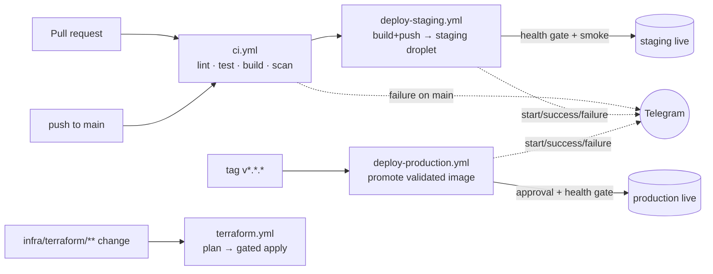

# Nexus Agent — CI/CD & Deployment

This directory holds every deployment profile. It is organized **by target** so
each environment's config is self-contained:

```
deploy/
  mini/    reference source-build topology (docker compose, target-state)
  do/      DigitalOcean droplet — PRODUCTION shape, Docker Hub images + Caddy (LE TLS)
  local/   local deploy TEST — same topology as do/, built locally, Caddy internal TLS
  eks/     Kubernetes (DOKS/EKS) — future, additive (placeholder)
```

Infrastructure-as-code and pipelines live alongside:

```
infra/terraform/do/    droplet + firewall + reserved IP + DNS (state in DO Spaces)
infra/terraform/eks/   Kubernetes IaC — future (placeholder)
.github/workflows/     ci.yml, deploy-staging.yml, deploy-production.yml, terraform.yml
.github/actions/telegram-notify/   reusable notification action
scripts/               deploy.sh, smoke-test.sh, bootstrap-droplet.sh
```

## Pipeline at a glance



- **CI** (`ci.yml`) runs on every PR/push. It detects which components have source
  and skips absent ones, so it stays green on this spec-stage repo and lights up
  automatically once `backend-go/` or `backend-python/` land. Security scans
  (gitleaks, Trivy, Checkov) start advisory — flip `continue-on-error: false` to
  enforce.
- **Staging** deploys automatically on push to `main`: images build + push to
  Docker Hub (`sha-<short>` + `staging`), then `scripts/deploy.sh` rolls the
  droplet forward with a health gate and auto-rollback.
- **Production** deploys on a `v*.*.*` tag (or manual dispatch). It **re-tags the
  staging-validated image** — no rebuild — behind the `production` Environment's
  required-reviewer gate.
- **Terraform** plans on infra PRs (comments the plan) and applies on `main`
  behind the `infra` Environment gate. State lives in DigitalOcean Spaces.

## Required GitHub secrets & variables

| Name | Kind | Purpose |
|---|---|---|
| `DOCKERHUB_USERNAME` | secret | Docker Hub login |
| `DOCKERHUB_TOKEN` | secret | Docker Hub access token |
| `DOCKERHUB_NAMESPACE` | variable | Image namespace (defaults to username) |
| `DO_API_TOKEN` | secret | DigitalOcean API token (Terraform provider) |
| `DO_SPACES_KEY` / `DO_SPACES_SECRET` | secret | Spaces keys for Terraform state backend |
| `SSH_PRIVATE_KEY` | secret | Key authorized on the droplets' `deploy` user |
| `STAGING_HOST` / `PROD_HOST` | secret | Droplet IPs / hostnames |
| `DEPLOY_USER` | secret (optional) | SSH user (defaults to `deploy`) |
| `TELEGRAM_BOT_TOKEN` / `TELEGRAM_CHAT_ID` | secret | Notification channel (omit to disable) |

App/host secrets (`POSTGRES_PASSWORD`, `VAULT_TOKEN`, `OIDC_*`, `APP_DOMAIN`,
`ACME_EMAIL`) live in `/opt/nexus/.env` on the droplet — seeded by
`scripts/bootstrap-droplet.sh`, never in the repo.

You also need GitHub **Environments** named `staging`, `production`, and `infra`
(add required reviewers to `production` and `infra`).

## First-time setup

1. **Provision infra** (per environment):
   ```bash
   cd infra/terraform/do
   terraform init -backend-config="key=nexus/staging/terraform.tfstate"
   terraform apply -var-file=environments/staging.tfvars
   ```
   Note the `public_ip` output → set it as `STAGING_HOST`.
2. **Bootstrap the droplet** (once):
   ```bash
   sudo bash scripts/bootstrap-droplet.sh "ssh-ed25519 AAAA... deploy-key"
   # then edit /opt/nexus/.env with real secrets, and install nexus-sandboxd
   ```
3. **Deploy** — push to `main` (staging) or tag `v1.0.0` (production).

## Local deploy test

Validate the exact production cutover path on your machine before shipping:

```bash
cd deploy/local
cp .env.local.example .env
docker compose -f docker-compose.local.yml up -d --build
# → https://localhost  (Caddy internal TLS; browser will warn — expected)
curl -k https://localhost/healthz
```

This mirrors `deploy/do` (Caddy front-door, health-checked services) but builds
images locally and uses Caddy's internal CA instead of Let's Encrypt.

> **Do not** bind-mount `/var/run/docker.sock` into the app to "fix" sandbox
> provisioning — the create path is the privilege-separated `nexus-sandboxd` host
> daemon (see [`../mini/README.md`](../mini/README.md), spec `FR-059`).
