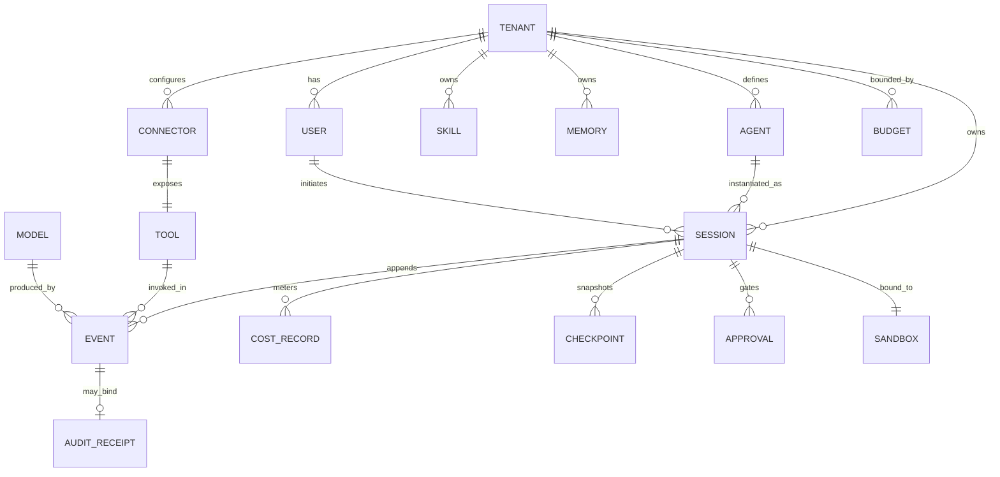

# Phase 1 Data Model: Production-Grade AI Agent Platform

**Feature**: `001-agent-platform` | **Date**: 2026-07-17 | **Plan**: [plan.md](plan.md)

Derived from the spec's Key Entities and Functional Requirements. **Tenant is the
first dimension** of every keyed entity; isolation is enforced at the data layer
via Postgres row-level security (RLS), never by application ACLs alone (FR-038,
FR-039). Immutable entities are written once and never updated in place; the only
mutable runtime state is the append-only event log (FR-006).

---

## Entity overview

---

## Immutable configuration entities

### Tenant
The first-class isolation boundary for data, secrets, budgets, rate limits,
workspaces, and audit.

| Field | Type | Notes |
|-------|------|-------|
| `tenant_id` | UUID (PK) | First dimension of every keyed row |
| `name` | string | Display name |
| `region` | string | Data-residency / region pinning |
| `retention_days` | int | Memory retention; default 90, overridable (FR-019) |
| `deployment_tier` | enum | `saas` / `single_tenant` / `byoc` / `hybrid` |
| `identity_config` | jsonb | SSO/OIDC settings |
| `rbac_map` | jsonb | Role → permission-scope map |
| `created_at` | timestamptz | |

- **Validation**: `retention_days > 0`; regulated tiers may tighten/extend by config.
- **RLS**: root of the isolation model — every other table's policy joins on `tenant_id`.

### User
The delegated identity whose RBAC permission scope the agent acts within (FR-035).

| Field | Type | Notes |
|-------|------|-------|
| `user_id` | UUID (PK) | |
| `tenant_id` | UUID (FK) | RLS key |
| `external_subject` | string | OIDC subject |
| `roles` | string[] | Resolve to scopes via tenant `rbac_map` |
| `created_at` | timestamptz | |

### Agent
An immutable configuration (persona/bootstrap, toolset profile, autonomy level)
that produces the next action from history — not code, never forked per customer
(FR-050).

| Field | Type | Notes |
|-------|------|-------|
| `agent_id` | UUID (PK) | |
| `tenant_id` | UUID (FK) | RLS key |
| `version` | int | Immutable; new version = new row (FR-042) |
| `bootstrap` | text | Markdown persona (`SOUL.md`/`IDENTITY.md`/`TOOLS.md`) |
| `toolset_profile` | enum | `read_only` / `coding` / `messaging` / `full` |
| `autonomy_level` | enum | `read_only` / `supervised` / `full` |
| `created_at` | timestamptz | |

- **Immutability**: a change is a new versioned row; a prompt/model change is a deploy.

### Tool
A self-describing capability with input schema and per-invocation checks; a built-in
or a per-tenant permission-scoped connector (FR-007, FR-011).

| Field | Type | Notes |
|-------|------|-------|
| `tool_id` | string (PK) | Namespaced (e.g. `asana_search`) |
| `description` | text | Progressive-disclosure summary |
| `input_schema` | jsonb | Validated per invocation |
| `capability` | enum | `read_only` / `mutating` |
| `concurrency_safe` | bool | Default false (fail-closed, FR-008) |
| `connector_id` | UUID (FK, nullable) | Set when tool is a connector |

- **Note**: safety is judged **per invocation on parsed input**, not stored per tool (FR-009).

### Model / Provider
A pluggable backend accessed only through one abstraction with a normalized stream
contract and deterministic, auditable routing (FR-027).

| Field | Type | Notes |
|-------|------|-------|
| `model_id` | string (PK) | e.g. `anthropic:...`, `self-hosted:vllm-...` |
| `provider` | enum | `anthropic` / `openai_compatible` / `bedrock` / `vertex` / `cli` / `self_hosted` |
| `capability_floor` | int | Feature-demand routing floor |
| `data_labels_allowed` | string[] | e.g. `regulated` → self-hosted only (FR-037) |

### Skill
A versioned, progressively disclosed procedure; growable by the agent only through
a human/eval promotion gate (FR-020, FR-021).

| Field | Type | Notes |
|-------|------|-------|
| `skill_id` | UUID (PK) | |
| `tenant_id` | UUID (FK) | RLS key |
| `name` | string | |
| `description` | text | Always visible (progressive disclosure) |
| `body` | text | Loaded on demand |
| `version` | int | Immutable per version |
| `status` | enum | `proposed` / `approved` / `promoted` — never auto-promoted |
| `created_at` | timestamptz | |

- **State transitions**: `proposed → approved (human+eval gate) → promoted`. No edge skips the gate.

### Connector
An external system-of-record integration attached only through the vetted,
per-tenant, RBAC-scoped catalog (FR-012).

| Field | Type | Notes |
|-------|------|-------|
| `connector_id` | UUID (PK) | |
| `tenant_id` | UUID (FK) | RLS key |
| `kind` | string | `jira` / `salesforce` / `github` / … |
| `secret_handle` | string | Vault handle; never the raw credential (FR-034) |
| `scope` | jsonb | RBAC scope, per calling user |

---

## Mutable runtime state (append-only)

### Session / Conversation
The only mutable runtime state: an append-only, event-sourced log keyed first by
tenant, replayable and auditable (FR-006, FR-041).

| Field | Type | Notes |
|-------|------|-------|
| `session_id` | UUID (PK) | |
| `session_key` | string | `{tenant_id}:{...}` — routing + serial lock key |
| `tenant_id` | UUID (FK) | First dimension, RLS key |
| `user_id` | UUID (FK) | Delegated identity |
| `agent_id` | UUID (FK) | + version |
| `status` | enum | `queued` / `running` / `suspended` / `terminal` |
| `terminal_reason` | enum (nullable) | `completed` / `max_turns` / `cost_exhausted` / `error` / `aborted` / `prompt_too_long` / `hook_stopped` / `approval_expired` (FR-004) |
| `created_at` | timestamptz | |

- **Concurrency**: per-session serial (lock on `session_key`), cross-session concurrent.

### Event
A typed, timestamped, attributable record appended to the log — the single source
of truth (FR-002, FR-003, FR-040).

| Field | Type | Notes |
|-------|------|-------|
| `event_id` | UUID (PK) | |
| `session_id` | UUID (FK) | |
| `tenant_id` | UUID (FK) | RLS key |
| `seq` | bigint | Monotonic per session (append-only) |
| `type` | enum | `thought` / `action` / `observation` / `tool_use` / `tool_result` / `condensation` |
| `payload` | jsonb | Structured; large blobs offloaded to object storage by ref (FR-010) |
| `tool_id` | string (nullable) | For `tool_use` / `tool_result` |
| `pair_ref` | UUID (nullable) | Links `tool_result` to its `tool_use` (invariant, FR-003) |
| `model_id` | string (nullable) | For model-produced events |
| `created_at` | timestamptz | |

- **Invariant**: every `tool_use` has a paired `tool_result` (synthetic on cancel/error) before the next model call.

### Checkpoint
Durable snapshot enabling resume-from-last-checkpoint rather than restart (FR-024).

| Field | Type | Notes |
|-------|------|-------|
| `checkpoint_id` | UUID (PK) | |
| `session_id` | UUID (FK) | |
| `tenant_id` | UUID (FK) | RLS key |
| `last_seq` | bigint | Event seq covered |
| `condensed_state` | jsonb | Structured checkpoint (durable memory, exec summary, verbatim requirements) |
| `created_at` | timestamptz | |

### Cost Record
Per-task and per-tenant token/cost accounting with hard ceilings and an explicit
exhaustion reason (FR-016, FR-017).

| Field | Type | Notes |
|-------|------|-------|
| `cost_id` | UUID (PK) | |
| `session_id` | UUID (FK) | Task chain attribution |
| `tenant_id` | UUID (FK) | RLS key |
| `turn_seq` | bigint | Per-turn granularity |
| `input_tokens` | int | |
| `output_tokens` | int | |
| `cost_usd` | numeric | |
| `latency_ms` | int | |
| `model_id` | string | |

- **Enforcement**: rolling sums checked against Budget; breach → session terminates with `cost_exhausted` + alert.

### Budget
Per-task and per-tenant ceilings.

| Field | Type | Notes |
|-------|------|-------|
| `budget_id` | UUID (PK) | |
| `tenant_id` | UUID (FK) | RLS key |
| `scope` | enum | `per_task` / `per_tenant` |
| `ceiling_usd` | numeric | Hard cap |
| `window` | enum | e.g. `run` / `monthly` |

### Memory
Per-tenant, retention-bounded durable knowledge injected immutably at session start
after injection screening (FR-019).

| Field | Type | Notes |
|-------|------|-------|
| `memory_id` | UUID (PK) | |
| `tenant_id` | UUID (FK) | RLS key |
| `kind` | enum | `working` / `episodic` / `semantic` (L0/L1/L2) |
| `content` | text | File-first; screened before injection |
| `expires_at` | timestamptz | Retention (default now+90d) |
| `screened` | bool | Injection/exfiltration scan passed |

- **Injection rule**: immutable snapshot at session start; updates take effect next session.

### Approval
Scoped human approval for high-impact actions; fail-closed on timeout (FR-036).

| Field | Type | Notes |
|-------|------|-------|
| `approval_id` | UUID (PK) | |
| `session_id` | UUID (FK) | |
| `tenant_id` | UUID (FK) | RLS key |
| `action_ref` | UUID | The gated `tool_use` event |
| `scope` | enum | `once` / `session` / `permanent` |
| `status` | enum | `pending` / `granted` / `denied` / `expired` |
| `ttl_expires_at` | timestamptz | On expiry → `expired` → run ends `approval_expired` |

- **State transitions**: `pending → granted` / `pending → denied` / `pending → expired` (TTL, fail-closed). `expired` and `denied` both block the action.

### Audit Receipt
Tamper-evident record binding a mutating action to session, tool, args, result, and
timestamp (FR-040; Security section).

| Field | Type | Notes |
|-------|------|-------|
| `receipt_id` | UUID (PK) | |
| `event_id` | UUID (FK) | The mutating action |
| `tenant_id` | UUID (FK) | RLS key |
| `user_id` | UUID (FK) | Attribution |
| `hmac` | bytea | HMAC over session + tool + args + result + timestamp |
| `created_at` | timestamptz | Immutable |

### Sandbox / Workspace
Per-tenant isolated execution environment from a warm pool with TTLs and caps; the
trust boundary (FR-047).

| Field | Type | Notes |
|-------|------|-------|
| `sandbox_id` | UUID (PK) | |
| `tenant_id` | UUID (FK) | RLS key |
| `session_id` | UUID (FK, nullable) | Bound while in use |
| `state` | enum | `warm` / `assigned` / `reclaimed` |
| `ttl_expires_at` | timestamptz | Hard TTL → reclamation |
| `isolation` | enum | `microvm` / `gvisor` / `container` (by topology) |

---

## Cross-cutting rules

- **RLS everywhere**: every table above (except global `Tool`/`Model` catalogs)
  carries `tenant_id` with a Postgres RLS policy; queries without a tenant context
  return zero rows (FR-039).
- **Immutability**: `Agent`, `Tool`, `Model`, `Skill` (per version), `Event`,
  `Audit Receipt` are write-once. Config changes create new versioned rows.
- **Append-only**: `Event` is never updated or deleted; `seq` is monotonic per
  session and the ordering is the source of truth for replay.
- **Attribution**: every `Event` and `Cost Record` ties to `tenant_id` + `user_id`;
  every mutating action produces an `Audit Receipt` (FR-040).
