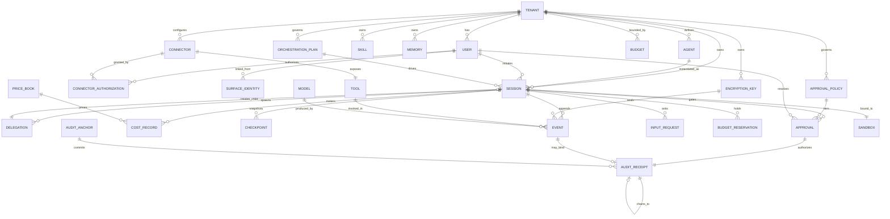

# Phase 1 Data Model: Production-Grade AI Agent Platform

**Feature**: `001-agent-platform` | **Date**: 2026-07-17 | **Plan**: [plan.md](plan.md)

Derived from the spec's Key Entities and Functional Requirements. **Tenant is the
first dimension** of every keyed entity; isolation is enforced at the data layer
via Postgres row-level security (RLS), never by application ACLs alone (FR-038,
FR-039). Immutable entities are written once and never updated in place; the only
mutable runtime state is the append-only event log (FR-006) — every other mutable
column in this document is a **projection** rebuildable by replaying that log
(FR-086), never an independent source of truth.

Three cross-cutting rules govern how these tables are read and written:

- **Tenant scope is transaction-local.** RLS reads a scope set with
  `SET LOCAL app.tenant_id` (or `SET ROLE LOCAL`) **inside** the transaction.
  Session-level `SET` is prohibited: the production topology places a
  transaction-pooling tier (PgBouncer) in front of Postgres, which reassigns a
  physical connection between tenants between statements, so session-level scope
  leaks across tenants (FR-039).
- **Content at rest is envelope-encrypted per tenant.** Every column marked
  *(encrypted)* holds ciphertext under a per-tenant (optionally per-erasure-
  subject) data key held outside the database; erasure is key destruction, not
  row deletion (FR-080, FR-089).
- **Integrity is chained, not per-record.** Audit receipts and event digests form
  a per-session hash chain whose head is anchored externally (FR-081).

---

## Entity overview

```mermaid
erDiagram
    TENANT ||--o{ USER : has
    TENANT ||--o{ AGENT : defines
    TENANT ||--o{ SESSION : owns
    TENANT ||--o{ SKILL : owns
    TENANT ||--o{ MEMORY : owns
    TENANT ||--o{ CONNECTOR : configures
    TENANT ||--o{ BUDGET : bounded_by
    AGENT ||--o{ SESSION : instantiated_as
    USER ||--o{ SESSION : initiates
    USER ||--o{ CONNECTOR_AUTHORIZATION : authorizes
    USER ||--o{ SURFACE_IDENTITY : linked_from
    CONNECTOR ||--o{ CONNECTOR_AUTHORIZATION : granted_by
    TENANT ||--o{ ORCHESTRATION_PLAN : governs
    ORCHESTRATION_PLAN ||--o{ SESSION : drives
    SESSION ||--o{ DELEGATION : spawns
    DELEGATION ||--o| SESSION : creates_child
    SESSION ||--o{ EVENT : appends
    SESSION ||--o{ COST_RECORD : meters
    SESSION ||--o{ CHECKPOINT : snapshots
    SESSION ||--o{ APPROVAL : gates
    SESSION ||--o{ INPUT_REQUEST : asks
    TENANT ||--o{ APPROVAL_POLICY : governs
    APPROVAL_POLICY ||--o{ APPROVAL : tiers
    USER ||--o{ APPROVAL : resolves
    APPROVAL ||--|| AUDIT_RECEIPT : authorizes
    SESSION ||--o{ BUDGET_RESERVATION : holds
    EVENT ||--o| AUDIT_RECEIPT : may_bind
    AUDIT_RECEIPT ||--o| AUDIT_RECEIPT : chains_to
    AUDIT_ANCHOR ||--o{ AUDIT_RECEIPT : commits
    ENCRYPTION_KEY ||--o{ EVENT : seals
    TENANT ||--o{ ENCRYPTION_KEY : owns
    TOOL ||--o{ EVENT : invoked_in
    CONNECTOR ||--|| TOOL : exposes
    SESSION ||--|| SANDBOX : bound_to
    MODEL ||--o{ EVENT : produced_by
    PRICE_BOOK ||--o{ COST_RECORD : prices
```

---

## Immutable configuration entities

### Tenant
The first-class isolation boundary for data, secrets, budgets, rate limits,
workspaces, and audit.

| Field | Type | Notes |
|-------|------|-------|
| `tenant_id` | UUID (PK) | First dimension of every keyed row |
| `name` | string | Display name |
| `region` | string | Data-residency / region pinning |
| `retention_days` | int | Memory retention; default 90, overridable (FR-019) |
| `deployment_tier` | enum | `saas` / `single_tenant` / `byoc` / `hybrid` |
| `identity_config` | jsonb | SSO/OIDC settings |
| `rbac_map` | jsonb | Role → permission-scope map |
| `created_at` | timestamptz | |

- **Validation**: `retention_days > 0`; regulated tiers may tighten/extend by config.
- **RLS**: root of the isolation model — every other table's policy joins on `tenant_id`.

### User
The delegated identity whose RBAC permission scope the agent acts within (FR-035).

| Field | Type | Notes |
|-------|------|-------|
| `user_id` | UUID (PK) | |
| `tenant_id` | UUID (FK) | RLS key |
| `external_subject` | string | OIDC subject |
| `roles` | string[] | Resolve to scopes via tenant `rbac_map` |
| `created_at` | timestamptz | |

### Agent
An immutable configuration (persona/bootstrap, toolset profile, autonomy level)
that produces the next action from history — not code, never forked per customer
(FR-050).

| Field | Type | Notes |
|-------|------|-------|
| `agent_id` | UUID (PK) | |
| `tenant_id` | UUID (FK) | RLS key |
| `version` | int | Immutable; new version = new row (FR-042) |
| `bootstrap` | text | Markdown persona (`SOUL.md`/`IDENTITY.md`/`TOOLS.md`) |
| `toolset_profile` | enum | `read_only` / `coding` / `messaging` / `full` |
| `autonomy_level` | enum | `read_only` (refuses every mutating capability) / `supervised` (approval on every mutating invocation) / `full` (approval per effect class + Rule of Two + `ApprovalPolicy`) — normative pipeline semantics, not a label (FR-111) |
| `created_at` | timestamptz | |

- **Immutability**: a change is a new versioned row; a prompt/model change is a deploy.
- **Autonomy is enforced, not advisory**: the three levels have defined effects in the execution pipeline and sit at a fixed position in the one published permission resolution order (FR-111, [contracts/tool-contract.md](contracts/tool-contract.md)). Raising a tenant's autonomy level carries a recorded governance sign-off (FR-096).

### Tool
A self-describing capability with input schema and per-invocation checks; a built-in
or a per-tenant permission-scoped connector (FR-007, FR-011).

| Field | Type | Notes |
|-------|------|-------|
| `tool_id` | string (PK) | Namespaced (e.g. `asana_search`) |
| `tenant_id` | UUID (FK, nullable) | **RLS key.** NULL only for genuinely global built-in definitions; any tool exposed by a per-tenant connector MUST carry its tenant (FR-011) |
| `description` | text | Progressive-disclosure summary |
| `input_schema` | jsonb | Validated per invocation |
| `capability` | enum | `read_only` / `mutating` |
| `concurrency_safe` | enum | `read_only` / `concurrency_safe` / `exclusive`; default `exclusive` (fail-closed, FR-008, FR-061) |
| `returns_untrusted` | bool | Taint leg A — output is untrusted content. Default **true** (fail-closed, FR-087) |
| `reads_private_data` | bool | Taint leg B — touches tenant/private data. Default **true** (FR-087) |
| `mutates_external` | bool | Taint leg C — changes external state or communicates outward. Default **true** (FR-087) |
| `effect_class` | enum (nullable) | For mutating tools: `payment` / `delete` / `external_send` / `prod_change` / `other` — the unit an approval scope may cover (FR-036) |
| `idempotency_key_spec` | jsonb (nullable) | How a stable per-effect key is derived for state-changing calls (FR-071) |
| `connector_id` | UUID (FK, nullable) | Set when tool is a connector |

- **Note**: safety is judged **per invocation on parsed input**, not stored per tool (FR-009). The three taint booleans are *declarations* consumed by the Rule-of-Two evaluator (FR-087); a tool whose declarations are missing is treated as engaging all three legs.
- **RLS**: policy applies where `tenant_id IS NOT NULL`; a tenant can neither enumerate nor invoke another tenant's catalog entries (FR-011, FR-039).
- **Built-ins**: the platform ships built-in tools — workspace-restricted filesystem (`file_read`/`file_write`/`file_search`/…), a sandboxed shell/code-execution tool, and web search/fetch (egress-allowlisted, untrusted results) — governed by the same three gates and per-invocation safety (FR-056–FR-058).

### Model / Provider
A pluggable backend accessed only through one abstraction with a normalized stream
contract and deterministic, auditable routing (FR-027).

| Field | Type | Notes |
|-------|------|-------|
| `model_id` | string (PK) | e.g. `anthropic:...`, `self-hosted:vllm-...` |
| `provider` | enum | `anthropic` / `openai_compatible` / `bedrock` / `vertex` / `cli` / `self_hosted` |
| `pinned_snapshot` | string | Exact provider snapshot; a change is an eval-gated deploy (FR-078) |
| `capability_floor` | int | Feature-demand routing floor |
| `data_labels_allowed` | string[] | e.g. `regulated` → self-hosted only (FR-037) |
| `regions_allowed` | string[] | Region pinning — a run MUST NOT route outside its tenant's region (FR-091) |

### Price Book
A versioned, effective-dated price table; cost is never computed from constants in
code, and every cost record names the version it used (FR-084).

| Field | Type | Notes |
|-------|------|-------|
| `price_book_version` | string (PK) | e.g. `2026-07-01.1` |
| `model_id` | string (FK, PK) | |
| `usd_per_1k_input_uncached` | numeric | |
| `usd_per_1k_input_cache_read` | numeric | The dominant term at >90% cache-read (FR-014) |
| `usd_per_1k_input_cache_write` | numeric | |
| `usd_per_1k_output` | numeric | |
| `effective_from` | timestamptz | |

- **Immutability**: a price change creates a new version; historical cost records recompute identically forever.

### Skill
A versioned, progressively disclosed procedure; growable by the agent only through
a human/eval promotion gate (FR-020, FR-021).

| Field | Type | Notes |
|-------|------|-------|
| `skill_id` | UUID (PK) | |
| `tenant_id` | UUID (FK) | RLS key |
| `name` | string | |
| `description` | text | Always visible (progressive disclosure) |
| `body` | text | Loaded on demand |
| `version` | int | Immutable per version |
| `status` | enum | `proposed` / `approved` / `promoted` — never auto-promoted |
| `created_at` | timestamptz | |

- **State transitions**: `proposed → approved (human+eval gate) → promoted`. No edge skips the gate.

### Connector
An external system-of-record integration attached only through the vetted,
per-tenant, RBAC-scoped catalog (FR-012).

| Field | Type | Notes |
|-------|------|-------|
| `connector_id` | UUID (PK) | |
| `tenant_id` | UUID (FK) | RLS key |
| `kind` | string | `jira` / `salesforce` / `github` / `gmail` / `gdrive` / `gcalendar` / `notion` / … |
| `secret_handle` | string | Vault handle; never the raw credential (FR-034) |
| `scope` | jsonb | RBAC scope, per calling user |
| `auth_kind` | enum | `tenant_service` (admin-configured) / `per_user_oauth` (personal, FR-052) |

### Connector Authorization
A per-user OAuth grant binding a `User` to a `Connector`, stored only in the
per-tenant vault and never exposed to the model (FR-052, FR-054). Applies to
personal connectors (`auth_kind = per_user_oauth`, e.g. Gmail/Drive/Calendar).

| Field | Type | Notes |
|-------|------|-------|
| `authorization_id` | UUID (PK) | |
| `tenant_id` | UUID (FK) | RLS key |
| `user_id` | UUID (FK) | The authorizing user (delegated scope, FR-054) |
| `connector_id` | UUID (FK) | Unique per `(tenant, user, connector)` |
| `token_handle` | string | Vault handle for access+refresh tokens; never in prompt/log (FR-052) |
| `scopes` | string[] | OAuth scopes granted at consent |
| `expires_at` | timestamptz | Access-token expiry; auto-refresh on/after |
| `status` | enum | `active` / `expired` / `revoked` |
| `created_at` | timestamptz | |

- **Uniqueness**: one active row per `(tenant_id, user_id, connector_id)`.
- **Lifecycle**: `active → expired (auto-refresh) → active`; user revoke → `revoked` (blocks use, fail-closed).
- **Secret rule**: only `token_handle` is stored; raw tokens live in the vault and never enter a prompt, transcript, or log.

### Surface Identity
A verified binding from an external consumer-surface identity (e.g. Telegram/Zalo
user id) to a platform `User` within a tenant; required before any action runs
from that surface (FR-055).

| Field | Type | Notes |
|-------|------|-------|
| `surface_identity_id` | UUID (PK) | |
| `tenant_id` | UUID (FK) | RLS key |
| `user_id` | UUID (FK) | The bound platform user (delegated identity) |
| `surface` | enum | `telegram` / `zalo` |
| `external_id` | string | The surface-native user/chat id |
| `verified` | bool | Linking step passed; unverified → denied (fail-closed) |
| `created_at` | timestamptz | |

- **Uniqueness**: one row per `(tenant_id, surface, external_id)`.
- **Rule**: an unverified or unlinked external identity performs zero actions (FR-055).

---

## Mutable runtime state (append-only)

### Session / Conversation
The only mutable runtime state: an append-only, event-sourced log keyed first by
tenant, replayable and auditable (FR-006, FR-041).

| Field | Type | Notes |
|-------|------|-------|
| `session_id` | UUID (PK) | |
| `session_key` | string | `{tenant_id}:{...}` — routing + serial lock key |
| `tenant_id` | UUID (FK) | First dimension, RLS key |
| `user_id` | UUID (FK) | Delegated identity |
| `agent_id` | UUID (FK) | |
| `agent_version` | int | **Pinned at run start and held for the run's life** so a concurrent deploy cannot shift behavior or bust the prompt prefix mid-run (FR-088, FR-013) |
| `data_label` | enum | `public` / `internal` / `regulated` — drives deterministic routing (FR-037) |
| `route_model_id` | string | The routing decision actually taken (auditable, replayable) |
| `route_reason` | jsonb | Why that model: data label, difficulty, capability floor (FR-076) |
| `execution_class` | enum | `interactive` / `batch` — the field priority load-shedding reads (FR-049, FR-088) |
| `priority` | int | Scheduling weight within the class |
| `region` | string | Placement region; a run outside the tenant's pin fails closed (FR-091) |
| `parent_session_id` | UUID (nullable) | Immediate parent in a delegation tree; NULL for a root run (FR-101) |
| `root_session_id` | UUID | Root of the delegation tree; equals `session_id` for a root run — the key cost rolls up to (FR-101) |
| `depth` | int | 0 for a root run; bounded by the FR-099 depth limit (default 1) |
| `delegation_role` | enum | `root` / `leaf` — a `leaf` cannot delegate further (FR-098, FR-099) |
| `plan_id` / `plan_version` | UUID / int (nullable) | The orchestration plan version driving this run, pinned at start (FR-102) |
| `taint_state` | jsonb | Rule-of-Two legs engaged so far, plus the last sanitization boundary (FR-087) — *projection* |
| `status` | enum | `queued` / `running` / `suspended` / `terminal` — *projection* |
| `autonomy_level` | enum | `read_only` / `supervised` / `full`, **pinned at run start** and ratcheting — tightenable mid-run, never widenable by any path (FR-111) |
| `terminal_reason` | enum (nullable) | `completed` / `max_turns` / `cost_exhausted` / `error` / `aborted` / `prompt_too_long` / `hook_stopped` / `approval_expired` / `input_expired` (FR-004) — *projection* |
| `created_at` | timestamptz | |

- **Concurrency**: per-session serial (lock on `session_key`), cross-session concurrent.
- **Projections**: `status`, `terminal_reason`, and `taint_state` are derived from the event log and rebuildable by replay; they are read paths, not truth (FR-086).
- **Delegation chain**: `root_session_id` + `parent_session_id` + `depth` are written at session creation and never updated. They are a **foundational seam, not a later feature** — retrofitting a chain onto historical cost records and receipts is exactly the migration the append-only log exists to avoid, so the columns ship in Increment 1 even though delegation itself is deferred (see plan.md "MVP cut line").
- **Scope descent**: a child session's resolved scope (tool catalog, connector authorizations, egress allowlist, `data_label`, `region`) is a **subset** of its parent's at creation time and is never widened afterward (FR-098).
- **Suspension**: a session awaiting human approval, an input request, or a long external job sits in `suspended` at **zero ongoing token cost**, resumed by an event rather than polled (FR-036, FR-110).
- **Autonomy ratchet**: `autonomy_level` is pinned at run start like `agent_version` and may only move toward *more* restrictive within the run. No model output, tool result, steering message, hook, or delegation parameter may widen it — a mid-run widening is a direct prompt-injection lever (FR-111).
- **No approval outlives its run**: reaching any terminal state, being cancelled, being reaped, or breaching a ceiling invalidates every outstanding `Approval` and `Input Request` for the session *before* the terminal event is appended (FR-106).

### Event
A typed, timestamped, attributable record appended to the log — the single source
of truth (FR-002, FR-003, FR-040).

| Field | Type | Notes |
|-------|------|-------|
| `event_id` | UUID (PK) | |
| `session_id` | UUID (FK) | |
| `tenant_id` | UUID (FK) | RLS key |
| `seq` | bigint | Monotonic per session (append-only) |
| `schema_version` | int | **Envelope version**; upcasting keeps old events replayable (FR-086) |
| `type` | enum | See the taxonomy below (FR-085) |
| `payload` | jsonb *(encrypted)* | Ciphertext under the tenant/subject key; large blobs offloaded to object storage by ref (FR-010, FR-080) |
| `payload_digest` | bytea | Digest over plaintext, bound by the audit chain — survives crypto-shredding (FR-081) |
| `key_id` | string | Which content-encryption key sealed this payload; destroying it is erasure (FR-080) |
| `actor` | enum | `model` / `tool` / `user` / `system` — who produced the event |
| `tool_id` | string (nullable) | For `tool_use` / `tool_result` |
| `pair_ref` | UUID (nullable) | Links `tool_result` to its `tool_use` (invariant, FR-003) |
| `model_id` | string (nullable) | For model-produced events |
| `created_at` | timestamptz | |

**Event taxonomy** (`type`) — must be complete enough to replay any run from the
log alone, and identical to the externally published event contract (FR-085):

| Group | Types |
|-------|-------|
| Model output | `thought` · `content` · `tool_use` |
| Tool | `tool_result` (incl. synthetic) · `tool_receipt_ref` |
| Context | `condensation` · `checkpoint` |
| Human (push) | `user_message` (the mid-run steering input of FR-005) |
| Human (pull) | `input_requested` · `input_answered` · `input_expired` · `input_invalidated` (FR-110) |
| Approval | `approval_requested` · `approval_notified` · `approval_reminded` · `approval_escalated` · `approval_granted` · `approval_granted_modified` · `approval_denied` · `approval_expired` · `approval_invalidated` · `approval_resolution_refused` · `approval_mismatch` (FR-036, FR-103–FR-108) |
| Safety | `taint_transition` · `sanitization_boundary` (FR-087) |
| Delegation | `delegation_requested` · `delegation_refused` (bound/scope/admission) · `delegation_returned` · `delegation_reaped` (FR-098–FR-101) |
| Orchestration | `plan_started` · `plan_step_entered` · `plan_transition` · `plan_step_exited` · `plan_completed` (FR-102) |
| Lifecycle | `error` · `terminal` (carries the FR-004 typed reason) · `erasure` (FR-080) |

- **Invariant**: every `tool_use` has a paired `tool_result` (synthetic on cancel/error) before the next model call — a **total** invariant over all histories, therefore property-tested (FR-097).
- **Replay completeness**: a run whose steering, approval outcome, or termination cannot be reconstructed from these events alone violates FR-006.

### Delegation
The bounded parent→child record that makes a delegation tree attributable and
replayable (FR-079, FR-098–FR-101). One row per delegation attempt, including
refused and reaped ones — a delegation that never ran is itself audit-relevant.

| Field | Type | Notes |
|-------|------|-------|
| `delegation_id` | UUID (PK) | |
| `tenant_id` | UUID (FK) | RLS key |
| `parent_session_id` | UUID (FK) | The delegating run |
| `child_session_id` | UUID (FK, nullable) | NULL when admission was refused before a child existed |
| `root_session_id` | UUID (FK) | Tree root (FR-101) |
| `depth` | int | Child's depth; refused when > the FR-099 limit |
| `pair_ref` | UUID | The parent `tool_use` this delegation answers — the paired-result invariant applies (FR-003) |
| `scope_snapshot` | jsonb | The child's resolved scope, proven a subset of the parent's at call time (FR-098) |
| `taint_at_spawn` | jsonb | Parent taint when the child was created (context for the return fold) |
| `taint_engaged` | jsonb | Legs the child actually engaged; folded into the parent on return (FR-087) |
| `return_schema` | jsonb | Validated on return, never trusted (FR-100) |
| `acceptance` | jsonb | The criterion the summary is judged against — no self-declared success (FR-044) |
| `max_summary_tokens` | int | Platform-enforced by truncation (default ~1–2k / ~8 KB) |
| `ceiling_usd` | numeric | This child's draw from the parent's fan-out envelope (FR-099) |
| `outcome` | enum | `accepted` / `rejected_schema` / `rejected_acceptance` / `bound_exceeded` / `child_error` / `reaped` |
| `reap_reason` | enum (nullable) | `parent_terminal` / `parent_cancelled` / `ceiling_exhausted` |
| `created_at` / `closed_at` | timestamptz | |

- **Immutable once closed**; the lifecycle is reconstructable from the delegation events below.
- **Refusals are rows too**: a `bound_exceeded` admission refusal is recorded, so a runaway fan-out attempt is visible rather than silent.
- **Scope is snapshotted, not referenced** — proving descent after the fact requires the scope as it stood at spawn time, not as it stands now.

### Orchestration Plan
A versioned, tenant-scoped, immutable declaration of control flow the platform
evaluates at **zero model-token cost** (FR-102). See
[contracts/orchestration-plane.md](contracts/orchestration-plane.md).

| Field | Type | Notes |
|-------|------|-------|
| `plan_id` | UUID (PK) | |
| `tenant_id` | UUID (FK) | RLS key — one tenant may neither enumerate nor run another's plans |
| `version` | int (PK part) | Immutable; a change publishes a new version |
| `status` | enum | `draft` / `gated` / `enabled` / `retired` |
| `steps` | jsonb | Steps, transitions, bounded loops, approval gates, fan-outs |
| `pinned_routes` | jsonb | Per-step `agent_version` + `route_model_id`, frozen at enable (FR-088) |
| `cost_envelope_usd` | numeric | Reserved before step 1 (FR-083, FR-099) |
| `eval_run_id` | UUID (nullable) | The gate run that cleared it (FR-043) |
| `governance_signoff` | jsonb (nullable) | Recorded approver + timestamp; required to reach `enabled` (FR-096) |
| `created_at` | timestamptz | |

- **A plan version cannot reach `enabled`** without both `eval_run_id` and `governance_signoff` — the same bar a new tool or connector clears.
- **In-flight runs finish on the version they started with** (FR-026).

### Checkpoint
Durable snapshot enabling resume-from-last-checkpoint rather than restart (FR-024).

| Field | Type | Notes |
|-------|------|-------|
| `checkpoint_id` | UUID (PK) | |
| `session_id` | UUID (FK) | |
| `tenant_id` | UUID (FK) | RLS key |
| `last_seq` | bigint | Event seq covered |
| `condensed_state` | jsonb | Structured checkpoint (durable memory, exec summary, verbatim requirements) |
| `created_at` | timestamptz | |

### Cost Record
Per-task and per-tenant token/cost accounting with hard ceilings and an explicit
exhaustion reason (FR-016, FR-017).

| Field | Type | Notes |
|-------|------|-------|
| `cost_id` | UUID (PK) | |
| `session_id` | UUID (FK) | Task chain attribution |
| `tenant_id` | UUID (FK) | RLS key |
| `user_id` | UUID (FK) | Chargeback dimension (FR-093) |
| `agent_id` | UUID (FK) | Chargeback dimension |
| `surface` | string | Chargeback dimension |
| `turn_seq` | bigint | Per-turn granularity |
| `input_tokens_uncached` | int | **Split by token class** — the cache-read rate of FR-014/SC-003 is otherwise unmeasurable |
| `input_tokens_cache_read` | int | |
| `input_tokens_cache_write` | int | |
| `output_tokens` | int | |
| `price_book_version` | string (FK) | Which price table produced `cost_usd` (FR-084) |
| `cost_usd` | numeric | Derived, reproducible from tokens × price book |
| `latency_ms` | int | |
| `parent_session_id` | UUID (nullable) | Immediate parent — sub-agent spend attributed to the parent task (FR-079) |
| `root_session_id` | UUID | Root of the delegation tree; the key ceilings, showback, and chargeback roll up to (FR-101, FR-093) |
| `depth` | int | Position in the tree; 0 for a root run |
| `model_id` | string | |

- **Cache-read rate** = `input_tokens_cache_read / (uncached + cache_read + cache_write)`, computed from recorded measurements, never estimated (SC-017).
- **Enforcement is pre-spend**: see `Budget Reservation` below. Post-hoc rolling sums reconcile; they do not gate.
- **Tree roll-up**: a run's true cost is `SUM(cost_usd) WHERE root_session_id = :root`. Attributing only to `parent_session_id` cannot reconstruct a multi-hop delegation and understates a nested tree (FR-101, SC-022).

### Budget
Per-task and per-tenant ceilings.

| Field | Type | Notes |
|-------|------|-------|
| `budget_id` | UUID (PK) | |
| `tenant_id` | UUID (FK) | RLS key |
| `scope` | enum | `per_task` / `per_tenant` |
| `ceiling_usd` | numeric | Hard cap |
| `window` | enum | e.g. `run` / `monthly` |
| `alert_threshold_pct` | int | Warn before the hard stop (SC-002) |

### Budget Reservation
The pre-spend gate that makes a ceiling a ceiling rather than an after-the-fact
detection (FR-083). Held in an atomic store (Redis) with a durable reconciliation
record; a reservation is taken **before** each model call.

| Field | Type | Notes |
|-------|------|-------|
| `reservation_id` | UUID (PK) | |
| `session_id` | UUID (FK) | |
| `tenant_id` | UUID (FK) | RLS key |
| `turn_seq` | bigint | |
| `reserved_usd` | numeric | Worst case: measured input + reserved `max_tokens` output at price-book rates |
| `state` | enum | `held` / `reconciled` / `released` / `expired` |
| `created_at` | timestamptz | TTL-bounded so a crashed worker cannot strand budget |

- **Rule**: if `sum(held) + actuals + this reservation > ceiling`, the call is refused and the run terminates `cost_exhausted` — *before* the tokens are spent.
- **Reconciliation**: on completion the actual cost replaces the hold and the remainder is released; expiry releases a stranded hold.

### Memory
Per-tenant, retention-bounded durable knowledge injected immutably at session start
after injection screening (FR-019).

| Field | Type | Notes |
|-------|------|-------|
| `memory_id` | UUID (PK) | |
| `tenant_id` | UUID (FK) | RLS key |
| `kind` | enum | `working` / `episodic` / `semantic` (L0/L1/L2) |
| `content` | text | File-first; screened before injection |
| `expires_at` | timestamptz | Retention (default now+90d) |
| `screened` | bool | Injection/exfiltration scan passed |

- **Injection rule**: immutable snapshot at session start; updates take effect next session.

### Approval
The authorization **transaction** for a high-impact invocation — bound to the exact
input it authorizes, rendered to a named approver, resolvable only by an authorized
human, and invalidated with the run it gates (FR-036, FR-103–FR-108).

| Field | Type | Notes |
|-------|------|-------|
| `approval_id` | UUID (PK) | |
| `session_id` | UUID (FK) | |
| `tenant_id` | UUID (FK) | RLS key |
| `action_ref` | UUID | The gated `tool_use` event — **identity, not authorization** |
| `approved_input_digest` | bytea | **What the grant actually authorizes** (FR-103): canonical digest over `tool_id` + fully resolved input. Re-verified immediately before execute; divergence → typed `approval_mismatch` |
| `idempotency_key` | string | Derived from the same digest, so approved / executed / de-duplicated are provably one invocation (FR-071) |
| `kind` | enum | `single` / `batch` / `plan_preauth` — a batch or pre-authorization **enumerates** its members (FR-109) |
| `member_digests` | bytea[] (nullable) | For `batch` / `plan_preauth`: the enumerated set an invocation must match to be admitted. Non-empty when `kind ≠ single` |
| `effect_class` | enum | `payment` / `delete` / `external_send` / `prod_change` / `other` |
| `risk_tier` | enum | Resolved from the `ApprovalPolicy` at request time — recorded, so the policy version that gated this is replayable |
| `context_package` | jsonb *(encrypted)* | The decision-ready package of FR-104: action summary, blast-radius parameters, taint legs, cost + delegation chain, requester |
| `redaction_policy_version` | string | Which masking rules produced `context_package` (FR-037, FR-104) |
| `context_mode` | enum | `local` / `upstream` — where the package may be rendered (FR-091, FR-104) |
| `assignee_ref` | jsonb | Declared recipient: user, approver group, or rotation — never an implicit broadcast (FR-108) |
| `escalation_chain` | jsonb | Ordered fallback approvers + reminder/escalation offsets (FR-108) |
| `required_approvals` | int | ≥2 for tenant-configured multi-party classes (FR-105); default 1 |
| `separation_of_duties` | bool | True for irreversible classes: resolver ≠ run initiator (FR-105) |
| `step_up_required` | bool | Resolution demands fresh re-authentication (FR-105) |
| `resolution_token_hash` | bytea | Hash of the single-use channel token bound to `approval_id` + resolver; invalid after first use and after TTL (FR-105) |
| `scope` | enum | `once` / `session` / `standing` — **no unbounded `permanent`** (FR-036) |
| `scope_tool_id` | string (nullable) | A scope names the tool it covers |
| `scope_effect_class` | enum (nullable) | …and the effect class it covers |
| `scope_expires_at` | timestamptz (nullable) | Every scope wider than `once` carries an expiry — no scope permanently ungates a class |
| `status` | enum | `pending` / `granted` / `granted_modified` / `denied` / `expired` / `invalidated` — *projection* of the approval events |
| `ttl_expires_at` | timestamptz | Decision deadline; on expiry → `expired` (fail-closed) |
| `resolved_by` | UUID (nullable) | The approving **human** — attribution (FR-040). Agent/service principals can never be written here |
| `resolved_authn_method` | string (nullable) | How that human was authenticated at resolution (step-up evidence) |
| `resolved_channel` | string (nullable) | Where the decision came from (web / Slack / Telegram / API) |
| `resolution_note` | text (nullable) *(encrypted)* | Deny rationale or modification reason, returned to the loop (FR-107) |
| `invalidation_reason` | enum (nullable) | `run_cancelled` / `run_terminal` / `reaped` / `steered` / `ceiling_exhausted` (FR-106) |

- **State transitions**: `pending → granted` / `granted_modified` / `denied` / `expired` (TTL, fail-closed) / `invalidated` (FR-106). Everything except `granted` and `granted_modified` blocks the action. There is no transition out of a resolved state — a second decision on a resolved approval is a **refused resolution**, recorded, never an overwrite.
- **A grant authorizes a digest, not an intent** (FR-103): execution re-verifies `approved_input_digest` and refuses on divergence. `action_ref` identifies *which* call was gated; it does not survive a change of arguments and is never sufficient on its own.
- **Grant-with-modification** (FR-107): the approver's input becomes authoritative, `approved_input_digest` is recomputed over it, and the agent is not told the request executed unmodified.
- **Expiry semantics**: the action is denied, and the denial — carrying `resolution_note` where present — is returned to the loop as a **typed synthetic `tool_result`** so the agent may replan or finish without it; the run ends `approval_expired` (still returning its best partial artifact, FR-067) only when it cannot proceed. While `pending`, the session is `suspended` at zero token cost.
- **Invalidation is mandatory, not best-effort** (FR-106): cancel, terminal, reap, ceiling breach, and steering-while-suspended all invalidate outstanding approvals **before** the run terminates, each releasing a paired synthetic `tool_result` (FR-003). A pending approval MUST NOT outlive the run state it was requested against.
- **Every outcome is an event** — `approval_requested` / `notified` / `reminded` / `escalated` / `granted` / `granted_modified` / `denied` / `expired` / `invalidated` / `resolution_refused` — and this table is the projection (FR-085).
- **Every resolution emits a chained receipt** binding approver, authn method, channel, digest, scope, and decision (FR-112) — the authorization record is not merely a mutable projection.

### Approval Policy
The versioned, tenant-scoped rule set that bounds **how often** a human is asked, so
the effect-class gate does not degrade into rubber-stamping (FR-109).

| Field | Type | Notes |
|-------|------|-------|
| `policy_id` | UUID (PK) | |
| `tenant_id` | UUID (FK) | RLS key |
| `version` | int (PK part) | Immutable; a change publishes a new version (FR-042) |
| `rules` | jsonb | Ordered (effect class × risk tier × value threshold × autonomy level) → `auto` / `once` / `session` / `multi_party` |
| `routing` | jsonb | Per-class assignee/group/rotation, reminder offsets, escalation chain (FR-108) |
| `step_up_classes` | enum[] | Effect classes demanding fresh re-authentication (FR-105) |
| `redaction_policy` | jsonb | Masking rules producing the `context_package` (FR-037, FR-104) |
| `eval_run_id` | UUID (nullable) | The gate run that cleared it (FR-043) |
| `governance_signoff` | jsonb (nullable) | Recorded approver + timestamp; required to enable (FR-096) |

- **Behavior-bearing config**: a policy version cannot be enabled without both `eval_run_id` and `governance_signoff` — the same bar a tool, connector, or plan clears.
- **Evaluated deterministically** and recorded on the `Approval` (`risk_tier`, plus the policy version), so *why this needed a human* replays.
- **Never model-widenable**: no model-facing parameter selects, edits, or relaxes a policy; an `auto` rule still passes the per-invocation safety check and the Rule of Two (FR-111).

### Input Request
The agent→human **pull** channel — a schema-declared question, distinct from an
approval and carrying no authorization (FR-110).

| Field | Type | Notes |
|-------|------|-------|
| `input_request_id` | UUID (PK) | |
| `session_id` | UUID (FK) | |
| `tenant_id` | UUID (FK) | RLS key |
| `pair_ref` | UUID | The `tool_use` this answers — the paired-result invariant applies (FR-003) |
| `question` | jsonb *(encrypted)* | Prompt plus presentation hints |
| `answer_schema` | jsonb | JSON Schema the response is validated against |
| `assignee_ref` | jsonb | Declared recipient (FR-108) |
| `on_expiry` | enum | **Caller-declared**: `assume_default` / `terminate` (FR-110) |
| `default_answer` | jsonb (nullable) *(encrypted)* | Required when `on_expiry = assume_default`; recorded so the assumption is auditable |
| `status` | enum | `pending` / `answered` / `expired` / `invalidated` — *projection* |
| `ttl_expires_at` | timestamptz | Decision deadline |
| `answered_by` | UUID (nullable) | Attribution |
| `answer` | jsonb (nullable) *(encrypted)* | Schema-validated; **untrusted content** subject to the input guard (FR-069) |

- **Not an approval**: an `Input Request` can never satisfy FR-036. The two share the durable-suspend machinery and nothing else — an unanswered question is not a denied action.
- **Expiry is declared, not assumed**: `assume_default` resolves with a recorded assumption and continues; `terminate` ends the run `input_expired` (FR-004) returning its partial artifact (FR-067).
- **Invalidated with the run** on cancel/terminal/reap/steer, exactly like an approval (FR-106).

### Audit Receipt
Tamper-evident record binding a mutating action to session, tool, args, result, and
timestamp (FR-040; Security section).

| Field | Type | Notes |
|-------|------|-------|
| `receipt_id` | UUID (PK) | |
| `kind` | enum | `action` (a mutating invocation) / `authorization` (an approval decision, FR-112) — both chain into the same per-session chain |
| `event_id` | UUID (FK) | The mutating action, or the approval-decision event |
| `approval_id` | UUID (FK, nullable) | For `kind = authorization`: binds approver identity, `resolved_authn_method`, `resolved_channel`, `approved_input_digest`, scope + expiry, and the decision |
| `tenant_id` | UUID (FK) | RLS key |
| `user_id` | UUID (FK) | Attribution — the human whose delegated scope authorized this |
| `session_id` | UUID (FK) | The run that acted |
| `root_session_id` | UUID (FK) | Tree root — with `delegation_path`, answers "through which chain of agents" (FR-101) |
| `delegation_path` | UUID[] | Ordered root→…→acting session; empty for a root run. A receipt naming only its immediate parent cannot reconstruct a multi-hop delegation |
| `chain_seq` | bigint | Monotonic per session — a gap is detectable tampering |
| `prev_digest` | bytea | Digest of the preceding receipt: **the chain** (FR-081) |
| `digest` | bytea | Over `prev_digest` + session + `delegation_path` + tool + arg/result **digests** + timestamp — never plaintext, so a lawful redaction cannot break verification |
| `signature` | bytea | Produced by a **sign-only** KMS/HSM key the data plane cannot read |
| `created_at` | timestamptz | Immutable |

- **Two chains, one record**: `chain_seq`/`prev_digest` prove *integrity* over time; `root_session_id`/`delegation_path` prove *authority* across a delegation tree. Neither substitutes for the other (FR-081, FR-101).

### Audit Anchor
The external commitment that makes the chain tamper-*evident* rather than merely
tamper-resistant (FR-081).

| Field | Type | Notes |
|-------|------|-------|
| `anchor_id` | UUID (PK) | |
| `tenant_id` | UUID (FK) | RLS key |
| `chain_head_digest` | bytea | Root/head committed at this point |
| `covers_through_seq` | bigint | |
| `external_ref` | string | Where it was anchored (append-only external store / transparency log) |
| `anchored_at` | timestamptz | |

- **Verification**: a scheduled verifier walks the chain, confirms continuity, sequence completeness, signature validity, and agreement with the latest anchor — alerting on any break or gap (SC-015).

### Encryption Key
Custody record for the per-tenant (optionally per-erasure-subject) content key
whose destruction constitutes erasure (FR-080, FR-089). The key material itself
lives in the vault/KMS, never in this table.

| Field | Type | Notes |
|-------|------|-------|
| `key_id` | string (PK) | Referenced by `Event.key_id` and other encrypted columns |
| `tenant_id` | UUID (FK) | RLS key |
| `subject_ref` | string (nullable) | Set where subject-level DSAR erasure is required |
| `custody` | enum | `platform_managed` / `customer_managed` (BYOK/CMK, FR-089) |
| `status` | enum | `active` / `rotated` / `destroyed` |
| `destroyed_at` | timestamptz (nullable) | Erasure timestamp; content is thereafter unrecoverable |

- **Erasure**: destroying a key is recorded as an `erasure` event and an audit receipt; **no event row is deleted or rewritten**, so the chain still verifies and structure-only telemetry survives (SC-014).

### Sandbox / Workspace
Per-tenant isolated execution environment from a warm pool with TTLs, caps, and
hard resource limits; the trust boundary for all code/shell execution
(FR-047, FR-059).

| Field | Type | Notes |
|-------|------|-------|
| `sandbox_id` | UUID (PK) | |
| `tenant_id` | UUID (FK) | RLS key |
| `session_id` | UUID (FK, nullable) | Bound while in use |
| `state` | enum | `warm` / `assigned` / `reclaimed` |
| `ttl_expires_at` | timestamptz | Hard TTL → reclamation |
| `isolation` | enum | `e2b` (default) / `microvm` / `gvisor` / `container` (by topology) |
| `cpu_limit` | numeric | Hard CPU cap (cores); breach → terminate + reclaim |
| `mem_limit_mb` | int | Hard memory cap; breach → terminate + reclaim |
| `pid_limit` | int | Max process/PID count (fork-bomb guard) |
| `wallclock_limit_s` | int | Hard wall-clock cap per execution |
| `network_policy` | enum | `deny` (default) / `allowlist` (egress only via FR-037 domain allowlist) |
| `reclaim_reason` | enum (nullable) | `ttl` / `terminal` / `stuck` / `cpu` / `mem` / `pid` / `wallclock` / `egress_denied` |

---

## Cross-cutting rules

- **RLS everywhere**: every table above carries `tenant_id` with a Postgres RLS
  policy; queries without a tenant context return zero rows (FR-039). Only
  genuinely global catalog rows (`Model`, `Price Book`, and built-in `Tool`
  definitions with `tenant_id IS NULL`) are untenanted — a per-tenant connector's
  tools are **not** global and carry their tenant (FR-011).
- **Tenant scope is transaction-local**: set with `SET LOCAL` inside the
  transaction, never at session level, because a transaction-pooling tier
  reassigns connections between tenants (FR-039). Isolation tests run through
  that pooler (SC-013).
- **Immutability**: `Agent`, `Tool`, `Model`, `Price Book`, `Skill` (per version),
  `Orchestration Plan` (per version), `Approval Policy` (per version), `Event`,
  `Audit Receipt`, `Audit Anchor` are write-once. Config changes create new
  versioned rows.
- **Approval is a transaction, not a flag**: a grant authorizes
  `Approval.approved_input_digest` — the exact resolved invocation — and execution
  re-verifies it, so a retry, resume, redelivery, or substituted argument cannot
  ride an earlier consent (FR-103). The same digest derives the exactly-once
  idempotency key (FR-071). Approvals are resolvable only by authorized human
  principals (FR-105) and are invalidated with the run they gate (FR-106).
- **Delegation is one-way down, one-way up**: capability is monotonically
  non-increasing down a chain (`Delegation.scope_snapshot` ⊆ parent scope) and
  taint is monotonically non-decreasing up it (`taint_engaged` folds into the
  parent's `taint_state` on return). A returned summary never clears the
  untrusted-content leg (FR-087, FR-098).
- **Chain, not parent**: `root_session_id` + `parent_session_id` + `depth` ride on
  `Session`, `Cost Record`, `Delegation`, and `Audit Receipt` so cost rolls up to
  the root task and any receipt's full authorization chain is reconstructable
  without cross-record correlation (FR-101).
- **Append-only**: `Event` is never updated or deleted; `seq` is monotonic per
  session and the ordering is the source of truth for replay. Every event carries
  a `schema_version` and an upcasting path keeps old events replayable (FR-086).
- **Projections, not truth**: `Session.status` / `terminal_reason` / `taint_state`,
  `Approval.status`, `InputRequest.status`, `Sandbox.state`, and
  `ConnectorAuthorization.status` are derived from the event log and rebuildable
  by replay (FR-086). The *authorization* itself is not left to a projection — a
  grant, modification, or denial also emits a chained `Audit Receipt` (FR-112).
- **Erasure**: content columns are envelope-encrypted per tenant/subject; erasure
  destroys the key (`Encryption Key.status = destroyed`) rather than deleting
  rows, preserving replay structure and audit-chain verification (FR-080).
- **Migrations are expand/contract**: additive first, destructive cleanup a later
  release, verified in CI against the previous application version, so a rolling
  deploy never needs two schemas at once (FR-094).
- **Attribution**: every `Event` and `Cost Record` ties to `tenant_id` + `user_id`;
  every mutating action produces an `Audit Receipt` (FR-040).
- **Per-user connector secrets**: `Connector Authorization` stores only a
  `token_handle`; raw OAuth tokens live in the vault, are injected at tool-execution
  time (model sees a handle), auto-refreshed, and user-revocable (FR-052, FR-054).
- **Verified surface binding**: an external `Surface Identity` (Telegram/Zalo) must
  be verified-linked to a `User` before any action runs (FR-055).
