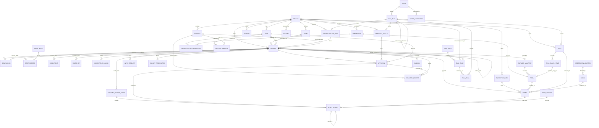

# Phase 1 Data Model: Production-Grade AI Agent Platform

**Feature**: `001-agent-platform` | **Date**: 2026-07-17 | **Plan**: [plan.md](plan.md)

Derived from the spec's Key Entities and Functional Requirements. **Tenant is the
first dimension** of every keyed entity; isolation is enforced at the data layer
via Postgres row-level security (RLS), never by application ACLs alone (FR-038,
FR-039). Immutable entities are written once and never updated in place; the only
mutable runtime state is the append-only event log (FR-006) — every other mutable
column in this document is a **projection** rebuildable by replaying that log
(FR-086), never an independent source of truth.

Three cross-cutting rules govern how these tables are read and written:

- **Tenant scope is transaction-local.** RLS reads a scope set with
  `SET LOCAL app.tenant_id` (or `SET ROLE LOCAL`) **inside** the transaction.
  Session-level `SET` is prohibited: the production topology places a
  transaction-pooling tier (PgBouncer) in front of Postgres, which reassigns a
  physical connection between tenants between statements, so session-level scope
  leaks across tenants (FR-039).
- **Content at rest is envelope-encrypted per tenant.** Every column marked
  *(encrypted)* holds ciphertext under a per-tenant (optionally per-erasure-
  subject) data key held outside the database; erasure is key destruction, not
  row deletion (FR-080, FR-089).
- **Integrity is chained, not per-record.** Audit receipts and event digests form
  a per-session hash chain whose head is anchored externally (FR-081).

---

## Entity overview

```mermaid
erDiagram
    TENANT ||--o{ USER : has
    TENANT ||--o{ AGENT : defines
    TENANT ||--o{ SESSION : owns
    TENANT ||--o{ SKILL : owns
    TENANT ||--o{ MEMORY : owns
    TENANT ||--o{ CONNECTOR : configures
    TENANT ||--o{ BUDGET : bounded_by
    AGENT ||--o{ SESSION : instantiated_as
    USER ||--o{ SESSION : initiates
    USER ||--o{ CONNECTOR_AUTHORIZATION : authorizes
    USER ||--o{ SURFACE_IDENTITY : linked_from
    CONNECTOR ||--o{ CONNECTOR_AUTHORIZATION : granted_by
    TENANT ||--o{ ORCHESTRATION_PLAN : governs
    ORCHESTRATION_PLAN ||--o{ SESSION : drives
    SESSION ||--o{ DELEGATION : spawns
    DELEGATION ||--o| SESSION : creates_child
    SESSION ||--o{ EVENT : appends
    SESSION ||--o{ COST_RECORD : meters
    SESSION ||--o{ CHECKPOINT : resumes_from
    SESSION ||--o{ SNAPSHOT : hydrates_from
    SESSION ||--o{ IDEMPOTENCY_CLAIM : claims
    SESSION ||--o| SESSION : forked_from
    SESSION ||--o{ CONTENT_ACCESS_GRANT : read_under
    CONTENT_ACCESS_GRANT ||--o{ AUDIT_RECEIPT : records
    SESSION ||--o{ APPROVAL : gates
    SESSION ||--o{ INPUT_REQUEST : asks
    TENANT ||--o{ APPROVAL_POLICY : governs
    APPROVAL_POLICY ||--o{ APPROVAL : tiers
    USER ||--o{ APPROVAL : resolves
    APPROVAL ||--|| AUDIT_RECEIPT : authorizes
    SESSION ||--o{ BUDGET_RESERVATION : holds
    EVENT ||--o| AUDIT_RECEIPT : may_bind
    AUDIT_RECEIPT ||--o| AUDIT_RECEIPT : chains_to
    AUDIT_ANCHOR ||--o{ AUDIT_RECEIPT : commits
    ENCRYPTION_KEY ||--o{ EVENT : seals
    TENANT ||--o{ ENCRYPTION_KEY : owns
    TOOL ||--o{ EVENT : invoked_in
    CONNECTOR ||--|| TOOL : exposes
    CATALOG_MANIFEST ||--o{ TOOL : resolves
    SESSION ||--|| CATALOG_MANIFEST : pinned_to
    SKILL ||--o{ SKILL_BUNDLE_FILE : contains
    SKILL_BUNDLE_FILE ||--o| TOOL : registers_script_as
    SKILL ||--o{ EVENT : activated_in
    TENANT ||--o{ SURFACE : enables
    SURFACE ||--o{ SURFACE_IDENTITY : authenticates
    SURFACE ||--o{ SESSION : submits_through
    SURFACE ||--o{ DELIVERY_RECORD : delivers_over
    SESSION ||--o{ DELIVERY_RECORD : emits
    APPROVAL ||--o{ DELIVERY_RECORD : notified_by
    SESSION ||--|| SANDBOX : bound_to
    MODEL ||--o{ EVENT : produced_by
    INTEGRATION_ADAPTER ||--o{ MODEL : fronted_by
    PRICE_BOOK ||--o{ COST_RECORD : prices
    EVAL_SUITE ||--o{ EVAL_CASE : contains
    EVAL_CASE ||--o{ EVAL_TRIAL : executed_as
    EVAL_RUN ||--o{ EVAL_TRIAL : records
    EVAL_RUN ||--o| EVAL_RUN : compared_to_baseline
    JUDGE ||--o{ EVAL_RUN : scores
    JUDGE ||--o{ JUDGE_CALIBRATION : calibrated_by
    TENANT ||--o{ EVAL_CASE : consented_source_of
    SESSION ||--o| EVAL_CASE : forked_prefix_for
    EVAL_RUN ||--o| ORCHESTRATION_PLAN : clears
    EVAL_RUN ||--o| APPROVAL_POLICY : clears
    EVAL_RUN ||--o| SKILL : clears
```

### Key Entities that are fields, not tables

Four entities named in spec.md's Key Entities list have no table of their own,
because each is a **property of a row or an event** rather than an independently
addressable record. They are listed here so the spec's entity list resolves
completely and nobody goes looking for a missing migration:

| Spec entity | Where it actually lives | Why not a table |
|-------------|-------------------------|-----------------|
| **Condensation** (FR-015, FR-130) | the `condensation` event in the Event taxonomy, versioned by the condenser config that produced it | It is a point in the log, not a mutable record — and giving it a table invites treating it as a resume artifact, which is precisely the conflation FR-126 closes |
| **Harness Digest** (FR-129) | `Session.harness_digest`, copied onto `Checkpoint`, `CostRecord`, `EvalRun`, and every span | A digest of configuration in force, pinned at run start; a separate table would imply it can change during a run, and a mid-run change is a defect (FR-088) |
| **Taint State** (FR-087) | `Session.taint_state` (a **projection**), with `taint_transition` / `sanitization_boundary` events as the truth | Derived state rebuildable by replay; a table would become a second source of truth for which legs are engaged |
| **Surface Capability** (FR-155) | `Surface.capabilities` + `Surface.principal_kind` + `Surface.conversation_binding` | A declared, conformance-tested descriptor versioned with the surface row it belongs to |

---

## Immutable configuration entities

### Tenant
The first-class isolation boundary for data, secrets, budgets, rate limits,
workspaces, and audit.

| Field | Type | Notes |
|-------|------|-------|
| `tenant_id` | UUID (PK) | First dimension of every keyed row |
| `name` | string | Display name |
| `region` | string | Data-residency / region pinning |
| `retention_days` | int | Memory retention; default 90, overridable (FR-019) |
| `deployment_tier` | enum | `saas` / `single_tenant` / `byoc` / `hybrid` |
| `identity_config` | jsonb | SSO/OIDC settings |
| `rbac_map` | jsonb | Role → permission-scope map |
| `created_at` | timestamptz | |

- **Validation**: `retention_days > 0`; regulated tiers may tighten/extend by config.
- **RLS**: root of the isolation model — every other table's policy joins on `tenant_id`.

### User
The delegated identity whose RBAC permission scope the agent acts within (FR-035).

| Field | Type | Notes |
|-------|------|-------|
| `user_id` | UUID (PK) | |
| `tenant_id` | UUID (FK) | RLS key |
| `external_subject` | string | OIDC subject |
| `roles` | string[] | Resolve to scopes via tenant `rbac_map` |
| `created_at` | timestamptz | |

### Agent
An immutable configuration (persona/bootstrap, toolset profile, autonomy level)
that produces the next action from history — not code, never forked per customer
(FR-050).

| Field | Type | Notes |
|-------|------|-------|
| `agent_id` | UUID (PK) | |
| `tenant_id` | UUID (FK) | RLS key |
| `version` | int | Immutable; new version = new row (FR-042) |
| `bootstrap` | text | Markdown persona (`SOUL.md`/`IDENTITY.md`/`TOOLS.md`) |
| `toolset_profile` | enum | `read_only` / `coding` / `messaging` / `full` |
| `autonomy_level` | enum | `read_only` (refuses every mutating capability) / `supervised` (approval on every mutating invocation) / `full` (approval per effect class + Rule of Two + `ApprovalPolicy`) — normative pipeline semantics, not a label (FR-111) |
| `prompt_mode` | enum | `full` / `task` / `minimal` / `none` — the **default** selector for which named prefix sections load, resolved to a concrete mode at run start together with the surface and execution class; behaviour-bearing config, versioned and eval-gated like `bootstrap`, and folded into `Session.harness_digest` so a mode change is a distinct cache prefix (FR-172, FR-129) |
| `created_at` | timestamptz | |

- **Immutability**: a change is a new versioned row; a prompt/model change is a deploy.
- **Autonomy is enforced, not advisory**: the three levels have defined effects in the execution pipeline and sit at a fixed position in the one published permission resolution order (FR-111, [contracts/tool-contract.md](contracts/tool-contract.md)). Raising a tenant's autonomy level carries a recorded governance sign-off (FR-096).
- **Prompt mode selects text, never a control** (FR-172): the mode gates which system-prefix sections render, but the per-invocation safety check (FR-009), permission chain (FR-111), and tenant attribution (FR-038) are enforced in the pipeline, not in prompt text. A mode that would omit the safety or tool-contract section from an agent whose `autonomy_level` can reach a mutating capability is **refused at configuration**, and the resolved mode is recorded on `Session` so a replay names the sections it ran under.

### Tool
A self-describing capability with input schema and per-invocation checks; a built-in
or a per-tenant permission-scoped connector (FR-007, FR-011).

| Field | Type | Notes |
|-------|------|-------|
| `tool_id` | string (PK) | The **fully-qualified identity** `{namespace}/{name}@{version}` — what an approval scope, an audit receipt, and the harness digest bind (FR-147) |
| `namespace` | string | Owned by exactly one source per tenant (built-ins, one connector, or one MCP server); a descriptor claiming a name in another source's namespace is **refused at admission**, never resolved by registration order (FR-147) |
| `name` | string | Unique within `(tenant_id, namespace)` |
| `tool_version` | string | SemVer; pinned into the harness digest and treated as a production dependency — a bump is an eval-gated, revertible deploy (FR-147, FR-078, FR-129) |
| `source_ref` | string | The admitting source (`builtin` / `connector:{id}` / `mcp:{server_id}`) — the namespace's owner of record |
| `descriptor_digest` | bytea | Hash of the exact descriptor admitted; re-verified at use so a protocol-level listing cache cannot serve an unadmitted descriptor (FR-150, FR-113) |
| `tenant_id` | UUID (FK, nullable) | **RLS key.** NULL only for genuinely global built-in definitions; any tool exposed by a per-tenant connector MUST carry its tenant (FR-011) |
| `description` | text | Progressive-disclosure summary |
| `input_schema` | jsonb | Validated per invocation |
| `output_schema` | jsonb (nullable) | Declared structured result shape where the source provides one; validated on return and used for result budgeting. A schema-conformant result is still untrusted — validation proves shape, never intent (FR-150, FR-033) |
| `disclosure` | enum | `resident` (in the cache-stable prefix) / `deferred` (name + description only until loaded, FR-062, FR-148) |
| `capability` | enum | `read_only` / `mutating` |
| `concurrency_safe` | enum | `read_only` / `concurrency_safe` / `exclusive`; default `exclusive` (fail-closed, FR-008, FR-061) |
| `returns_untrusted` | bool | Taint leg A — output is untrusted content. Default **true** (fail-closed, FR-087) |
| `reads_private_data` | bool | Taint leg B — touches tenant/private data. Default **true** (FR-087) |
| `mutates_external` | bool | Taint leg C — changes external state or communicates outward. Default **true** (FR-087) |
| `effect_class` | enum (nullable) | For mutating tools: `payment` / `delete` / `external_send` / `prod_change` / `other` — the unit an approval scope may cover (FR-036) |
| `idempotency_key_spec` | jsonb (nullable) | How a stable per-effect key is derived for state-changing calls (FR-071) |
| `connector_id` | UUID (FK, nullable) | Set when tool is a connector |
| `catalog_scan_status` | enum | `pending` / `clean` / `flagged` / `rejected` — result of the descriptor injection scan (FR-113). A tool MUST NOT be enumerable to the model while `pending` or `rejected` |
| `scan_policy_version` | string | Version of the injection-scan policy that produced `catalog_scan_status`, so a past admission decision is replayable (FR-113) |
| `scanned_at` | timestamptz | Set on first registration and on every version bump (FR-113) |

- **Note**: safety is judged **per invocation on parsed input**, not stored per tool (FR-009). The three taint booleans are *declarations* consumed by the Rule-of-Two evaluator (FR-087); a tool whose declarations are missing is treated as engaging all three legs.
- **RLS**: policy applies where `tenant_id IS NOT NULL`; a tenant can neither enumerate nor invoke another tenant's catalog entries (FR-011, FR-039).
- **Built-ins**: the platform ships built-in tools — workspace-restricted filesystem (`file_read`/`file_write`/`file_search`/…), a sandboxed shell/code-execution tool, and web search/fetch (egress-allowlisted, untrusted results) — governed by the same three gates and per-invocation safety (FR-056–FR-058).
- **Catalog admission**: `catalog_scan_status` transitions `pending → clean` (admitted) or `pending → flagged/rejected` (refused, fail-closed) before a descriptor is ever added to the tenant's tool catalog or re-admitted on a version bump; the transition is recorded as part of the tool's FR-096 governance sign-off, not as a silent background job (FR-113).
- **One owner per namespace** (FR-147): uniqueness is `(tenant_id, namespace, name, tool_version)`, and a second source attempting to register into a namespace it does not own fails admission. Registration order is never a resolution policy — a hostile source shadowing a legitimate tool would silently re-point every approval scope and audit receipt naming that string.
- **The alias map is tenant configuration** (FR-147): pipeline step 1 resolves aliases from a governance-signed tenant table, never from descriptor contents. An alias a catalog source can write is a rename primitive handed to the party the catalog exists to distrust.

### Catalog Manifest
The **resolvable universe** of tools for a run — what the harness digest pins so that
deferred disclosure (FR-062) does not mutate a run's configuration mid-flight (FR-148).

| Field | Type | Notes |
|-------|------|-------|
| `manifest_digest` | bytea (PK) | Hash over the sorted set of `(tool_id, descriptor_digest)` — a component of `Session.harness_digest` (FR-129) |
| `tenant_id` | UUID (FK) | RLS key |
| `resident_tool_ids` | string[] | Materialized into the cache-stable prefix in the FR-013 canonical order |
| `deferred_tool_ids` | string[] | Name + description advertised; full schema loaded on demand into the **volatile** zone |
| `resident_token_budget` | int | Cap on the resident tier; exceeded ⇒ relevance selection, never arbitrary truncation |
| `max_loadable_per_run` | int | Ceiling on mid-run loads (FR-148) |
| `selector_version` | string (FK) | The eval-gated selector config in force; behaviour-bearing config under FR-143 |

- **The manifest is fixed for the run; the materialized subset is not.** Each load appends a `tool_loaded` event, so a replay reconstructs the visible catalog turn by turn while `harness_digest` never moves (FR-148, FR-088).
- **Selection is measured**: tool-selection accuracy, wrong-tool rate, and no-tool-found rate are reported per agent version and harness digest (FR-095).

### Model / Provider
A pluggable backend accessed only through one abstraction with a normalized stream
contract and deterministic, auditable routing (FR-027).

| Field | Type | Notes |
|-------|------|-------|
| `model_id` | string (PK) | e.g. `anthropic:...`, `self-hosted:vllm-...` |
| `provider` | enum | `anthropic` / `openai_compatible` / `bedrock` / `vertex` / `cli` / `self_hosted` |
| `pinned_snapshot` | string | Exact provider snapshot; a change is an eval-gated deploy (FR-078) |
| `eval_run_id` | UUID (nullable) | The run that cleared the current snapshot; a bump without one is not adoptable, and the scheduled re-run of FR-143 re-verifies it against drift no bump announces |
| `capability_floor` | int | Feature-demand routing floor |
| `data_labels_allowed` | string[] | e.g. `regulated` → self-hosted only (FR-037) |
| `regions_allowed` | string[] | Region pinning — a run MUST NOT route outside its tenant's region (FR-091) |
| `adapter_id` | string (FK, nullable) | The `IntegrationAdapter` this model is reached through — NULL for a built-in direct adapter, set when a gateway/proxy fronts it (FR-132) |

- **A gateway is transport, not the router**: when `adapter_id` names a gateway, the request still carries this row's `pinned_snapshot`, and a response whose model does not match it is a typed failure, never a substitution (FR-132). Gateway-side aliasing and fallback are disabled on the adapter.

### Integration Adapter
An optional third-party implementation of an existing port, admitted only with a
recorded capability matrix (FR-131, FR-133). Configuration, never a kernel fork.

| Field | Type | Notes |
|-------|------|-------|
| `adapter_id` | string (PK) | e.g. `litellm`, `temporal`, `langfuse-otlp`, `pgvector`, `qdrant`, `braintrust`, `agui`, `skillhub` |
| `port` | enum | `provider` / `queue` / `plan_runner` / `telemetry_export` / `sandbox` / `connector` / `retrieval` / `prompt_source` / `vault` / `eval` / `surface` / `skill_source` — the **closed, normative** set of FR-131; a framework with no port here has no admission path |
| `version` | string | Pinned; a bump is an eval-gated dependency deploy (FR-078) |
| `capabilities` | jsonb | Per contract feature: `supported` / `degraded` / `unsupported`, on the dimensions declared **for this `port`** (FR-133) — see below |
| `conformance_run_id` | UUID | The suite run that produced `capabilities`; absent ⇒ not enablable |
| `governance_signoff` | jsonb | Recorded approver + timestamp, as for any new tool or connector (FR-096) |
| `enabled_for_tenants` | UUID[] | Per-tenant enablement; disabled everywhere is the default |

**Conformance dimensions are per port** (FR-133), because a provider-shaped list
says nothing about a store or a gate. A port whose dimensions are undeclared
admits no adapters:

| Port | Dimensions recorded in `capabilities` |
|---|---|
| `provider` | `token_class_reporting`, `cache_breakpoints`, `cache_affinity_ttl`, `native_tool_calling`, `schema_normalization`, `reasoning_roundtrip`, `stream_ordering` (FR-132) |
| `queue` / `plan_runner` | `exactly_once_claim_compat`, `durable_redelivery`, `digest_bound_approval_compat`, `log_remains_source_of_truth` (FR-136) |
| `telemetry_export` | `otlp_only_write_path`, `tenant_isolation_primitive`, `attribute_allowlist_preserved` (FR-134) |
| `retrieval` | `tenant_isolation_primitive` (store-enforced vs. application-supplied filter — the latter is `degraded`, being the application ACL FR-039 rejects), `subject_level_delete`, `tenant_level_delete`, `region_placement`, `pitr_backup` (FR-162, FR-091, FR-090) |
| `eval` | `score_only_egress`, `dataset_import_from_fr125`, `no_gate_authority`, `no_trace_mining` (FR-135, FR-134) |
| `surface` | The FR-155 capability descriptor plus `principal_kind` admission (FR-158) |
| `skill_source` | `publisher_provenance`, `signature_over_bundle_digest`, `version_pinning` (FR-152) |
| `sandbox` / `connector` / `prompt_source` / `vault` | Per the contract each already satisfies |

- **Optional by construction**: the platform passes its full suite with every adapter row disabled (FR-131, SC-040).
- **A degraded capability withdraws the claim it supports**: e.g. an adapter with `token_class_reporting: degraded` means the FR-014/SC-003 cache-read gate is **not claimed** on that path — recorded, surfaced in the release report, never estimated around (FR-132, FR-133). The same rule bites hardest on `retrieval`: an adapter with `subject_level_delete: unsupported` is **not admissible for any tenant carrying an erasure obligation**, because crypto-shredding the key does not reach an index it never encrypted (FR-162).
- **Authority boundary** (FR-131): no adapter row can grant routing authority, ceiling authority, source-of-truth status, gate authority, audit-record status, or content access. Those are not fields here because they are not configurable. An `eval` adapter is the sharpest case — it may hold corpora and receive scores and still holds no gate authority, which is why `no_gate_authority` is a recorded conformance dimension rather than a policy statement.
- **A grader library is not an adapter row**: DeepEval, Promptfoo, and Ragas are pinned in-tree dependencies of the eval runner under FR-078, supplying metrics beneath the platform's FR-137 statistics. They get no row here because they run in the platform's own CI rather than behind a port — and any model-graded metric they contribute is a `Judge` row subject to FR-141 in full (FR-135).

### Price Book
A versioned, effective-dated price table; cost is never computed from constants in
code, and every cost record names the version it used (FR-084).

| Field | Type | Notes |
|-------|------|-------|
| `price_book_version` | string (PK) | e.g. `2026-07-01.1` |
| `model_id` | string (FK, PK) | |
| `usd_per_1k_input_uncached` | numeric | |
| `usd_per_1k_input_cache_read` | numeric | The dominant term at >90% cache-read (FR-014) |
| `usd_per_1k_input_cache_write` | numeric | |
| `usd_per_1k_output` | numeric | |
| `effective_from` | timestamptz | |

- **Immutability**: a price change creates a new version; historical cost records recompute identically forever.

### Skill
A versioned, progressively disclosed procedure; growable by the agent only through
a human/eval promotion gate (FR-020, FR-021).

| Field | Type | Notes |
|-------|------|-------|
| `skill_id` | UUID (PK) | |
| `tenant_id` | UUID (FK) | RLS key |
| `name` | string | |
| `description` | text | Always visible — tier 1 of three (FR-154) |
| `body` | text | Tier 2; loaded on activation |
| `version` | int | Immutable per version |
| `bundle_digest` | bytea | Content address over **every** file in the bundle; what the harness digest pins and a signature covers (FR-151, FR-129) |
| `origin` | enum | `first_party` / `tenant_authored` / `agent_proposed` / `third_party_import` — immutable per version; **all four clear the same gate** (FR-152) |
| `executable` | bool | Declared posture. `false` + executable content in the bundle ⇒ refused admission, never sanitized (FR-151) |
| `publisher_ref` | string (nullable) | Required for `third_party_import`: the authenticated publisher and source |
| `signature` | bytea (nullable) | Required for `third_party_import`: verified over `bundle_digest` at admission (FR-152) |
| `pinned_upstream_version` | string (nullable) | Required for `third_party_import`; an upstream bump is an eval-gated, revertible dependency deploy (FR-078) |
| `trust_tier` | enum | Tenant-declared bound on what a skill of this origin may carry — executability, reachable effect classes, whether enablement needs per-tenant sign-off (FR-152) |
| `declared_tool_ids` | string[] | **Intersected** with the run's resolved catalog, never unioned into it; an entry the run does not hold is ignored and recorded (FR-153) |
| `status` | enum | `proposed` / `approved` / `promoted` — never auto-promoted |
| `suite_id` | string (FK) | The skill's **own** case set; a proposal without one is refused at the gate (FR-143) |
| `eval_run_id` | UUID (nullable) | The run that cleared it; required to reach `promoted` (FR-021, FR-043) |
| `catalog_scan_status` | enum | `pending` / `clean` / `flagged` / `rejected` — the FR-113 injection scan applied to **every file**, at admission and on every version bump (FR-151) |
| `created_at` | timestamptz | |

### Skill Bundle File
Tier 3 of progressive disclosure and the unit the injection scan operates on
(FR-151, FR-154).

| Field | Type | Notes |
|-------|------|-------|
| `file_id` | UUID (PK) | |
| `skill_id` | UUID (FK) | |
| `path` | string | Relative path within the bundle |
| `kind` | enum | `manifest` / `body` / `reference` / `asset` / `script` |
| `content_digest` | bytea | Component of `bundle_digest` |
| `scan_status` | enum | Per file; a high-severity match fails the whole bundle closed (FR-113) |
| `registered_tool_id` | string (FK, nullable) | Set for `kind = script`: the `Tool` row it was admitted as. NULL for a script ⇒ the bundle is refused (FR-151) |

- **State transitions**: `proposed → approved (human+eval gate) → promoted`. No edge skips the gate, **and no origin skips the gate** — FR-021 previously covered only `agent_proposed`, which is the source least likely to be adversarial (FR-152).
- **The gate is the skill's own suite plus the platform corpus** (FR-143): the global corpus measures the platform, not this skill, so promotion on the strength of cases the skill never exercises measures nothing about it.
- **A script is a tool or the bundle is refused** (FR-151): a `kind = script` file with no `registered_tool_id` means executable code that skipped the three gates, per-invocation safety, taint declaration, and governance sign-off while running in the sandbox under the run's identity.
- **Activation is an event, not a state** (FR-153): which skills a run *could* load is pinned by `harness_digest`; which it *did* load is reconstructed from `skill_activated` events, so a fork or trajectory case can attribute a behaviour to a skill version rather than to a library.

### Connector
An external system-of-record integration attached only through the vetted,
per-tenant, RBAC-scoped catalog (FR-012).

| Field | Type | Notes |
|-------|------|-------|
| `connector_id` | UUID (PK) | |
| `tenant_id` | UUID (FK) | RLS key |
| `kind` | string | `jira` / `salesforce` / `github` / `gmail` / `gdrive` / `gcalendar` / `notion` / … |
| `secret_handle` | string | Vault handle; never the raw credential (FR-034) |
| `scope` | jsonb | RBAC scope, per calling user |
| `auth_kind` | enum | `tenant_service` (admin-configured) / `per_user_oauth` (personal, FR-052) |
| `token_audience` | string (nullable) | Resource indicator / audience the `tenant_service` token is minted for (FR-114); NULL only when the provider's token model has no separable audience and the narrowest available scope is used instead — a connector with neither MUST fail registration |

- **Audience restriction (FR-114)**: a connector whose provider cannot issue an audience-/resource-restricted token (or the narrowest equivalent scope) is rejected at the same governance gate as an over-broad permission scope (FR-078) — never registered with a tenant-wide credential as a fallback.

### Connector Authorization
A per-user OAuth grant binding a `User` to a `Connector`, stored only in the
per-tenant vault and never exposed to the model (FR-052, FR-054). Applies to
personal connectors (`auth_kind = per_user_oauth`, e.g. Gmail/Drive/Calendar).

| Field | Type | Notes |
|-------|------|-------|
| `authorization_id` | UUID (PK) | |
| `tenant_id` | UUID (FK) | RLS key |
| `user_id` | UUID (FK) | The authorizing user (delegated scope, FR-054) |
| `connector_id` | UUID (FK) | Unique per `(tenant, user, connector)` |
| `token_handle` | string | Vault handle for access+refresh tokens; never in prompt/log (FR-052) |
| `scopes` | string[] | OAuth scopes granted at consent |
| `resource_audience` | string | The RFC 8707 resource indicator (or provider's narrowest equivalent) the vaulted token is restricted to; MUST NOT be a tenant- or IdP-wide credential (FR-114) |
| `expires_at` | timestamptz | Access-token expiry; auto-refresh on/after |
| `status` | enum | `active` / `expired` / `revoked` |
| `created_at` | timestamptz | |

- **Uniqueness**: one active row per `(tenant_id, user_id, connector_id)`.
- **Audience restriction (FR-114)**: `resource_audience` is set at consent time from the connector's declared token model; a personal connector whose provider cannot support it is rejected at registration (same gate as `Connector.token_audience`), never silently issued a broader grant.
- **Lifecycle**: `active → expired (auto-refresh) → active`; user revoke → `revoked` (blocks use, fail-closed).
- **Secret rule**: only `token_handle` is stored; raw tokens live in the vault and never enter a prompt, transcript, or log.

### Surface
A registered channel the agent is reachable through, carrying the declared,
conformance-tested capability descriptor that routing filters on (FR-028, FR-155).

| Field | Type | Notes |
|-------|------|-------|
| `surface_id` | string (PK) | e.g. `web`, `cli`, `slack`, `telegram`, `email`, `cron`, `a2a` |
| `tenant_id` | UUID (FK, nullable) | NULL for platform-wide surface definitions |
| `principal_kind` | enum | `human` / `service` / `agent`. Undeclared ⇒ most restricted treatment (FR-158) |
| `can_render_approval_context` | bool | Whether an FR-104 decision-ready package is presentable at all |
| `max_render_bytes` | int | Ceiling on what an approver can actually be shown |
| `supports_step_up_auth` | bool | Whether FR-105 re-authentication is possible on this channel |
| `supports_resolution_token` | bool | Whether the single-use approval token can be carried |
| `supports_structured_input` | bool | Whether a schema-declared FR-110 answer can be collected |
| `supports_streaming` | bool | FR-031 progress without a blocked connection |
| `max_message_bytes` | int | Drives post-sanitizer chunking (never pre-sanitizer, FR-068) |
| `conversation_binding` | jsonb | How the surface's native thread identity resolves into `session_key` (FR-159) |
| `conformance_run_id` | UUID | The suite run that produced these values; absent ⇒ not enablable |
| `enabled_for_tenants` | UUID[] | Per-tenant enablement |

- **Capabilities are declared and *tested*, not assumed** (FR-155). Approval and input-request routing filter the assignee and escalation chain by them, and an `ApprovalPolicy` mapping an effect class to a channel set with no capable member is **refused at configuration time** (SC-060).
- **`principal_kind = agent` is a distinct admission class** (FR-158): subset-scope binding, source taint, a named payer, and no ability to resolve an approval or answer an input request.
- **Output adaptation happens after the egress sanitizer** (FR-068): chunking and truncation may reshape what was sanitized, never re-open it.

### Surface Identity
A verified binding from an external surface identity (e.g. Telegram/Zalo/Slack
user id) to a platform `User` within a tenant; required before any action runs
from that surface (FR-055).

| Field | Type | Notes |
|-------|------|-------|
| `surface_identity_id` | UUID (PK) | |
| `tenant_id` | UUID (FK) | RLS key |
| `user_id` | UUID (FK) | The bound platform user (delegated identity) |
| `surface` | string (FK) | `Surface.surface_id` |
| `external_id` | string | The surface-native user id |
| `channel_operator` | bool | May steer or cancel turns they did not submit, in conversations they operate (FR-156) |
| `verified` | bool | Linking step passed; unverified → denied (fail-closed) |
| `created_at` | timestamptz | |

- **Uniqueness**: one row per `(tenant_id, surface, external_id)`.
- **Rule**: an unverified or unlinked external identity performs zero actions (FR-055).
- **Every turn resolves its own identity** (FR-156): on a multi-principal surface the row is looked up per inbound message, and that principal's scope is what FR-035, FR-033, and FR-093 evaluate for that turn. Authority is never inherited from whoever opened the conversation.

### Delivery Record
The durable outbox entry for one outbound message on one channel — the artifact
that distinguishes "the approver did not answer" from "the approver was never
told" (FR-157).

| Field | Type | Notes |
|-------|------|-------|
| `delivery_id` | UUID (PK) | |
| `tenant_id` | UUID (FK) | RLS key |
| `session_id` | UUID (FK) | |
| `seq` | bigint | The event this delivery carries; **appended before the send** |
| `surface_id` | string (FK) | |
| `recipient_ref` | string | Idempotency is keyed `(session_id, seq, surface_id, recipient_ref)` |
| `kind` | enum | `reply` / `approval_request` / `reminder` / `escalation` / `input_request` / `completion` |
| `state` | enum | `pending` / `delivered` / `failed_retryable` / `failed_permanent` / `suppressed_by_audience` |
| `attempts` | int | Backoff-bounded |
| `approval_id` | UUID (FK, nullable) | Set for oversight kinds, so an undelivered request is separable from an unanswered one |

- **The log entry precedes the send** — the same write-ahead ordering FR-127 requires of tool effects, for the same reason: a message sent before it was recorded can be sent twice.
- **`failed_permanent` is a signal, not a cleanup** (FR-095). On an approval or input request it MUST NOT be silently absorbed into the FR-036 expiry, because to a tenant those look identical and mean opposite things.
- **`suppressed_by_audience`** records an FR-156 refusal: the content's redaction policy was resolved for a principal the conversation's audience does not cover.

---

## Mutable runtime state (append-only)

### Session / Conversation
The only mutable runtime state: an append-only, event-sourced log keyed first by
tenant, replayable and auditable (FR-006, FR-041).

| Field | Type | Notes |
|-------|------|-------|
| `session_id` | UUID (PK) | |
| `session_key` | string | `{tenant_id}:{...}` — routing + serial lock key, resolved from the surface's declared `conversation_binding` rather than by adapter-specific behaviour (FR-159) |
| `tenant_id` | UUID (FK) | First dimension, RLS key |
| `surface_id` | string (FK) | The surface this conversation lives on (FR-155) |
| `user_id` | UUID (FK) | The **opening** principal — an attribution record, **not** the run's standing authority. Each turn's authority is its own submitting principal, resolved per turn from `Surface Identity` (FR-156) |
| `audience_ref` | string (nullable) | Set for multi-principal conversations; bounds what may be delivered into the conversation and what may be written to durable memory from it (FR-156, FR-019) |
| `agent_id` | UUID (FK) | |
| `agent_version` | int | **Pinned at run start and held for the run's life** so a concurrent deploy cannot shift behavior or bust the prompt prefix mid-run (FR-088, FR-013) |
| `harness_digest` | bytea | Identity of *all* behavior-determining config in force: stable system-prompt version, resolved tool catalog, skill versions, safety/permission policy version, approval-policy version. Pinned at run start; also the cache-prefix identity (FR-129, FR-013) |
| `forked_from_session_id` | UUID (nullable) | Source run when this session was produced by `fork` (FR-128); NULL for an original run |
| `fork_seq` | bigint (nullable) | Sequence in the source run this fork branched at (FR-128) |
| `fork_overrides` | jsonb (nullable) | Declared divergences from the source run (agent version, prompt, tool catalog, model) — what the fork is testing |
| `data_label` | enum | `public` / `internal` / `regulated` — drives deterministic routing (FR-037) |
| `route_model_id` | string | The routing decision actually taken (auditable, replayable) |
| `route_reason` | jsonb | Why that model: data label, difficulty, capability floor (FR-076) |
| `execution_class` | enum | `interactive` / `batch` — the field priority load-shedding reads and, with `delegation_role`, what the scheduler derives a run's class concurrency pool from (FR-049, FR-168, FR-088) |
| `priority` | int | Scheduling weight within the class |
| `region` | string | Placement region; a run outside the tenant's pin fails closed (FR-091) |
| `parent_session_id` | UUID (nullable) | Immediate parent in a delegation tree; NULL for a root run (FR-101) |
| `root_session_id` | UUID | Root of the delegation tree; equals `session_id` for a root run — the key cost rolls up to (FR-101) |
| `depth` | int | 0 for a root run; bounded by the FR-099 depth limit (default 1) |
| `delegation_role` | enum | `root` / `leaf` — a `leaf` cannot delegate further (FR-098, FR-099) |
| `plan_id` / `plan_version` | UUID / int (nullable) | The orchestration plan version driving this run, pinned at start (FR-102) |
| `taint_state` | jsonb | Rule-of-Two legs engaged so far, plus the last sanitization boundary (FR-087) — *projection* |
| `status` | enum | `queued` / `running` / `suspended` / `terminal` — *projection* |
| `autonomy_level` | enum | `read_only` / `supervised` / `full`, **pinned at run start** and ratcheting — tightenable mid-run, never widenable by any path (FR-111) |
| `terminal_reason` | enum (nullable) | `completed` / `max_turns` / `cost_exhausted` / `error` / `aborted` / `prompt_too_long` / `hook_stopped` / `approval_expired` / `input_expired` (FR-004) — *projection* |
| `active_ms` / `suspended_ms` | bigint | Duration split; **every latency SLI is measured on `active_ms`** so human decision latency does not consume the run's error budget (FR-120, FR-095) — *projections* |
| `created_at` | timestamptz | |

- **Concurrency**: per-session serial (lock on `session_key`), cross-session concurrent.
- **Projections**: `status`, `terminal_reason`, and `taint_state` are derived from the event log and rebuildable by replay; they are read paths, not truth (FR-086).
- **Delegation chain**: `root_session_id` + `parent_session_id` + `depth` are written at session creation and never updated. They are a **foundational seam, not a later feature** — retrofitting a chain onto historical cost records and receipts is exactly the migration the append-only log exists to avoid, so the columns ship in Increment 1 even though delegation itself is deferred (see plan.md "MVP cut line").
- **Scope descent**: a child session's resolved scope (tool catalog, connector authorizations, egress allowlist, `data_label`, `region`) is a **subset** of its parent's at creation time and is never widened afterward (FR-098).
- **Suspension**: a session awaiting human approval, an input request, or a long external job sits in `suspended` at **zero ongoing token cost**, resumed by an event rather than polled (FR-036, FR-110).
- **Autonomy ratchet**: `autonomy_level` is pinned at run start like `agent_version` and may only move toward *more* restrictive within the run. No model output, tool result, steering message, hook, or delegation parameter may widen it — a mid-run widening is a direct prompt-injection lever (FR-111).
- **No approval outlives its run**: reaching any terminal state, being cancelled, being reaped, or breaching a ceiling invalidates every outstanding `Approval` and `Input Request` for the session *before* the terminal event is appended (FR-106).
- **Harness digest is pinned like `agent_version`** and never changes mid-run: a change is by definition a new cache prefix, so a mid-run change would both bust the prefix (FR-013) and make the run unreproducible (FR-129).
- **A fork is a new run, not an annotation**: it gets its own `session_id`, its own cost attribution and audit chain, inherits no approvals (FR-106), and runs with external effects disabled or sandbox-confined (FR-128). `forked_from_session_id` is written at creation and never updated.

### Event
A typed, timestamped, attributable record appended to the log — the single source
of truth (FR-002, FR-003, FR-040).

| Field | Type | Notes |
|-------|------|-------|
| `event_id` | UUID (PK) | |
| `session_id` | UUID (FK) | |
| `tenant_id` | UUID (FK) | RLS key |
| `seq` | bigint | Monotonic per session (append-only) |
| `schema_version` | int | **Envelope version**; upcasting keeps old events replayable (FR-086) |
| `type` | enum | See the taxonomy below (FR-085) |
| `payload` | jsonb *(encrypted)* | Ciphertext under the tenant/subject key; large blobs offloaded to object storage by ref (FR-010, FR-080) |
| `payload_digest` | bytea | Digest over plaintext, bound by the audit chain — survives crypto-shredding (FR-081) |
| `key_id` | string | Which content-encryption key sealed this payload; destroying it is erasure (FR-080) |
| `actor` | enum | `model` / `tool` / `user` / `system` — who produced the event |
| `tool_id` | string (nullable) | For `tool_use` / `tool_result` |
| `pair_ref` | UUID (nullable) | Links `tool_result` to its `tool_use` (invariant, FR-003) |
| `model_id` | string (nullable) | For model-produced events |
| `trace_id` / `span_id` | bytea (nullable) | The trace and span current when this event was appended — the join key that makes a span resolvable to an event range and back (FR-119). A **foundational** column: retrofitting it onto historical events is exactly the migration an append-only log exists to avoid |
| `created_at` | timestamptz | |

**Event taxonomy** (`type`) — must be complete enough to replay any run from the
log alone, and identical to the externally published event contract (FR-085):

| Group | Types |
|-------|-------|
| Model output | `thought` · `content` · `tool_use` |
| Tool | `tool_result` (incl. synthetic) · `tool_receipt_ref` · `effect_claimed` · `effect_claim_resolved` (write-ahead idempotency claim and its outcome, FR-127) |
| Context | `condensation` (model-facing compaction, FR-015/FR-130) · `context_pruned` (a non-destructive live-context prune of the slice sent to the provider — which results were trimmed or hard-cleared and by which pass, FR-164; never mutates a prior event, so the log the condensation, fork, and content-access read see stays intact) · `checkpoint` (machine-facing resume record, FR-024/FR-126) — **distinct artifacts, never interchangeable** |
| Human (push) | `user_message` (the mid-run steering input of FR-005) |
| Human (pull) | `input_requested` · `input_answered` · `input_expired` · `input_invalidated` (FR-110) |
| Approval | `approval_requested` · `approval_notified` · `approval_reminded` · `approval_escalated` · `approval_granted` · `approval_granted_modified` · `approval_denied` · `approval_expired` · `approval_invalidated` · `approval_resolution_refused` · `approval_mismatch` (FR-036, FR-103–FR-108) |
| Catalog | `tool_loaded` (a deferred schema materialized into the volatile zone — what lets a replay reconstruct the visible catalog turn by turn while `harness_digest` stays fixed, FR-148) |
| Skills | `skill_activated` (identity, version, `bundle_digest`, and whether the trigger was a match, an explicit request, or configuration) · `skill_capability_ignored` (a declared tool the run does not hold — recorded, never honoured, FR-153) |
| Delivery | `delivery_enqueued` · `delivery_delivered` · `delivery_failed` · `delivery_suppressed` (FR-157) — the enqueue precedes the send, so a permanently undelivered approval request is separable from an unanswered one |
| Safety | `taint_transition` · `sanitization_boundary` (FR-087) |
| Delegation | `delegation_requested` · `delegation_target_selected` (a target materialized from a roster-scale search — the resolvable roster stays pinned by `harness_digest` while the chosen target is reconstructed turn by turn, FR-169) · `delegation_refused` (bound/scope/admission) · `delegation_returned` · `delegation_reaped` (FR-098–FR-101) |
| Orchestration | `plan_started` · `plan_step_entered` · `plan_transition` · `plan_step_exited` · `plan_completed` (FR-102) |
| Observability | `content_access_granted` · `content_accessed` · `content_access_refused` (FR-118) |
| Lifecycle | `error` · `stuck_suspected` (first stuck-heuristic trip, non-terminal, FR-115) · `forked` (recorded on the source run when a fork branches from it, FR-128) · `terminal` (carries the FR-004 typed reason) · `erasure` (FR-080) |

- **Invariant**: every `tool_use` has a paired `tool_result` (synthetic on cancel/error) before the next model call — a **total** invariant over all histories, therefore property-tested (FR-097).
- **Replay completeness**: a run whose steering, approval outcome, or termination cannot be reconstructed from these events alone violates FR-006.

### Delegation
The bounded parent→child record that makes a delegation tree attributable and
replayable (FR-079, FR-098–FR-101). One row per delegation attempt, including
refused and reaped ones — a delegation that never ran is itself audit-relevant.

| Field | Type | Notes |
|-------|------|-------|
| `delegation_id` | UUID (PK) | |
| `tenant_id` | UUID (FK) | RLS key |
| `parent_session_id` | UUID (FK) | The delegating run |
| `child_session_id` | UUID (FK, nullable) | NULL when admission was refused before a child existed |
| `root_session_id` | UUID (FK) | Tree root (FR-101) |
| `depth` | int | Child's depth; refused when > the FR-099 limit |
| `pair_ref` | UUID | The parent `tool_use` this delegation answers — the paired-result invariant applies (FR-003) |
| `scope_snapshot` | jsonb | The child's resolved scope, proven a subset of the parent's at call time (FR-098) |
| `taint_at_spawn` | jsonb | Parent taint when the child was created (context for the return fold) |
| `taint_engaged` | jsonb | Legs the child actually engaged; folded into the parent on return (FR-087) |
| `return_schema` | jsonb | Validated on return, never trusted (FR-100) |
| `acceptance` | jsonb | The criterion the summary is judged against — no self-declared success (FR-044) |
| `max_summary_tokens` | int | Platform-enforced by truncation (default ~1–2k / ~8 KB) |
| `ceiling_usd` | numeric | This child's draw from the parent's fan-out envelope (FR-099) |
| `outcome` | enum | `accepted` / `rejected_schema` / `rejected_acceptance` / `bound_exceeded` / `child_error` / `reaped` |
| `reap_reason` | enum (nullable) | `parent_terminal` / `parent_cancelled` / `ceiling_exhausted` |
| `created_at` / `closed_at` | timestamptz | |

- **Immutable once closed**; the lifecycle is reconstructable from the delegation events below.
- **Refusals are rows too**: a `bound_exceeded` admission refusal is recorded, so a runaway fan-out attempt is visible rather than silent.
- **Scope is snapshotted, not referenced** — proving descent after the fact requires the scope as it stood at spawn time, not as it stands now.

### Orchestration Plan
A versioned, tenant-scoped, immutable declaration of control flow the platform
evaluates at **zero model-token cost** (FR-102). See
[contracts/orchestration-plane.md](contracts/orchestration-plane.md).

| Field | Type | Notes |
|-------|------|-------|
| `plan_id` | UUID (PK) | |
| `tenant_id` | UUID (FK) | RLS key — one tenant may neither enumerate nor run another's plans |
| `version` | int (PK part) | Immutable; a change publishes a new version |
| `status` | enum | `draft` / `gated` / `enabled` / `retired` |
| `steps` | jsonb | Steps, transitions, bounded loops, approval gates, fan-outs |
| `pinned_routes` | jsonb | Per-step `agent_version` + `route_model_id`, frozen at enable (FR-088) |
| `cost_envelope_usd` | numeric | Reserved before step 1 (FR-083, FR-099) |
| `eval_run_id` | UUID (nullable) | The gate run that cleared it (FR-043) |
| `governance_signoff` | jsonb (nullable) | Recorded approver + timestamp; required to reach `enabled` (FR-096) |
| `created_at` | timestamptz | |

- **A plan version cannot reach `enabled`** without both `eval_run_id` and `governance_signoff` — the same bar a new tool or connector clears.
- **In-flight runs finish on the version they started with** (FR-026).

### Checkpoint
The **machine-facing** resume record: everything a fresh worker needs to continue
a killed run correctly (FR-024, FR-126). Its failure mode is a duplicated or
orphaned side effect — which is why it is not the same object as a compaction.

| Field | Type | Notes |
|-------|------|-------|
| `checkpoint_id` | UUID (PK) | |
| `session_id` | UUID (FK) | |
| `tenant_id` | UUID (FK) | RLS key |
| `last_seq` | bigint | Event seq covered |
| `harness_digest` | bytea | The config the run was executing under; a resume under a different digest is a divergence, not a resume (FR-129) |
| `in_flight_claim_id` | UUID (nullable) | The `IdempotencyClaim` open at checkpoint time — the field that distinguishes "the effect happened" from "the effect may have happened" (FR-127) |
| `reservation_id` | UUID (nullable) | Budget reservation held at checkpoint time, so a resume reconciles rather than double-reserves (FR-083) |
| `sandbox_handle` | jsonb (nullable) | Sandbox/workspace identity and the durability status of its workspace (FR-047) |
| `pending_oversight` | jsonb (nullable) | Outstanding approval / input request and the digest it binds (FR-103, FR-110) |
| `provider_request_id` | string (nullable) | In-flight provider request, so a resume can reconcile a stream that may have completed upstream (FR-027, FR-066) |
| `open_delegations` | jsonb (nullable) | Children outstanding at checkpoint time, each needing a paired result on resume or reap (FR-100) |
| `created_at` | timestamptz | |

- **A condensation is not a checkpoint**: the `condensation` event is model-facing context management (FR-015) and cannot answer whether an external effect completed. Conflating the two was the defect FR-126 closes.
- **Written at effect boundaries**, not on a timer — a checkpoint whose boundaries do not align with the replay boundaries is a snapshot of the wrong thing.

### Snapshot
A **disposable projection cache** at a sequence, whose only job is to bound
hydration cost (FR-126). Rebuildable by replay and safely discardable — never a
source of truth (FR-086).

| Field | Type | Notes |
|-------|------|-------|
| `snapshot_id` | UUID (PK) | |
| `session_id` | UUID (FK) | |
| `tenant_id` | UUID (FK) | RLS key |
| `at_seq` | bigint | Sequence the projected state is valid as of |
| `projection_version` | int | Version of the projection code that wrote it; a bump invalidates every snapshot rather than silently serving stale shape |
| `state` | jsonb *(encrypted)* | Projected state; ciphertext under the tenant key like any other content (FR-089) |
| `created_at` | timestamptz | |

- **Deletable at will**: dropping every snapshot costs hydration time and nothing else. If dropping one changes behavior, it was being used as truth — a defect.
- **Bounds hydration**: replay cost is bounded by `head_seq − at_seq`, not by run length, which is what makes worker pickup on a long-running session predictable (FR-126).

### Idempotency Claim
The **write-ahead** record of an intended external effect (FR-127, FR-071). It is
committed *before* the effect leaves the process, which is the only ordering that
survives a crash mid-effect.

| Field | Type | Notes |
|-------|------|-------|
| `claim_id` | UUID (PK) | |
| `tenant_id` | UUID (FK) | RLS key — dedup is tenant-scoped |
| `session_id` | UUID (FK) | |
| `idempotency_key` | string | Derived from the canonical digest of `tool_id` + resolved input — the same artifact the approval binds and step 9a re-verifies (FR-103) |
| `pair_ref` | UUID | The `tool_use` this claim answers |
| `state` | enum | `in_flight` / `completed` / `failed` / `abandoned` |
| `resolution` | enum (nullable) | How an `in_flight` claim was closed on resume: `probe_confirmed` / `probe_absent` / `human_resolved` |
| `result_ref` | UUID (nullable) | The `tool_result` event recording the outcome |
| `attempts` | int | Bounded; exceeding the bound raises an operational signal rather than retrying (FR-095) |
| `created_at` / `resolved_at` | timestamptz | |

- **Uniqueness**: one row per `(tenant_id, idempotency_key)`; a second invocation with the same key does not execute, it reads.
- **Resume rule**: an `in_flight` claim is resolved by provider probe or by human escalation — **never** by re-execution, and never discarded as if unattempted (FR-127).
- **Unresolved is an alert, not a cleanup**: every stranded claim is a possible duplicated or lost external effect and is surfaced, not swept.

### Content Access Grant
The authorization transaction for reading decrypted conversation content — the
platform's only other privileged operation that must be as provable as an approval
(FR-118).

| Field | Type | Notes |
|-------|------|-------|
| `grant_id` | UUID (PK) | |
| `tenant_id` | UUID (FK) | RLS key — the tenant whose content may be read |
| `scope` | jsonb | Session id or bounded session set; never "all sessions" |
| `requester_user_id` | UUID | Who will read |
| `authorizer_user_id` | UUID | Who authorized — MUST differ from the requester for another tenant's content |
| `purpose` | text | Stated reason, recorded for the receipt |
| `expires_at` | timestamptz | Bounded; expiry is denial |
| `status` | enum | `active` / `expired` / `revoked` — *projection* of the grant events |
| `read_count` | int | Reads performed under it — *projection* |
| `created_at` | timestamptz | |

- **Every read emits its own receipt**, not just the grant, so the audit answers *what was read*, not merely *that access was possible* (FR-081, FR-118).
- **Never an authorization to act**: a content-access grant can never satisfy an approval gate (FR-036), and agent/service principals are refused outright.
- **Refusals are recorded** and reported as a signal (FR-095) — repeated refused reads are an insider-risk indicator, not noise.

### Cost Record
Per-task and per-tenant token/cost accounting with hard ceilings and an explicit
exhaustion reason (FR-016, FR-017).

| Field | Type | Notes |
|-------|------|-------|
| `cost_id` | UUID (PK) | |
| `session_id` | UUID (FK) | Task chain attribution |
| `tenant_id` | UUID (FK) | RLS key |
| `user_id` | UUID (FK) | Chargeback dimension (FR-093) |
| `agent_id` | UUID (FK) | Chargeback dimension |
| `surface` | string | Chargeback dimension |
| `turn_seq` | bigint | Per-turn granularity |
| `call_class` | enum | The billable-call category (FR-165) — `user_turn` / `condensation` / `safety_classifier` / `judge` / `embedding` / `rerank` / `routing` / `title` / `conversion` / `memory`; an auxiliary class is reserved, metered, and ceilinged identically to `user_turn`, and is what makes the platform's own background spend visible and droppable under budget pressure |
| `input_tokens_uncached` | int | **Split by token class** — the cache-read rate of FR-014/SC-003 is otherwise unmeasurable |
| `input_tokens_cache_read` | int | |
| `input_tokens_cache_write` | int | |
| `output_tokens` | int | |
| `price_book_version` | string (FK) | Which price table produced `cost_usd` (FR-084) |
| `cost_usd` | numeric | Derived, reproducible from tokens × price book |
| `latency_ms` | int | |
| `parent_session_id` | UUID (nullable) | Immediate parent — sub-agent spend attributed to the parent task (FR-079) |
| `root_session_id` | UUID | Root of the delegation tree; the key ceilings, showback, and chargeback roll up to (FR-101, FR-093) |
| `depth` | int | Position in the tree; 0 for a root run |
| `model_id` | string | |
| `harness_digest` | bytea | Config the turn ran under — makes cache-read attributable to a known prefix rather than an unlabeled one (FR-129, FR-013) |
| `reservation_id` | UUID (FK) | The reservation this record reconciles (FR-083) |
| `outbox_state` | enum | `pending` / `shipped` / `acked` — delivery to the control plane's accounting store, at-least-once and idempotent on `(session_id, turn_seq, reservation_id)` (FR-124) |

- **Cost is a projection of the log, shipped through an outbox** — the record is appended in the same transaction as the turn and delivered separately (FR-124). A failed upstream call delays accounting; it never loses it. Outbox backlog is a reported signal (FR-095).
- **Cache-read rate** = `input_tokens_cache_read / (uncached + cache_read + cache_write)`, computed from recorded measurements, never estimated (SC-017).
- **Enforcement is pre-spend**: see `Budget Reservation` below. Post-hoc rolling sums reconcile; they do not gate.
- **Tree roll-up**: a run's true cost is `SUM(cost_usd) WHERE root_session_id = :root`. Attributing only to `parent_session_id` cannot reconstruct a multi-hop delegation and understates a nested tree (FR-101, SC-022).

### Budget
Per-task and per-tenant ceilings.

| Field | Type | Notes |
|-------|------|-------|
| `budget_id` | UUID (PK) | |
| `tenant_id` | UUID (FK) | RLS key |
| `scope` | enum | `per_task` / `per_tenant` |
| `ceiling_usd` | numeric | Hard cap |
| `window` | enum | e.g. `run` / `monthly` |
| `alert_threshold_pct` | int | Warn before the hard stop (SC-002) |

### Budget Reservation
The pre-spend gate that makes a ceiling a ceiling rather than an after-the-fact
detection (FR-083). Held in an atomic store (Redis) with a durable reconciliation
record; a reservation is taken **before** each model call.

| Field | Type | Notes |
|-------|------|-------|
| `reservation_id` | UUID (PK) | |
| `session_id` | UUID (FK) | |
| `tenant_id` | UUID (FK) | RLS key |
| `turn_seq` | bigint | |
| `reserved_usd` | numeric | Worst case: measured input + reserved `max_tokens` output at price-book rates |
| `state` | enum | `held` / `reconciled` / `released` / `expired` |
| `created_at` | timestamptz | TTL-bounded so a crashed worker cannot strand budget |

- **Rule**: if `sum(held) + actuals + this reservation > ceiling`, the call is refused and the run terminates `cost_exhausted` — *before* the tokens are spent.
- **Reconciliation**: on completion the actual cost replaces the hold and the remainder is released; expiry releases a stranded hold.

### Memory
Per-tenant, retention-bounded durable knowledge injected immutably at session start
after injection screening (FR-019).

| Field | Type | Notes |
|-------|------|-------|
| `memory_id` | UUID (PK) | |
| `tenant_id` | UUID (FK) | RLS key |
| `kind` | enum | `working` / `episodic` / `semantic` (L0/L1/L2) |
| `tier` | enum | `resident` (L0 `working`, injected at session start) / `on_demand` (L1/L2, loaded during the run through the gated selector) — the disclosure discipline, distinct from `kind` (FR-173) |
| `content` | text | File-first; screened before injection |
| `expires_at` | timestamptz | Retention (default now+90d) |
| `screened` | bool | Injection/exfiltration scan passed |

- **Injection rule**: the `resident` (L0) tier is an immutable snapshot at session start; updates take effect next session.
- **Progressive disclosure** (FR-173): `on_demand` (L1/L2) memory is not resident in the cache-stable prefix. The **resolvable memory set** — the identity over the memory rows and derived indexes a run may load, capped by a per-run budget — is pinned into `Session.harness_digest` exactly as the catalog manifest is (FR-148/FR-129), and each load is a typed **`memory_loaded`** event appended to the volatile zone, so which memory was visible at each turn replays from the log while the digest stays constant. The selector is gated and measured on the FR-095/FR-161 footing (memory-selection accuracy, wrong-item and no-item rates), every tier is screened before injection (FR-019/FR-075), and each L1/L2 index is a **deletable derived artifact** (`kind = memory_index`) inside the erasure boundary (FR-162).

### Derived Artifact
Anything built by transforming customer content and stored outside the event log:
a vector or keyword index, a knowledge graph, an FR-072 response-cache entry, a
search index over memory. Always a **projection**, never a store of record —
which is what makes it hard-deletable where an event is not (FR-162, FR-080).

| Field | Type | Notes |
|-------|------|-------|
| `artifact_id` | UUID (PK) | |
| `tenant_id` | UUID (FK) | RLS key |
| `kind` | enum | `vector_index` / `keyword_index` / `knowledge_graph` / `response_cache` / `memory_index` |
| `adapter_id` | string (FK, nullable) | The `retrieval`-port adapter holding it — NULL for the built-in pgvector tier |
| `source_ref` | jsonb | What it projects from: event range, memory ids, or ingested document ids (FR-075) |
| `erasure_subject_ids` | UUID[] | The subjects whose content contributed, so a DSAR resolves without a scan |
| `corpus_snapshot_version` | string (nullable) | The versioned snapshot an FR-161 `retrieval` case was labelled over |
| `rebuilt_from_seq` | bigint | The log sequence this projection is current to |

- **Erasure is a deletion here, not a shred** (FR-162): an erasure request or retention expiry **deletes** the derived rows in the **same audited transaction** that destroys the per-tenant or per-subject key, and the deletion is itself a typed event. Encrypting the index is not an alternative — an embedding is an invertible-in-practice representation of its source text, so a vector surviving a crypto-shred is retained content.
- **A scheduled reconciliation proves it**: no derived row may outlive its source; a survivor is an erasure defect on the FR-095 footing, not a cache-coherence nuisance.
- **Rebuild reproduces the post-erasure state**, never the pre-erasure one, because the log it projects from no longer decrypts.
- **Admissibility follows deletability**: a `retrieval` adapter recorded `subject_level_delete: unsupported` cannot be enabled for a tenant with an erasure obligation (FR-133).

### Approval
The authorization **transaction** for a high-impact invocation — bound to the exact
input it authorizes, rendered to a named approver, resolvable only by an authorized
human, and invalidated with the run it gates (FR-036, FR-103–FR-108).

| Field | Type | Notes |
|-------|------|-------|
| `approval_id` | UUID (PK) | |
| `session_id` | UUID (FK) | |
| `tenant_id` | UUID (FK) | RLS key |
| `action_ref` | UUID | The gated `tool_use` event — **identity, not authorization** |
| `approved_input_digest` | bytea | **What the grant actually authorizes** (FR-103): canonical digest over `tool_id` + fully resolved input. Re-verified immediately before execute; divergence → typed `approval_mismatch` |
| `idempotency_key` | string | Derived from the same digest, so approved / executed / de-duplicated are provably one invocation (FR-071) |
| `kind` | enum | `single` / `batch` / `plan_preauth` — a batch or pre-authorization **enumerates** its members (FR-109) |
| `member_digests` | bytea[] (nullable) | For `batch` / `plan_preauth`: the enumerated set an invocation must match to be admitted. Non-empty when `kind ≠ single` |
| `effect_class` | enum | `payment` / `delete` / `external_send` / `prod_change` / `other` |
| `risk_tier` | enum | Resolved from the `ApprovalPolicy` at request time — recorded, so the policy version that gated this is replayable |
| `context_package` | jsonb *(encrypted)* | The decision-ready package of FR-104: action summary, blast-radius parameters, taint legs, cost + delegation chain, requester |
| `redaction_policy_version` | string | Which masking rules produced `context_package` (FR-037, FR-104) |
| `context_mode` | enum | `local` / `upstream` — where the package may be rendered (FR-091, FR-104) |
| `assignee_ref` | jsonb | Declared recipient: user, approver group, or rotation — never an implicit broadcast (FR-108) |
| `escalation_chain` | jsonb | Ordered fallback approvers + reminder/escalation offsets (FR-108) |
| `required_approvals` | int | ≥2 for tenant-configured multi-party classes (FR-105); default 1 |
| `separation_of_duties` | bool | True for irreversible classes: resolver ≠ run initiator (FR-105) |
| `step_up_required` | bool | Resolution demands fresh re-authentication (FR-105) |
| `resolution_token_hash` | bytea | Hash of the single-use channel token bound to `approval_id` + resolver; invalid after first use and after TTL (FR-105) |
| `scope` | enum | `once` / `session` / `standing` — **no unbounded `permanent`** (FR-036) |
| `scope_tool_id` | string (nullable) | A scope names the tool it covers |
| `scope_effect_class` | enum (nullable) | …and the effect class it covers |
| `scope_expires_at` | timestamptz (nullable) | Every scope wider than `once` carries an expiry — no scope permanently ungates a class |
| `status` | enum | `pending` / `granted` / `granted_modified` / `denied` / `expired` / `invalidated` — *projection* of the approval events |
| `ttl_expires_at` | timestamptz | Decision deadline; on expiry → `expired` (fail-closed) |
| `resolved_by` | UUID (nullable) | The approving **human** — attribution (FR-040). Agent/service principals can never be written here |
| `resolved_authn_method` | string (nullable) | How that human was authenticated at resolution (step-up evidence) |
| `resolved_channel` | string (nullable) | Where the decision came from (web / Slack / Telegram / API) |
| `resolution_note` | text (nullable) *(encrypted)* | Deny rationale or modification reason, returned to the loop (FR-107) |
| `invalidation_reason` | enum (nullable) | `run_cancelled` / `run_terminal` / `reaped` / `steered` / `ceiling_exhausted` (FR-106) |

- **State transitions**: `pending → granted` / `granted_modified` / `denied` / `expired` (TTL, fail-closed) / `invalidated` (FR-106). Everything except `granted` and `granted_modified` blocks the action. There is no transition out of a resolved state — a second decision on a resolved approval is a **refused resolution**, recorded, never an overwrite.
- **A grant authorizes a digest, not an intent** (FR-103): execution re-verifies `approved_input_digest` and refuses on divergence. `action_ref` identifies *which* call was gated; it does not survive a change of arguments and is never sufficient on its own.
- **Grant-with-modification** (FR-107): the approver's input becomes authoritative, `approved_input_digest` is recomputed over it, and the agent is not told the request executed unmodified.
- **Expiry semantics**: the action is denied, and the denial — carrying `resolution_note` where present — is returned to the loop as a **typed synthetic `tool_result`** so the agent may replan or finish without it; the run ends `approval_expired` (still returning its best partial artifact, FR-067) only when it cannot proceed. While `pending`, the session is `suspended` at zero token cost.
- **Invalidation is mandatory, not best-effort** (FR-106): cancel, terminal, reap, ceiling breach, and steering-while-suspended all invalidate outstanding approvals **before** the run terminates, each releasing a paired synthetic `tool_result` (FR-003). A pending approval MUST NOT outlive the run state it was requested against.
- **Every outcome is an event** — `approval_requested` / `notified` / `reminded` / `escalated` / `granted` / `granted_modified` / `denied` / `expired` / `invalidated` / `resolution_refused` — and this table is the projection (FR-085).
- **Every resolution emits a chained receipt** binding approver, authn method, channel, digest, scope, and decision (FR-112) — the authorization record is not merely a mutable projection.

### Approval Policy
The versioned, tenant-scoped rule set that bounds **how often** a human is asked, so
the effect-class gate does not degrade into rubber-stamping (FR-109).

| Field | Type | Notes |
|-------|------|-------|
| `policy_id` | UUID (PK) | |
| `tenant_id` | UUID (FK) | RLS key |
| `version` | int (PK part) | Immutable; a change publishes a new version (FR-042) |
| `rules` | jsonb | Ordered (effect class × risk tier × value threshold × autonomy level) → `auto` / `once` / `session` / `multi_party` |
| `routing` | jsonb | Per-class assignee/group/rotation, reminder offsets, escalation chain (FR-108) |
| `step_up_classes` | enum[] | Effect classes demanding fresh re-authentication (FR-105) |
| `redaction_policy` | jsonb | Masking rules producing the `context_package` (FR-037, FR-104) |
| `eval_run_id` | UUID (nullable) | The gate run that cleared it (FR-043) |
| `governance_signoff` | jsonb (nullable) | Recorded approver + timestamp; required to enable (FR-096) |

- **Behavior-bearing config**: a policy version cannot be enabled without both `eval_run_id` and `governance_signoff` — the same bar a tool, connector, or plan clears.
- **Evaluated deterministically** and recorded on the `Approval` (`risk_tier`, plus the policy version), so *why this needed a human* replays.
- **Never model-widenable**: no model-facing parameter selects, edits, or relaxes a policy; an `auto` rule still passes the per-invocation safety check and the Rule of Two (FR-111).

### Input Request
The agent→human **pull** channel — a schema-declared question, distinct from an
approval and carrying no authorization (FR-110).

| Field | Type | Notes |
|-------|------|-------|
| `input_request_id` | UUID (PK) | |
| `session_id` | UUID (FK) | |
| `tenant_id` | UUID (FK) | RLS key |
| `pair_ref` | UUID | The `tool_use` this answers — the paired-result invariant applies (FR-003) |
| `question` | jsonb *(encrypted)* | Prompt plus presentation hints |
| `answer_schema` | jsonb | JSON Schema the response is validated against |
| `assignee_ref` | jsonb | Declared recipient (FR-108) |
| `on_expiry` | enum | **Caller-declared**: `assume_default` / `terminate` (FR-110) |
| `default_answer` | jsonb (nullable) *(encrypted)* | Required when `on_expiry = assume_default`; recorded so the assumption is auditable |
| `status` | enum | `pending` / `answered` / `expired` / `invalidated` — *projection* |
| `ttl_expires_at` | timestamptz | Decision deadline |
| `answered_by` | UUID (nullable) | Attribution |
| `answer` | jsonb (nullable) *(encrypted)* | Schema-validated; **untrusted content** subject to the input guard (FR-069) |

- **Not an approval**: an `Input Request` can never satisfy FR-036. The two share the durable-suspend machinery and nothing else — an unanswered question is not a denied action.
- **Expiry is declared, not assumed**: `assume_default` resolves with a recorded assumption and continues; `terminate` ends the run `input_expired` (FR-004) returning its partial artifact (FR-067).
- **Invalidated with the run** on cancel/terminal/reap/steer, exactly like an approval (FR-106).

### Audit Receipt
Tamper-evident record binding a mutating action to session, tool, args, result, and
timestamp (FR-040; Security section).

| Field | Type | Notes |
|-------|------|-------|
| `receipt_id` | UUID (PK) | |
| `kind` | enum | `action` (a mutating invocation) / `authorization` (an approval decision, FR-112) — both chain into the same per-session chain |
| `event_id` | UUID (FK) | The mutating action, or the approval-decision event |
| `approval_id` | UUID (FK, nullable) | For `kind = authorization`: binds approver identity, `resolved_authn_method`, `resolved_channel`, `approved_input_digest`, scope + expiry, and the decision |
| `tenant_id` | UUID (FK) | RLS key |
| `user_id` | UUID (FK) | Attribution — the human whose delegated scope authorized this |
| `session_id` | UUID (FK) | The run that acted |
| `root_session_id` | UUID (FK) | Tree root — with `delegation_path`, answers "through which chain of agents" (FR-101) |
| `delegation_path` | UUID[] | Ordered root→…→acting session; empty for a root run. A receipt naming only its immediate parent cannot reconstruct a multi-hop delegation |
| `chain_seq` | bigint | Monotonic per session — a gap is detectable tampering |
| `prev_digest` | bytea | Digest of the preceding receipt: **the chain** (FR-081) |
| `digest` | bytea | Over `prev_digest` + session + `delegation_path` + tool + arg/result **digests** + timestamp — never plaintext, so a lawful redaction cannot break verification |
| `signature` | bytea | Produced by a **sign-only** KMS/HSM key the data plane cannot read |
| `created_at` | timestamptz | Immutable |

- **Two chains, one record**: `chain_seq`/`prev_digest` prove *integrity* over time; `root_session_id`/`delegation_path` prove *authority* across a delegation tree. Neither substitutes for the other (FR-081, FR-101).

### Audit Anchor
The external commitment that makes the chain tamper-*evident* rather than merely
tamper-resistant (FR-081).

| Field | Type | Notes |
|-------|------|-------|
| `anchor_id` | UUID (PK) | |
| `tenant_id` | UUID (FK) | RLS key |
| `chain_head_digest` | bytea | Root/head committed at this point |
| `covers_through_seq` | bigint | |
| `external_ref` | string | Where it was anchored (append-only external store / transparency log) |
| `anchored_at` | timestamptz | |

- **Verification**: a scheduled verifier walks the chain, confirms continuity, sequence completeness, signature validity, and agreement with the latest anchor — alerting on any break or gap (SC-015).

### Encryption Key
Custody record for the per-tenant (optionally per-erasure-subject) content key
whose destruction constitutes erasure (FR-080, FR-089). The key material itself
lives in the vault/KMS, never in this table.

| Field | Type | Notes |
|-------|------|-------|
| `key_id` | string (PK) | Referenced by `Event.key_id` and other encrypted columns |
| `tenant_id` | UUID (FK) | RLS key |
| `subject_ref` | string (nullable) | Set where subject-level DSAR erasure is required |
| `custody` | enum | `platform_managed` / `customer_managed` (BYOK/CMK, FR-089) |
| `status` | enum | `active` / `rotated` / `destroyed` |
| `destroyed_at` | timestamptz (nullable) | Erasure timestamp; content is thereafter unrecoverable |

- **Erasure**: destroying a key is recorded as an `erasure` event and an audit receipt; **no event row is deleted or rewritten**, so the chain still verifies and structure-only telemetry survives (SC-014).

### Sandbox / Workspace
Per-tenant isolated execution environment from a warm pool with TTLs, caps, and
hard resource limits; the trust boundary for all code/shell execution
(FR-047, FR-059).

| Field | Type | Notes |
|-------|------|-------|
| `sandbox_id` | UUID (PK) | |
| `tenant_id` | UUID (FK) | RLS key |
| `session_id` | UUID (FK, nullable) | Bound while in use |
| `state` | enum | `warm` / `assigned` / `reclaimed` |
| `ttl_expires_at` | timestamptz | Hard TTL → reclamation |
| `isolation` | enum | `gvisor` (default) / `kata` / `container` / `microvm` (by topology) |
| `cpu_limit` | numeric | Hard CPU cap (cores); breach → terminate + reclaim |
| `mem_limit_mb` | int | Hard memory cap; breach → terminate + reclaim |
| `pid_limit` | int | Max process/PID count (fork-bomb guard) |
| `wallclock_limit_s` | int | Hard wall-clock cap per execution |
| `network_policy` | enum | `deny` (default) / `allowlist` (egress only via FR-037 domain allowlist) |
| `reclaim_reason` | enum (nullable) | `ttl` / `terminal` / `stuck` / `cpu` / `mem` / `pid` / `wallclock` / `egress_denied` |

- **Eval trials do not draw from the warm pool** (FR-138): a trial provisions a
  cold sandbox, because pooled state shared between trials produces correlated
  failures and silently inflated scores. The pool optimises production latency;
  reusing it for measurement optimises the number instead of the agent.

---

## Evaluation & measurement entities

Every other governed artifact in this document names an `eval_run_id`; these are
the tables that identifier resolves to. They live outside tenant RLS — the corpus
is platform-owned, not tenant-owned — with the single exception of `EvalCase`
provenance, which names the tenant a production-derived case came from so consent
withdrawal and erasure can reach it (FR-125, FR-146).

### Eval Suite
A named class of cases with its own threshold and its own blocking semantics,
because one threshold cannot serve both "this is starting to work" and "this must
never break" (FR-139).

| Field | Type | Notes |
|-------|------|-------|
| `suite_id` | string (PK) | e.g. `regression`, `capability`, `safety`, `negative`, `retrieval`, `skill:invoice-triage` |
| `class` | enum | `regression` / `capability` / `safety` / `negative` / `retrieval` (FR-161) |
| `scope` | enum | `platform` / `skill` / `tool` / `plan` / `approval_policy` / `condenser` / `retrieval_tier` (FR-143, FR-161) |
| `scope_ref` | string (nullable) | The artifact this suite travels with, for non-`platform` scope |
| `metric` | enum | `pass_hat_k` (all k trials pass) / `pass_at_k` (≥1 of k passes) |
| `trials_dev` | int | Default 3 |
| `trials_release` | int | Default ≥10 |
| `threshold` | numeric | `1.0` for `safety` — **no value below 1.0 is representable for that class** |
| `blocking` | bool | `capability` is reported, not blocking, except on a graduated case |

- **Safety admits no waiver**: the class carries a check constraint, not a convention — a threshold below 1.0 for `class = safety` is unrepresentable rather than discouraged (FR-139, SC-046).
- **Graduation and retirement** move a case between suites; both are recorded, because a corpus silently losing its hard cases looks identical to an agent that got better.
- **The `retrieval` class gates a tier, not a turn** (FR-161): it runs at retrieval-tier enablement and on every embedding-model, chunking, reranker, top-K, or `retrieval`-adapter change — each an FR-078 dependency deploy whose effect an end-state grader cannot see. Its cases carry `ground_truth_chunks` and are graded predominantly by code (context precision/recall, first-relevant rank, citation validity), with a judge reserved for groundedness under FR-141.
- **Adversarial *discovery* is not a suite** (FR-163): a scheduled scanner's findings arrive as candidate cases requiring human triage and promotion into `safety`. Nothing generated at scan time gates a release, because a non-deterministic probe set cannot satisfy FR-137's trial statistics or FR-138's digest comparison.

### Eval Case
One addressable, versioned unit of measurement. Never an anonymous fixture: a
corpus that cannot say where a case came from cannot honour a withdrawal
(FR-125, FR-144).

| Field | Type | Notes |
|-------|------|-------|
| `case_id` | UUID (PK) | |
| `suite_id` | string (FK) | Its current class; changes on graduation/retirement |
| `version` | int | Immutable per version |
| `shape` | enum | `end_state` (FR-044) / `fork` (FR-142 — an event-log prefix, effects disabled) |
| `input` | jsonb (encrypted) | Task input, or for `fork` shape the source `session_id` + `seq` and overrides |
| `graders` | jsonb | Ordered list, each `{kind: code\|model\|human, ref, visible\|held_out}` (FR-144). A `ref` naming a third-party grader library (DeepEval, Promptfoo, Ragas) pins its version under FR-078; a `model`-kind entry from any such library is a `Judge` and carries FR-141 in full (FR-135) |
| `ground_truth_chunks` | jsonb (nullable) | `retrieval` class only: the labelled relevant chunks of the pinned corpus snapshot that context precision/recall and citation validity are computed against (FR-161) |
| `corpus_snapshot_version` | string (nullable) | `retrieval` class only: the versioned corpus the case was labelled over — a comparison across snapshots is refused on the FR-138 principle |
| `reference_solution` | jsonb (encrypted) | A known output that passes **all** its graders; absent ⇒ case not admissible |
| `acceptance` | text | Unambiguous enough that two qualified reviewers reach the same verdict |
| `acceptable_actions` | jsonb (nullable) | For `fork` shape: the acceptable-action set — never a required step sequence (FR-142) |
| `efficiency_budget` | jsonb | Per-class tokens, turns, tool calls, active seconds + regression band (FR-145) |
| `provenance` | enum | `authored` / `production_export` |
| `source_tenant_id` | UUID (nullable) | Set for `production_export`; the handle consent withdrawal and erasure act on (FR-125) |
| `consent_id` | UUID (nullable) | The recorded tenant consent this case was exported under |
| `governance_signoff` | jsonb (nullable) | Required for `production_export` (FR-096, FR-125) |
| `status` | enum | `active` / `quarantined` / `retired` / `revoked` |

- **Quarantine is the default reading of 0%**: a case failing every one of k trials is presumed **broken** and quarantined for review, not scored as agent incapability (FR-144, SC-051).
- **Revocation is a first-class state**: consent withdrawal or erasure moves derived cases to `revoked` and removes them from every subsequent run; the *fact* a case existed remains, its content does not — the same reconciliation FR-080 makes for events.
- **Held-out graders are not stored where the agent can reach them** (FR-146): `graders[].ref` for a `held_out` grader resolves in a store with no egress route from any sandbox and no catalog, connector, retrieval, or memory path from an eval tenant.

### Eval Run
The release gate's audit artifact, and the object every `eval_run_id` elsewhere in
this document points at (FR-137, FR-138).

| Field | Type | Notes |
|-------|------|-------|
| `eval_run_id` | UUID (PK) | Referenced by `ORCHESTRATION_PLAN`, `APPROVAL_POLICY`, `SKILL`, `MODEL`, `INTEGRATION_ADAPTER` |
| `corpus_version` | string | The case-set version measured |
| `harness_digest` | bytea | Behavior-determining **configuration** under test (FR-129) |
| `eval_environment_digest` | bytea | Behavior-affecting **substrate** (see below, FR-138) |
| `judge_id` | string (FK, nullable) | Instrument identity; null for a code-graded-only run (FR-141) |
| `baseline_run_id` | UUID (nullable) | What "regression" is measured against; comparison **refused** across differing environment digests |
| `trials_per_case` | int | k actually executed |
| `verdict` | enum | `pass` / `fail` / `inconclusive` — **`inconclusive` MUST NOT be resolved as `pass`** (FR-137) |
| `minimum_detectable_effect` | numeric | The smallest regression this run could have resolved; published, not implied |
| `infra_error_rate` | numeric | Excluded from the pass-rate denominator; over bound ⇒ `inconclusive` |
| `held_out_gap` | numeric | Visible-criterion pass rate minus held-out pass rate — a persistently positive gap is a reward-hacking signal (FR-146) |
| `efficiency_delta` | jsonb | Tokens/turns/tool-calls/active-time vs baseline; a breach blocks on the same footing as quality (FR-145) |
| `report` | jsonb | Per-case outcome, interval, η$, CPM (FR-018) |
| `created_at` | timestamptz | |

- **A verdict is not a number**: `pass` requires clearing the class threshold *and* zero downward interval separations *and* the efficiency band. Any one failing yields `fail`; insufficient resolution yields `inconclusive`, which escalates trials to a bounded ceiling and then blocks for human adjudication.
- **The run is the receipt.** "This change cleared the gate" is provable only if the corpus version, both digests, the instrument, and k are recoverable from this row.

### Eval Trial
One execution of one case. The unit the statistics are computed over, and the
reason a "pass rate" in this system is an interval rather than a fraction
(FR-137).

| Field | Type | Notes |
|-------|------|-------|
| `trial_id` | UUID (PK) | |
| `eval_run_id` | UUID (FK) | |
| `case_id` | UUID (FK) | |
| `trial_index` | int | 0…k−1 |
| `session_id` | UUID (nullable) | The run this trial produced — the trajectory a reviewer reads when a grader is doubted |
| `outcome` | enum | `pass` / `fail` / `infra_error` — `infra_error` is **not** a fail and leaves the denominator (FR-138) |
| `grader_results` | jsonb | Per grader, with `visible` / `held_out` marked so the FR-146 gap is computable |
| `efficiency` | jsonb | Tokens by class, turns, tool calls, active seconds (FR-120, FR-145) |

- **Trials are retained, not just their aggregate**: "read the transcripts" is the only way to tell a genuine failure from a broken grader, and it is impossible if only the score survived.

### Eval Environment Digest
The identity of the substrate a measurement was produced on — the companion to
`harness_digest`, and the reason two scores are comparable or are refused
comparison (FR-138). Stored as the digest input, not only its hash.

| Field | Type | Notes |
|-------|------|-------|
| `env_digest` | bytea (PK) | Hash over every field below |
| `sandbox_image` | string | Pinned like any production dependency (FR-078) |
| `isolation` | enum | `gvisor` / `kata` / `container` / `microvm` — the backend the trial ran under (FR-059). A userspace-kernel runtime and plain runc differ in syscall cost, so a wall-clock-bounded trial moves between them; the image alone does not identify the substrate |
| `cpu_guaranteed` / `cpu_ceiling` | numeric | **Separate values.** Guaranteed allocation prevents spurious failures; the hard-kill ceiling bounds them — collapsing the two into one number is how resource configuration becomes an invisible confounder |
| `mem_guaranteed_mb` / `mem_ceiling_mb` | int | As above |
| `pid_limit` / `wallclock_limit_s` | int | |
| `trial_concurrency` | int | Contention is a confounder; it is declared, not discovered |
| `egress_policy` | string | |
| `provider_region` | string | |
| `adapter_versions` | jsonb | Every `IntegrationAdapter` in the path (FR-133) |

- **Resource bands are calibrated empirically, not guessed**: headroom up to a measured point removes infrastructure noise; beyond it, extra headroom starts changing what the agent can solve, which is a different measurement wearing the same name.

### Judge
The measuring instrument, governed as a pinned dependency rather than as a helper
script (FR-141).

| Field | Type | Notes |
|-------|------|-------|
| `judge_id` | string (PK) | |
| `model_snapshot` | string | Pinned under FR-078; a bump is a deploy requiring re-validation |
| `rubric_version` | string | Versioned with the corpus |
| `family` | string | SHOULD differ from the agent-under-test's family; MUST NOT be the same snapshot |
| `calibration_id` | UUID (FK, nullable) | Latest passing calibration; **absent ⇒ the judge cannot block a change** |

### Judge Calibration
Agreement between the instrument and human labels, measured before the gate is
trusted and re-measured on a schedule (FR-141).

| Field | Type | Notes |
|-------|------|-------|
| `calibration_id` | UUID (PK) | |
| `judge_id` | string (FK) | |
| `gold_set_version` | string | Human-labelled; carries a held-out adversarial slice the judge is never tuned against |
| `agreement_statistic` | enum | `cohens_kappa` (two raters) / `fleiss_kappa` / `krippendorff_alpha` |
| `agreement_value` | numeric | Floor κ ≥ 0.6; below floor ⇒ the judge is out of service, not the agent in regression |
| `sampled_at` | timestamptz | Re-sampled on schedule against fresh labels to detect drift |

- **Calibration precedes blocking** (SC-048): a gate steering development on an uncalibrated instrument is unmeasured development wearing a green check.

### Adaptation Proposal
A first-class, versioned **candidate change** to a behaviour-bearing artifact that
the platform's own production signals generated — the eval-gated, human-in-the-loop
inverse of "metrics → auto-adapt," which FR-044 and Principle IX forbid (FR-174).
Never an action: a row here is a proposal awaiting the ordinary gate, never a change
already applied.

| Field | Type | Notes |
|-------|------|-------|
| `proposal_id` | UUID (PK) | |
| `tenant_id` | UUID (FK) | RLS key |
| `target_kind` | enum | `prompt_section` / `prompt_mode` / `skill` / `approval_policy` / `condenser_config` / `selector_config` — the artifact class the diff touches (FR-172, FR-021, FR-109, FR-130, FR-148/FR-173) |
| `target_ref` | string | Fully-qualified identity of the target and its **current** version, so a stale proposal against a superseded version is detectable |
| `proposed_diff` | jsonb | The candidate change, expressed against `target_ref` |
| `evidence` | jsonb | **Structure-only** signal evidence that motivated it — golden-signal deltas (FR-095), online quality scores (FR-140), efficiency deltas (FR-145), held-out gap (FR-146); content-free by construction (FR-117) |
| `generator_ref` | string | The off-the-gate generator that produced it (FR-163); its model calls are auxiliary billable spend metered under FR-165 |
| `eval_run_id` | UUID (FK, nullable) | The gate run the proposal must clear before promotion — the **same** statistical gate as a hand-authored change (FR-137/FR-043) |
| `governance_signoff` | jsonb (nullable) | Recorded human approver + timestamp; required before the change is enabled (FR-096) |
| `status` | enum | `proposed` / `in_review` / `gated` / `approved` / `rejected` / `superseded` — a *projection* of the proposal events; there is no `applied` state that skips the gate |
| `rollout_ref` | UUID (nullable) | The FR-140 progressive-rollout the approved change ships under — bounded traffic slice, auto-rollback on breach |
| `created_at` | timestamptz | |

- **Never auto-applied** (FR-174): a proposal advances only through `proposed → in_review → gated → approved`, and `approved` still requires both `eval_run_id` (passing) and `governance_signoff` — the same bar a tool, connector, or policy clears. A rejected proposal is a retained, audited record, never a silent retry.
- **It cannot widen** (FR-111): a `proposed_diff` that would add a tool, connector, egress destination, data label, region, autonomy level, or approval-policy relaxation is refused as a human governance decision the pipeline surfaces — no volume of evidence promotes it here.
- **The generator never gates** (FR-163): like adversarial discovery, it is non-deterministic and blocks zero releases; it feeds the queue, and the gate and a human decide.
- **Rollout stays reversible** (FR-140): even a gate-passing, human-approved adaptation ships behind the progressive-rollout guardrail and auto-rolls-back on a live quality breach.

---

## Cross-cutting rules

- **RLS everywhere**: every table above carries `tenant_id` with a Postgres RLS
  policy; queries without a tenant context return zero rows (FR-039). Only
  genuinely global catalog rows (`Model`, `Price Book`, and built-in `Tool`
  definitions with `tenant_id IS NULL`) are untenanted — a per-tenant connector's
  tools are **not** global and carry their tenant (FR-011). The **evaluation
  tables** are platform-owned rather than tenant-owned and are likewise
  untenanted, with one deliberate exception: `EvalCase.source_tenant_id` names the
  tenant a production-derived case came from, because consent withdrawal and
  erasure must be able to reach it (FR-125, FR-146). That column makes the corpus
  reachable *by* a tenant's erasure, never *to* another tenant.
- **Tenant scope is transaction-local**: set with `SET LOCAL` inside the
  transaction, never at session level, because a transaction-pooling tier
  reassigns connections between tenants (FR-039). Isolation tests run through
  that pooler (SC-013).
- **Immutability**: `Agent`, `Tool`, `Model`, `Price Book`, `Skill` (per version),
  `Skill Bundle File`, `Catalog Manifest`, `Orchestration Plan` (per version),
  `Approval Policy` (per version), `Event`, `Audit Receipt`, `Audit Anchor` are
  write-once. Config changes create new versioned rows.
- **Identity binds, names do not**: an approval scope, an audit receipt, and the
  harness digest all bind `Tool.tool_id` in its fully-qualified
  `{namespace}/{name}@{version}` form and `Skill.bundle_digest` — never a bare
  name, which a later admission could re-point (FR-147, FR-151).
- **Authority is per turn, not per conversation**: `Session.user_id` records who
  opened the run; the scope every tool invocation is checked against is the
  submitting principal of *that turn*, resolved from `Surface Identity`
  (FR-156, FR-035).
- **Approval is a transaction, not a flag**: a grant authorizes
  `Approval.approved_input_digest` — the exact resolved invocation — and execution
  re-verifies it, so a retry, resume, redelivery, or substituted argument cannot
  ride an earlier consent (FR-103). The same digest derives the exactly-once
  idempotency key (FR-071). Approvals are resolvable only by authorized human
  principals (FR-105) and are invalidated with the run they gate (FR-106).
- **Delegation is one-way down, one-way up**: capability is monotonically
  non-increasing down a chain (`Delegation.scope_snapshot` ⊆ parent scope) and
  taint is monotonically non-decreasing up it (`taint_engaged` folds into the
  parent's `taint_state` on return). A returned summary never clears the
  untrusted-content leg (FR-087, FR-098).
- **Chain, not parent**: `root_session_id` + `parent_session_id` + `depth` ride on
  `Session`, `Cost Record`, `Delegation`, and `Audit Receipt` so cost rolls up to
  the root task and any receipt's full authorization chain is reconstructable
  without cross-record correlation (FR-101).
- **Append-only**: `Event` is never updated or deleted; `seq` is monotonic per
  session and the ordering is the source of truth for replay. Every event carries
  a `schema_version` and an upcasting path keeps old events replayable (FR-086),
  and a `trace_id`/`span_id` so a trace resolves to a replayable event range and
  back (FR-119).
- **Three artifacts, not one**: `condensation` (model-facing context, FR-015),
  `Checkpoint` (machine-facing resume, FR-024), and `Snapshot` (disposable
  projection cache, FR-126) are distinct. A compaction cannot answer whether an
  external effect completed; a snapshot may be deleted with no behavioral change.
- **Write-ahead before the effect**: an `IdempotencyClaim` is committed
  `in_flight` *before* a state-changing invocation leaves the process and resolved
  by probe or human decision on resume — never by re-execution (FR-127). A
  checkpoint records where a run was; only the claim records what it may have
  done.
- **Replay, resume, fork are different operations**: `replay` reconstructs state
  with no model call, tool execution, or external effect; `resume` continues the
  same run from its `Checkpoint`; `fork` creates a new `Session` from a source run
  at `fork_seq` with effects disabled (FR-128).
- **Projections, not truth**: `Session.status` / `terminal_reason` / `taint_state`,
  `Approval.status`, `InputRequest.status`, `Sandbox.state`, and
  `ConnectorAuthorization.status` are derived from the event log and rebuildable
  by replay (FR-086). The *authorization* itself is not left to a projection — a
  grant, modification, or denial also emits a chained `Audit Receipt` (FR-112).
- **Erasure**: content columns are envelope-encrypted per tenant/subject; erasure
  destroys the key (`Encryption Key.status = destroyed`) rather than deleting
  rows, preserving replay structure and audit-chain verification (FR-080). The
  erasure boundary is only as wide as the set of places content exists: telemetry
  is therefore defined content-free (FR-117), and reading decrypted content
  requires a `Content Access Grant` that leaves its own receipts (FR-118).
- **Migrations are expand/contract**: additive first, destructive cleanup a later
  release, verified in CI against the previous application version, so a rolling
  deploy never needs two schemas at once (FR-094).
- **Attribution**: every `Event` and `Cost Record` ties to `tenant_id` + `user_id`;
  every mutating action produces an `Audit Receipt` (FR-040).
- **Per-user connector secrets**: `Connector Authorization` stores only a
  `token_handle`; raw OAuth tokens live in the vault, are injected at tool-execution
  time (model sees a handle), auto-refreshed, and user-revocable (FR-052, FR-054).
- **Verified surface binding**: an external `Surface Identity` (Telegram/Zalo) must
  be verified-linked to a `User` before any action runs (FR-055).
